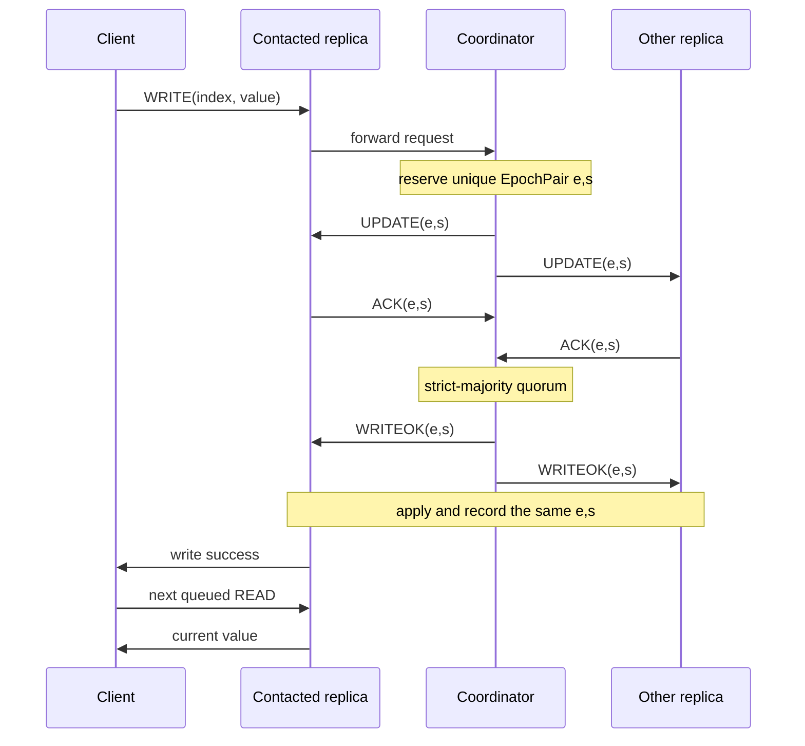

# Sequential consistency audit and guarantee

Date: 27 August 2026

Specification: `specs/ds1_project_2026_v1.pdf`
Target branch: `main` at `84846dce78e0fa20ff867591cdf3cda1d586611d`

## Executive conclusion

The original `main` branch did **not** guarantee the sequential consistency required by the project specification. It contained the FIFO network abstraction and a client-side transaction queue, but reads were unimplemented and the update and election protocols were still developed on separate branches. Even after integrating those live branches, the complete audit found five ordering and recovery gaps:

1. the coordinator did not assign one unique, stable `EpochPair` to an update;
2. update timeouts did not start recovery;
3. the crash instrumentation could not interrupt a `WRITEOK` dissemination;
4. overlapping election initiator windows could elect two coordinators for one failed term, leaving correct replicas with different values after recovery;
5. a pre-UPDATE write was not resumed after election, and retrying it exposed a heartbeat/update `TransactionId` collision on a newly elected coordinator.

This branch integrates the live read, update, and election work and makes the smallest changes at the ordering and recovery boundaries. With those changes, the implementation provides the specification's sequential-consistency safety property under the assumptions in this report:

- each client's completed operations retain program order;
- every committed update has one coordinator-assigned total-order identity;
- every correct replica applies the same ordered prefix of updates;
- a read after a completed write to the same replica observes that write;
- if `WRITEOK` is interrupted by a coordinator crash, election and synchronization recover one common prefix before the next epoch.

This is a safety claim, not a claim that every project requirement or every liveness scenario is complete.

## 1. Requirement being proved

The specification combines two related requirements:

- “The system provides sequential consistency from each replica's point of view.”
- “All operations issued by one client to a specific replica are observed in the same order in which they were sent on the whole system.”

It also requires total-order update delivery: all correct replicas must eventually apply updates in the same order. Each update is identified by an `EpochPair <epoch, sequence>`, with a new epoch after coordinator election.

For this implementation, the required observable history can be described as follows:

1. preserve each client's request order;
2. place all successful writes into one total order;
3. make every replica's applied updates a prefix of that order;
4. answer each read from the contacted replica's current prefix;
5. after a coordinator crash, select and propagate the longest committed prefix before continuing in a new epoch.

Sequential consistency does not require replicas to apply an update at the same wall-clock instant. A fast replica may temporarily have a longer prefix than a slow replica. It does require that no replica applies the same updates in a different order and that recovery does not roll back or fork the committed order.

## 2. Scope and dependency integration

At the audited `main` head, `Client.sendRead` was a TODO and there was no `UpdateTransaction` or `ElectionTransaction`. A guarantee could not be implemented or tested against `main` without first bringing in the protocol code already under review.

This branch therefore integrates these exact live heads:

| Dependency | Head | Purpose |
|---|---|---|
| PR #83, `feat/readTransaction` | `14b243bd0613f68517c288ba1c475a3ddb6e4997` | Read request, local replica read, result and timeout |
| PR #86, `feat/UpdateTransaction` | `73052d2d8a4123d06013808f36ad1080a85a517d` | Quorum `UPDATE/ACK/WRITEOK`, state application and history |
| PR #97, `feature/electionTransaction` | `d1222a2de68a5d3afc8ff5e31c38806b2bf659fe` | Ring election and state synchronization |

The merge commits preserve the provenance of that work. The consistency-specific behavior is concentrated in `Replica`, `UpdateTransaction`, and `TestSequentialConsistency`.

## 3. Why the integrated code was not sufficient

### 3.1 Update identity was local, duplicated, and rewritten

Before this fix, a replica forwarded its current `startEpochPair` to the coordinator. Two clients could start while their contacted replicas both held `<0,0>`, so two different updates could carry the same pair.

The coordinator then copied that pair into `UPDATE` and `WRITEOK`. On commit, each replica ignored the message pair and independently incremented its own local pair. History was keyed by that locally incremented value. One logical update therefore had two meanings:

- the protocol messages said, for example, `<0,0>`;
- the applied state and history said `<0,1>`.

That violates the specification's unique update identity and weakens recovery because election metadata, protocol messages, and history do not identify the same event.

### 3.2 Update failure detection was inert

`UpdateTimeoutMsg` and `WriteOkTimeoutMsg` were scheduled, but their state-machine branch was commented out. A participant could remain in an unfinished update transaction without starting election.

The original phase timeout was also only `3 * maxLatency`. With several FIFO messages queued, that bound can expire under normal execution and falsely report a live coordinator. The first concurrent regression run reproduced that false election.

### 3.3 Partial `WRITEOK` could not be exercised correctly

`Replica.broadcast` invoked the pending-crash callback once after sending to every destination. A configured “crash after the first WRITEOK” therefore happened after the whole broadcast, not during it. This hid the specification's important partial-dissemination case.

### 3.4 Election could produce a split brain

Election initiation was staggered by only one network-tolerance unit per ring position. UPDATE and heartbeat detectors can fire at different times, and a full ring circulation may take several hops plus a timeout for the failed coordinator. Those windows could overlap.

The new partial-`WRITEOK` regression exposed the concrete failure:

- replica 1 applied value `42`;
- coordinator 0 crashed during `WRITEOK`;
- one election selected replica 1 while another selected replica 4;
- replicas 1–3 synchronized to value `42`, but replica 4 retained `0`.

That execution is not sequentially consistent and violates uniform agreement.

### 3.5 Failover lost pending writes and reused the heartbeat ID

A write forwarded after the old coordinator had already crashed remained in `WAITING_ELECTION` after synchronization. The client eventually timed out because no component submitted that still-unobserved request to the new coordinator.

The first retry implementation exposed a second problem. Followers had not consumed local transaction sequence 0. If such a follower became coordinator, its restarted heartbeat used `<newCoordinator,0>` while its pending update also used `<newCoordinator,0>`. ACK and WRITEOK messages were routed into `HeartbeatTransaction`, which threw and caused Akka to restart the replica. A restarted replica then had no initialized group state.

## 4. Minimal consistency mechanism

### 4.1 Coordinator-only `EpochPair` allocation

`Replica.reserveNextUpdateEpochPair()` is the only allocation point. Because a replica actor processes one mailbox message at a time, reservations occur in coordinator receive order. The allocator is separate from the latest applied pair:

- `nextUpdateSequence` reserves identities for broadcasts;
- `epochPair` records only the latest update actually applied locally.

This distinction prevents an uncommitted reservation from making a replica appear more up to date during election. The first update in a term is `<epoch,1>` because `<epoch,0>` is the synchronized epoch baseline.

When election moves the replica to a new epoch, the allocator detects the epoch change and restarts at sequence 1.

### 4.2 One identity through the whole update

`UpdateTransaction` stores the coordinator-assigned pair in `updateEpochPair`. That exact immutable value is used in:

```text
UPDATE -> ACK -> WRITEOK -> setEpochPair -> updateHistory -> WriteFinish
```

ACKs and WRITEOKs with a different pair are ignored. A null pair is rejected at the point where a coordinator-assigned identity is mandatory.

### 4.3 Bounded phase timeouts start election

The update FSM now handles both update-phase timeouts and calls `Replica.startElection(currentCoordinatorId)`. The phase timeout covers two channel crossings plus bounded FIFO backlog using the configured latency tolerance and group size.

This follows the specification's synchronous failure-detector assumption. It avoids the observed false positive while still detecting a silent coordinator before the client write timeout expires.

### 4.4 Crash instrumentation can stop a broadcast

`Replica.broadcast` now checks the configured crash point after every transmitted message and stops immediately once the replica enters `CRASHED`. `WriteOkMsg` is classified as `Crash.Type.WriteOK`, so a regression can reproduce a coordinator that sends WRITEOK to only a prefix of destinations.

### 4.5 Non-overlapping election initiator slots

Possible initiators are ordered by ring distance from the failed coordinator. The immediate correct successor may start as soon as its detector fires. Every later candidate waits another full slot.

One slot covers:

- the maximum difference between heartbeat and update failure detection; and
- a complete token/ACK traversal of the ring.

The immediate successor uses no additional delay. Later candidates wait for the detector-skew allowance once and then add one ring-traversal interval for each preceding position. This gives the earlier correct initiator time to finish without multiplying the relatively large heartbeat allowance by every ring position. If an earlier candidate is crashed, a later slot still permits progress.

### 4.6 Safe retry after synchronization

`UpdateTransaction` records the phase occupied when it requested election:

- `WAITING_UPDATE` means the failed coordinator never broadcast the request, so the trigger replica may safely submit it to the new coordinator;
- `WAITING_WRITEOK` means the outcome may already be in the synchronized prefix, so the old transaction is retired rather than applied twice.

This distinction restores progress for definitely unobserved writes without violating reliable-broadcast integrity for outcome-unknown writes.

### 4.7 Disjoint transaction-ID namespaces

Replica-owned transaction IDs now have explicit namespaces:

- sequence 0 is reserved for the coordinator-term heartbeat identity shared by all replicas;
- ordinary replica transactions start at sequence 1;
- election transactions use negative sequence numbers.

This prevents a follower that becomes coordinator from routing update messages into its restarted heartbeat transaction.

## 5. Why the resulting order is sequentially consistent

### Invariant A: client program order

`Client` has one `currentTransaction` and a FIFO `scheduledTransactions` queue. A read or write is sent only when it becomes current. The next operation starts only after the current operation reports success or reaches its configured terminal timeout.

For a successful write followed by a read to the same replica:

1. the contacted replica applies `WRITEOK`;
2. that replica sends `WriteResultMsg`;
3. the client completes the write transaction;
4. only then does the client send the read;
5. the replica answers from the already updated local array.

### Invariant B: one coordinator order

The coordinator actor assigns pairs in its mailbox order. If update A is assigned before B, then `pair(A) < pair(B)` and the coordinator calls `broadcast(UPDATE A)` before `broadcast(UPDATE B)`.

`NetworkChannel` provides one FIFO channel for each sender/destination pair. Every replica therefore receives A's UPDATE before B's UPDATE and sends ACK A before ACK B.

### Invariant C: quorum cannot commit B before A

Suppose B reaches a strict-majority quorum. Every participant whose ACK contributes to B received A first and sent ACK A first. Its FIFO participant→coordinator channel delivers ACK A before ACK B. Therefore, by the time B has a quorum, A already has at least the same quorum.

The coordinator actor handles those ACKs sequentially, so it emits WRITEOK A no later than WRITEOK B.

### Invariant D: every replica applies one prefix

All WRITEOK messages for a term come from the coordinator. Coordinator→replica FIFO means each correct replica receives WRITEOKs in coordinator order. An update is applied only when a WRITEOK carries the transaction's exact pair.

Thus a replica may temporarily have `[A]` while another has `[A,B]`, but no correct replica can have `[B,A]` or `[B]` without A.

### Invariant E: crash recovery preserves the longest prefix

If the coordinator crashes during WRITEOK, replicas can hold different-length prefixes. Their latest applied `EpochPair` identifies the prefix length. Election compares those pairs and selects the most up-to-date correct candidate, with replica ID only as a tie-breaker.

The elected replica copies its positions to the other correct replicas and starts a higher epoch. Non-overlapping initiation slots prevent two snapshots for the same failed term. Synchronization and later UPDATE messages use the same new-coordinator→replica FIFO channel, so a follower receives the snapshot before any new-epoch update from that coordinator.

After synchronization, all correct replicas begin the new epoch from one common prefix. A trigger that never saw the old coordinator's UPDATE may then resubmit its write; a trigger that did see UPDATE does not resubmit an outcome-unknown operation.

## 6. Message trace



## 7. Verification evidence

The focused class `TestSequentialConsistency` covers four independent obligations:

1. coordinator allocation is unique and monotonic, resets on a new epoch, and cannot collide with heartbeat sequence 0;
2. two concurrent clients produce the exact same six-update order at five replicas while preserving each client's own order;
3. a read queued after a write by the same client observes the written value;
4. a coordinator crash after one WRITEOK transmission recovers value `42` at every correct replica.

Commands run from the repository root:

```bash
GRADLE_USER_HOME=/tmp/coredump-gradle-home gradle compileJava compileTestJava --no-daemon
GRADLE_USER_HOME=/tmp/coredump-gradle-home gradle test --tests it.unitn.ds.TestSequentialConsistency --no-daemon
GRADLE_USER_HOME=/tmp/coredump-gradle-home gradle regression --no-daemon
GRADLE_USER_HOME=/tmp/coredump-gradle-home gradle test --no-daemon
GRADLE_USER_HOME=/tmp/coredump-gradle-home gradle staticAnalysis --no-daemon
```

Compilation, all four focused tests, the regression task, and the complete 80-test suite passed. The static-analysis task also completed successfully; it reported existing PMD/SpotBugs/CPD warnings in the integrated election code, with zero errors and zero formatting problems. The detailed warning count and report paths are recorded in the pull request description.

## 8. Assumptions and limits

The proof relies on assumptions already present in the specification or starter architecture:

- static membership and unique replica IDs;
- reliable FIFO channels without Byzantine messages;
- one Akka mailbox turn at a time per actor;
- a strict majority of replicas remains correct;
- configured network delay and failure-detector bounds are respected;
- client timeouts are configured long enough to cover update failure detection, election, and synchronization, as done by `TestsCommons`;
- a crashed replica does not recover.

An arbitrarily short externally supplied client timeout is outside this guarantee. It could allow a client to advance past an operation whose outcome is still unknown. This is why the specification requires reasonable timeout configuration.

This report establishes sequential-consistency safety and recovery of committed prefixes. It does not claim Byzantine fault tolerance, network-partition tolerance, durable storage across process restarts, or completion when fewer than a quorum remain correct.

## 9. Review checklist

- [x] one client transaction is active at a time;
- [x] one coordinator allocates update identities;
- [x] the same non-null pair crosses UPDATE, ACK, WRITEOK, apply, and history;
- [x] quorum causality and FIFO preserve coordinator commit order;
- [x] reads observe the contacted replica's ordered prefix;
- [x] update timeouts initiate election;
- [x] partial WRITEOK dissemination is reproducible;
- [x] one election term cannot produce overlapping initiator windows;
- [x] interrupted WRITEOK recovery converges every correct replica;
- [x] only definitely unobserved writes retry after election;
- [x] heartbeat, ordinary, and election transaction IDs occupy disjoint namespaces;
- [x] focused concurrent and crash regressions pass.
