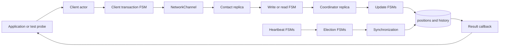
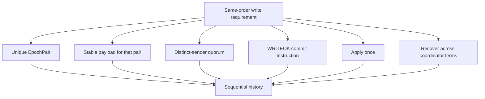
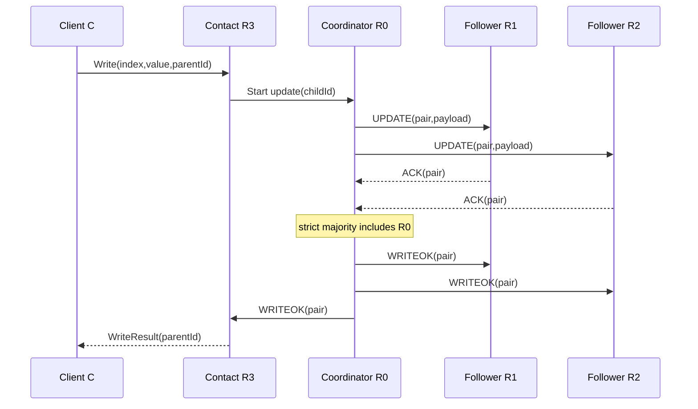
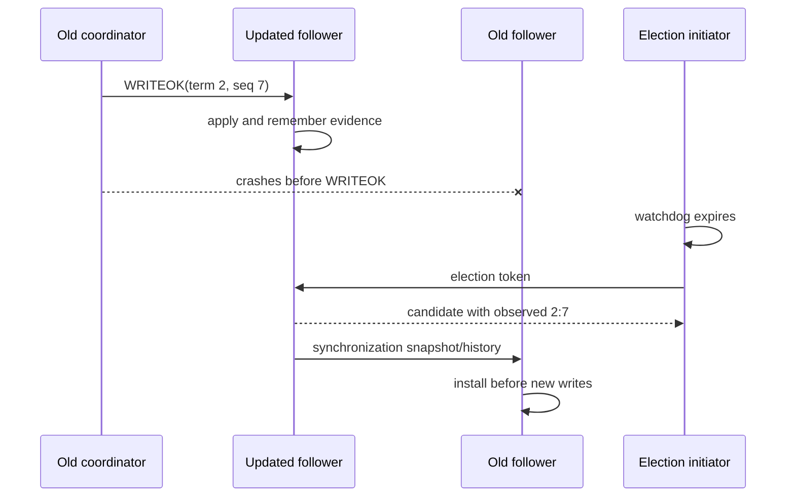
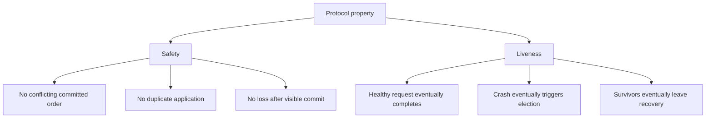
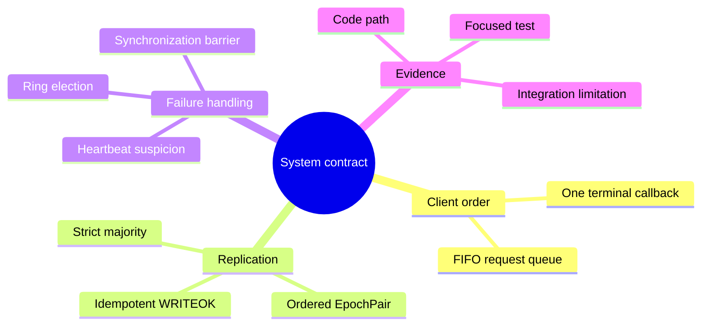

# Requirements and System Contract

> **Purpose.** This report explains what the system is supposed to achieve before discussing how the Java classes attempt to achieve it. It is a study report, not the final exam report.

**Primary source:** `specs/ds1_project_2026_v1.pdf`, dated June 2026.  
**Repository snapshot inspected:** `feature/electionTransaction`, commit `d1222a2`.  
**Important status note:** the working repository is split across feature branches. A requirement described here is not automatically an implemented feature.

## 1. The problem in everyday language

Imagine several offices, each holding a copy of the same array of integers. Each array index represents one person and the integer at that index represents that person's position. A client may ask any office to read a value or change a value.

Reading is simple: the contacted replica returns its local value immediately. Writing is harder. If two replicas apply changes in different orders, their arrays can diverge. The project therefore appoints one replica as **coordinator**. All writes pass through that coordinator, which orders updates and distributes them.

The coordinator may crash. The remaining replicas must notice, choose a replacement, recover any work that the old coordinator left half-finished, and only then accept new writes.

The system is therefore built around two large algorithms:

1. a two-phase, quorum-based update broadcast; and
2. a ring-based coordinator election followed by synchronization.

## 2. Actors and data

There are two kinds of application actors:

- A **client** asks for reads and writes. It does not store the database.
- A **replica** stores a fixed-length `positions[]` array. One replica is also the coordinator.

Membership is static. Every replica receives the complete map from numeric replica IDs to Akka `ActorRef`s during initialization. No replica joins later, and a crashed replica never recovers.

The specification assumes that a strict majority of replicas remains correct. For `N` replicas, the quorum size is:

```text
Q = floor(N / 2) + 1
```

For five replicas, `Q = 3`. The coordinator counts as one of those three.

## 3. Read contract

A read request contains an array index and the client's actor reference. The contacted replica reads its own `positions[index]` and replies immediately. It does not ask the coordinator or a quorum.

This design provides **sequential consistency from one replica's point of view**: operations sent by one client to one replica are observed in the order sent. It does not promise that a client switching arbitrarily between replicas always sees the newest real-time value.

The distinction matters in an exam. A local read is fast, but a replica that has not yet received a committed update can temporarily return an older value.

## 4. Write and update contract

A write request contains `(index, value)`. The contacted replica forwards the work to the current coordinator. The coordinator then performs the update protocol:

1. Choose a unique update order key `⟨epoch, sequence⟩`.
2. Broadcast `UPDATE(index, value, epochPair)`.
3. Each receiving replica records the update and returns `ACK`.
4. The coordinator waits for a strict majority, including itself.
5. The coordinator broadcasts `WRITEOK`.
6. A replica applies the change to `positions[]` only after `WRITEOK`.

The epoch identifies a coordinator term. The sequence number identifies the order within that term. Epochs increase when the coordinator changes; the sequence returns to zero at the start of the new epoch.

For example:

```text
<2, 7> comes before <2, 8>
<2, 100> comes before <3, 0>
```

`TransactionId` and `EpochPair` are not interchangeable. A transaction ID routes one local or distributed conversation. An epoch pair gives a replicated update its total-order position.

## 5. Reliable total-order broadcast properties

The specification describes four properties. Translate them into questions:

- **Validity:** if a correct sender broadcasts an update, will it eventually be delivered?
- **Integrity:** can a replica apply the same update twice, or apply an update that was never sent?
- **Uniform agreement:** if any replica applies an update, will every correct replica eventually apply it?
- **Total order:** if one correct replica applies `A` before `B`, do all correct replicas apply `A` before `B`?

Uniform agreement includes replicas that later crash. Suppose replica 2 applies update `U` and is then destroyed. The value must not disappear from all surviving histories. Recovery after coordinator failure exists largely to protect this property.

## 6. Failure detection contract

The project specifies three ways to suspect the coordinator:

1. A replica forwards a write but never receives the coordinator's `UPDATE`.
2. A replica receives `UPDATE` but never receives `WRITEOK`.
3. No write is active, but periodic `HEARTBEAT`s stop arriving.

These mechanisms detect different silences and should not be collapsed into one timer. Failure detection is assumed accurate: reasonable timeout values must not create false elections under the configured network delay.

## 7. Election and recovery contract

Replica IDs define a logical ring. An `ELECTION` message circulates through available replicas. Each participant adds its freshest observed update information. A sender waits for an ACK; if the next replica crashes, timeout handling skips it.

The best candidate is the replica that knows the most recent update. Numeric replica ID breaks a tie. After a winner is found, the new coordinator must:

1. announce itself with `SYNCHRONIZATION`;
2. establish a newer epoch;
3. recover missing or incomplete updates;
4. bring correct replicas to a common state;
5. restart failure detection for the new term; and
6. only then resume new writes.

Choosing a leader and recovering replicated state are separate responsibilities. A correct election can still produce an incorrect system if synchronization loses an incomplete update.

## 8. Environmental assumptions versus implementation duties

The environment promises:

- reliable FIFO communication channels;
- static membership;
- crash-stop failures;
- no false failure detections; and
- a surviving strict majority.

The implementation must still provide:

- per-channel FIFO delay emulation;
- actor encapsulation and immutable shared message data;
- update ordering and duplicate prevention;
- client timeouts and protocol timeouts;
- deterministic crash injection for tests;
- election termination despite crashed ring neighbors;
- recovery of interrupted work;
- mandatory callbacks; and
- timestamped logs through the supplied `Logger`.

An assumption is not a feature. For example, “channels are reliable” means messages are not lost by the model; it does not remove the need to route replica traffic through `NetworkChannel` so FIFO delay behavior is preserved.

## 9. Current implementation map

At the inspected snapshot:

- `origin/main` at `84846dc` contains transaction infrastructure and heartbeat behavior.
- `origin/feat/readTransaction` at `1ed58b6` contains the read FSM.
- `origin/feat/WriteTransaction` at `8c42a18` contains the client/contact-replica write wrapper.
- `origin/feat/UpdateTransaction` at `59bbe80` contains a partial UPDATE/ACK/WRITEOK implementation.
- `feature/electionTransaction` at `d1222a2` contains election and snapshot synchronization.

These branches are not one verified final system. In particular, timeout-driven update recovery and history replay are incomplete, and the current election synchronization copies a position snapshot rather than replaying every missing update.

## 10. Study checklist

You should be able to answer these without looking at the code:

1. Why can a read be local while a write requires coordination?
2. Why is a strict-majority ACK useful?
3. What is the difference between `TransactionId` and `EpochPair`?
4. Why are heartbeat timeout and WRITEOK timeout separate?
5. Why is election incomplete until synchronization finishes?

The central invariant to remember is: **once an update is applied anywhere, recovery must ensure that every correct replica eventually applies that update in the same relative order.**

## 11. A visual map from requirement to mechanism

<pre class="diagram">client request
      |
      v
client transaction ---- local read ----> replica.positions[index]
      |
      +---- write ----> coordinator ---- UPDATE/ACK ----> quorum
                                      |
                                      +---- WRITEOK ----> all replicas
                                                         |
                                                         v
                                                  history + positions

heartbeat notices silence -> election ring -> freshest candidate -> snapshot sync
                                                                 -> new term -> normal traffic</pre>

This map is useful because a requirement is not implemented by one class. A
write requirement crosses the client queue, a parent write transaction, a
replica update transaction, `NetworkChannel`, quorum bookkeeping, and the
state/history layer. Likewise, “the coordinator can fail” is not only a crash
test: heartbeat must notice it, election must choose a replacement, and
recovery must make the replacement safe before new writes are accepted.

<div class="callout"><div class="callout-title">Student tip: separate safety from liveness</div>Safety asks “can a bad result ever be produced?” (for example, two values at the same index in one committed order). Liveness asks “does a correct operation eventually finish?” (for example, a surviving client eventually receives a callback). A timeout may preserve safety while sacrificing liveness; a protocol that applies an uncommitted value may violate safety even if it is fast.</div>

## 12. Code microscope: translating a contract into a review question

When reading a method, write the requirement in plain English first and then
look for the exact state transition that enforces it. For example, the
sequential-read contract can be decomposed as follows:

<table><tr><th>Contract sentence</th><th>Concrete question to ask in code</th></tr>
<tr><td>A read observes the replica's current value</td><td>Does the handler read <code>positions[index]</code> at handling time, rather than from a cached request?</td></tr>
<tr><td>Requests from one client keep their order</td><td>Is a second request queued until the first transaction reaches a terminal state?</td></tr>
<tr><td>Every request has one result</td><td>Do success, timeout, and crash paths all clear the same active transaction exactly once?</td></tr>
<tr><td>A write becomes visible in one order</td><td>Is the same ordered <code>EpochPair</code> recorded before each replica applies the WRITEOK?</td></tr></table>

This technique prevents a common exam mistake: pointing at a class name and
calling it “the implementation.” The implementation is the chain of guards,
messages, and state mutations that makes the sentence true.

## 13. Worked timeline: why the requirements compose

Suppose client C writes `x=7`, then immediately reads `x`. The write first
needs a commit decision. The client therefore remains in its write transaction
until the parent receives completion. Only then does the request manager start
the read transaction. The read is local, so it can return immediately from the
selected replica. If the write were allowed to complete its callback before
WRITEOK was installed, the read could legally hit a replica that still stores
the old value. The client-level queue is therefore part of the consistency
argument, not just a convenience for tidier code.

For revision practice, draw the same timeline with a coordinator crash between
ACK and WRITEOK. Mark which facts are known (quorum evidence, candidate
history, visible positions) and which are unknown (whether every replica saw
the commit). That distinction is the bridge from the requirements report to
the election and recovery reports.

## 14. Questions to test your understanding

1. Which requirement is enforced locally by an actor mailbox, and which one
   requires a protocol across replicas?
2. Why can a client timeout be truthful without proving that the distributed
   write was rolled back?
3. If two updates receive different sequence numbers, which subsystem should
   reject or repair the disagreement?
4. Which safety property would be threatened if a follower applied UPDATE
   before receiving WRITEOK?

<div class="page-break"></div>

## 15. Extended guided study: the whole system as one pipeline

The following diagram is the map to keep beside you while reading every other
report. The arrows show responsibility rather than Java inheritance. A request
starts in a client-owned FSM, crosses an actor boundary, becomes a replicated
update, and may later become recovery evidence. Failure detection and election
run beside that foreground path rather than inside it.



Read the diagram from left to right for normal work and from heartbeat down to
state for failure recovery. Notice that the application never directly edits
replica state. Every boundary introduces a question: which ID identifies the
conversation, who is allowed to send the next message, which epoch applies,
and what happens if the event arrives after a timeout?

### 15.1 Requirement decomposition exercise

Take the sentence “writes are applied in the same order by all correct
replicas.” It hides at least six smaller obligations. The coordinator must
assign one ordered identity. Participants must associate the same payload with
that identity. The quorum decision must not count one participant twice.
WRITEOK must carry the decided identity. Applying it must be idempotent.
Finally, election and synchronization must preserve the decision if the
coordinator crashes. A useful report explains every obligation separately and
then reconnects them.



This decomposition is also a debugging method. If replicas disagree, do not
begin by staring at the final arrays. Compare the assigned pairs, then the
payload associated with each pair, then quorum membership, then WRITEOK
delivery, and finally recovery state. The first layer that differs is closer
to the root cause than the visible array mismatch.

<div class="page-break"></div>

## 16. A full normal-operation trace

Assume five replicas, R0–R4, with R0 as coordinator. Client C sends a write to
R3. R3 owns the parent write transaction because it is the client's contact
point. Its child update reaches R0. R0 assigns the next pair, broadcasts
UPDATE, and counts its own knowledge. When two distinct followers ACK, the set
has three members, which is a strict majority of five. R0 broadcasts WRITEOK.
Each receiver checks the transaction, sender, state, and pair before applying.
R3 can then complete its parent and reply to C.



The diagram deliberately omits random delay arrows. `NetworkChannel` may
delay each hop, but FIFO only constrains messages on the same directed link.
R2 may ACK before R1 even if R1's UPDATE was scheduled first. Correctness comes
from the pair and responder set, not global arrival order.

### 16.1 Where a read fits

A read addressed to R3 examines R3's materialized position at the mailbox turn
that handles the read. If C queues the read after the write, the client manager
does not start it until the write reaches a terminal callback. That produces
C's session order. A read from a different client may be handled at another
replica during dissemination, so the system-level consistency claim also
depends on when WRITEOK makes values visible and what reads are allowed during
synchronization.

<div class="page-break"></div>

## 17. Failure trace: responsibility moves, evidence stays

Now crash R0 after it sends WRITEOK only to R1. R1 has made the value visible;
the other correct replicas may still expose the old value. Uniform agreement
means the visible update cannot simply disappear. Heartbeat silence triggers
election, candidate freshness helps select a replica with relevant evidence,
and synchronization must carry enough information to complete or safely
reconcile the update before accepting a newer-term write.



Ask four questions at every failure boundary. What fact had become externally
visible? Which surviving nodes know that fact? Which message or history entry
represents it? Which barrier prevents newer work from overtaking recovery?
These questions are more precise than saying “the election fixes it.”

<div class="page-break"></div>

## 18. Safety, liveness, and the limits of the inspected branches



A code branch can demonstrate one local mechanism without establishing the
system property. The read branch can correctly correlate a result while the
integrated system still lacks a recovery barrier. The update branch can count
a quorum while failing to mutate `positions[]`. The election branch can choose
a deterministic candidate while copying only a snapshot rather than complete
history. Therefore, exam language should distinguish “the class contains this
mechanism” from “the combined system satisfies the property.”

### 18.1 A disciplined claim template

Use this five-part sentence when writing the later exam report: **property,
mechanism, code location, evidence, limitation**. For example: “Follower
watchdog versions prevent a queued old timeout from starting a new election;
the heartbeat FSM compares the event generation in its expiry handler; focused
tests cover stale expiry, while full integration with repeated coordinator
changes remains a separate requirement.” This wording is both educational and
honest.

<div class="page-break"></div>

## 19. Extended revision questions

1. Produce a legal sequential history for two clients whose requests overlap.
   Which per-client orders must be preserved, and which cross-client order may
   you choose?
2. Explain why FIFO from R0 to R1 does not order messages from R2 to R1.
3. Give a counterexample in which a raw ACK counter reaches quorum using the
   same sender twice.
4. Identify the exact moment an update becomes visible in the intended design.
5. Explain why a snapshot can answer current reads but still be insufficient
   evidence for interrupted-update recovery.
6. Draw a crash trace and label which claims are safety claims and which are
   liveness claims.

If you can answer these without referring to class names, you understand the
contract. The class names can then be added as implementation evidence rather
than memorized as substitutes for reasoning.


