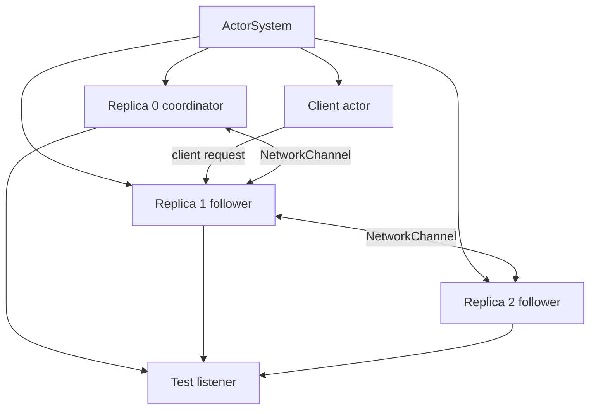
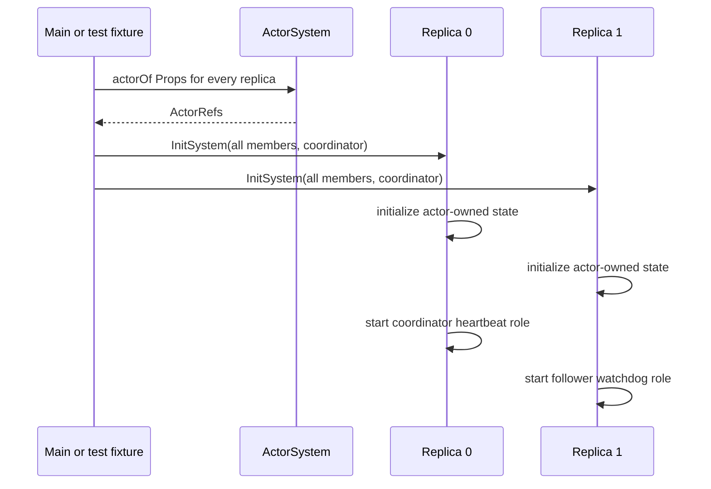
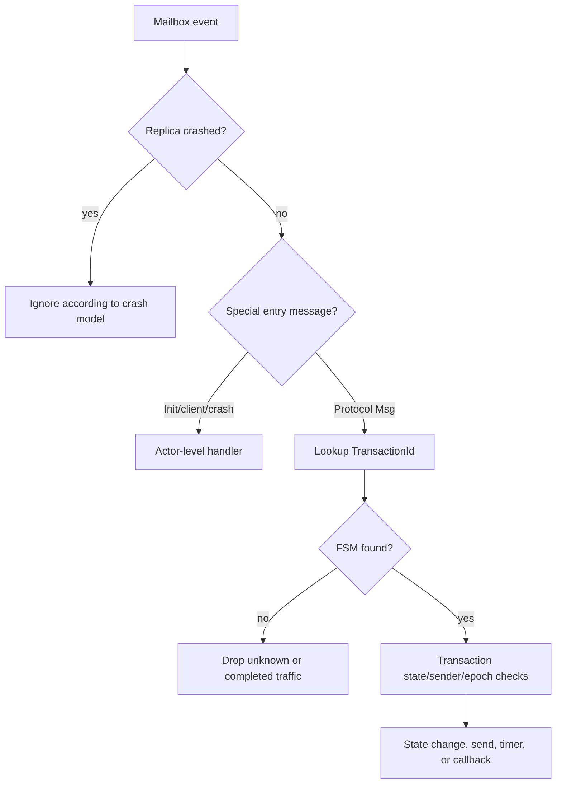
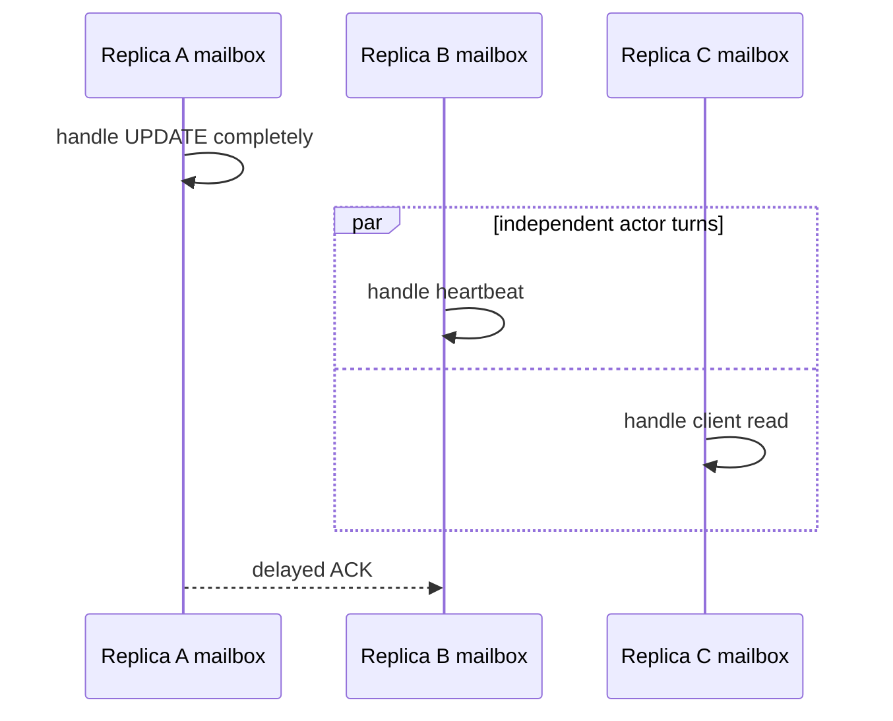
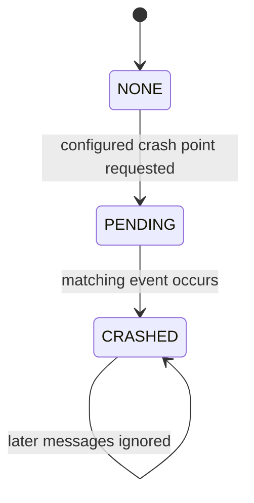
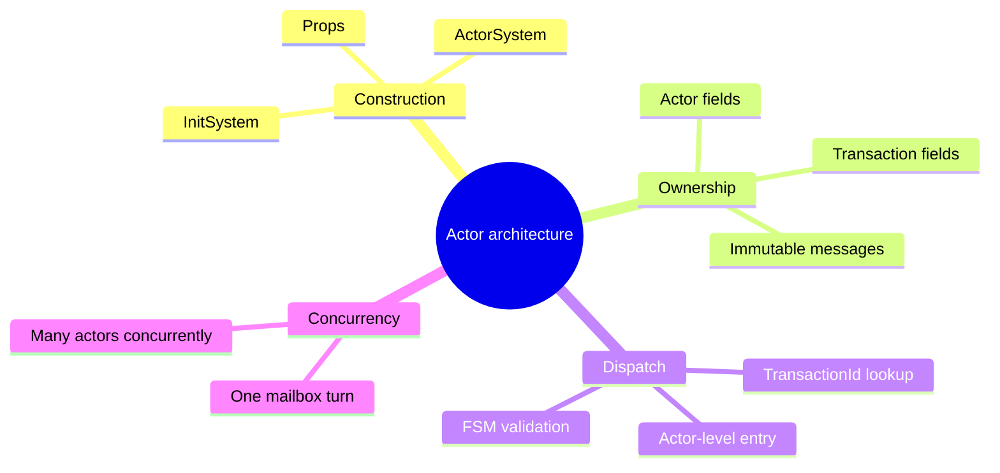

# Actor Architecture and Initialization

> **Learning goal.** Understand what an Akka actor owns, how the system is created, and how one incoming message becomes a method call without assuming prior Akka experience.

**Main snapshot:** `feature/electionTransaction` at `d1222a2`.  
**Key files:** `Main.java`, `AbstractClient.java`, `Client.java`, `AbstractReplica.java`, `Replica.java`.

## 1. A useful actor mental model

Think of an actor as a worker with a private desk and one inbox.

- Other actors cannot reach onto the desk and change fields.
- They send immutable messages to the inbox.
- The actor removes one message at a time and runs the matching handler.
- While one handler runs, another message for that same actor waits.

Akka calls the inbox a **mailbox**. `ActorRef` is the address used to send to that mailbox. The actual `Client` or `Replica` Java object is deliberately hidden behind the reference.

Mailbox serialization is valuable because `Replica` owns mutable state such as `positions`, `activeTransactions`, `coordinatorID`, and crash status. If only the replica's own handlers modify those fields, ordinary Java locks are unnecessary inside the actor.

This guarantee is local to one actor. Replica 1 and replica 2 still execute concurrently, and messages can be delayed relative to one another.

## 2. Class layers

The client side has two layers:

- `AbstractClient` is supplied course infrastructure. It defines public request messages, timeout/result callback objects, logging wrappers, and the required `sendRead`/`sendWrite` API.
- `Client` implements the project behavior and the transaction queue.

The replica side follows the same pattern:

- `AbstractReplica` supplies IDs, latency configuration, network channels, initialization/crash messages, callbacks, and the required abstract API.
- `Replica` owns the actual database and protocol transactions.

This inheritance is not decorative. Automated tests construct `Client` and `Replica` through required `Props` factories, send course-defined messages, and observe the required callbacks. A behavior can be algorithmically correct but still fail the project contract if it bypasses these entry points.

## 3. Creating actors

`Main.main` creates an `ActorSystem`, then creates each replica using `system.actorOf(Replica.props(...), name)`.

`Props` is a recipe for constructing actors. It lets Akka control actor creation rather than application code calling `new Replica(...)` and sharing that Java object.

The simplified startup flow is:

```text
Main
  -> create ActorSystem
  -> create Replica_0 ... Replica_N-1
  -> build Map<replicaId, ActorRef>
  -> send InitSystem(group, coordinatorId) to every replica
  -> create clients and send work
```

The current `Main.java` completes replica creation and initialization but leaves client creation and demonstration logic as TODOs. Tests use `TestsCommons.createTestSystem` instead, so regression tests can still build systems without a complete demo program.

## 4. Why initialization is a message

`InitSystem` contains an immutable copy of the replica map and the initial coordinator ID. It is sent to each actor after all `ActorRef`s exist.

This solves a construction problem: replica 0 cannot be constructed with references to replica 1 if replica 1 has not been created yet. Two-phase setup avoids that cycle:

1. create every actor address;
2. distribute the complete address book.

In `Replica.initSystem`, the replica stores the group and coordinator, then creates its local `HeartbeatTransaction`. Every replica derives the same heartbeat transaction ID from the coordinator's `ActorRef` and sequence zero. There is one local heartbeat FSM per replica, but the shared ID lets network heartbeat messages route to the corresponding local FSM.

## 5. Receive builders and handlers

An actor declares which message classes it accepts through `createReceive()`.

`AbstractClient.createBaseReceiveBuilder()` handles public `ReadRequest` and `WriteRequest`. `Client.createReceive()` extends it with protocol results/timeouts, probe messages, and a final fallback dispatcher.

`AbstractReplica.createBaseReceiveBuilder()` handles crash control and, before initialization, `InitSystem`. `Replica.createReceive()` adds special protocol entry messages such as `WriteMsg`, `ElectionMsg`, `ElectionStartMsg`, and `SynchronizationMsg`, then sends remaining `Msg` objects to the transaction dispatcher.

The ordering matters. A new `ElectionMsg` may need to create or replace a local election transaction before ordinary routing can find it. That is why `Replica.onElectionMsg` is a top-level handler rather than only another message passed blindly to `onMessage`.

## 6. State ownership

The main ownership boundaries are:

- A `Client` owns its transaction counter, one current transaction, and a queue of later transactions.
- A `Replica` owns its positions, coordinator view, epoch view, crash state, network-channel map inherited from `AbstractReplica`, and active transactions.
- A `Transaction` object is owned by exactly one client or replica actor. It is not itself an Akka actor.
- A `NetworkChannel` actor owns one FIFO queue for traffic from one replica to one destination.

Transaction objects are safe only because their owner calls them from its serialized mailbox. Passing a mutable transaction object to another actor would break this design.

## 7. Client serialization versus replica concurrency

`Client.scheduleTransaction` permits only one current transaction. Later client operations wait in `scheduledTransactions`. When the current transaction calls `onTransactionComplete`, the client polls and starts the next one.

`Replica.scheduleTransaction` behaves differently: it adds every transaction to `activeTransactions` and starts it immediately. A replica may therefore participate in heartbeat, election, and update conversations at the same time.

This difference is intentional:

- Client serialization helps preserve that client's operation order.
- Replica concurrency is required because background liveness monitoring must continue while application work exists.

It also makes correct message correlation essential. The replica must not deliver a message to the wrong active transaction.

## 8. Crash behavior at the actor boundary

A simulated crash does not terminate the Akka actor. Instead, `Replica` enters a `CRASHED` mode and ignores protocol activity. Keeping the actor alive lets the test harness send deterministic crash instructions and observe callbacks without relying on Akka supervision or actor restart behavior.

This is a model of crash-stop failure, not a real process crash. The educational question is whether the actor behaves externally like a dead replica: no useful incoming processing and no outgoing protocol traffic.

## 9. Course callbacks as observable outputs

Tests do not inspect private fields directly. They pass a TestKit listener into `propsWithListener` and expect callbacks such as:

- `callbackOnReadResult`
- `callbackOnWriteTimeout`
- `callbackOnUpdateApplied`
- `callbackOnElectionStarted`
- `callbackOnCoordinatorElected`

The callbacks convert internal behavior into messages the test probe can observe. Treat them like required output ports of the architecture.

## 10. Implementation status and limitations

- Actor creation, initialization, transaction hosting, and listener plumbing exist.
- `Main` is not a complete executable demonstration.
- The current branch does not contain integrated read or update protocol classes.
- The receive graph changes across feature branches, so a final merged branch must be re-documented and retested.
- Akka guarantees per-actor mailbox processing, but the project must still reason about delays between different actors.

## 11. Exam rehearsal

**Why are transactions ordinary objects instead of actors?** They are small FSMs hosted by a client or replica. The owner actor already provides mailbox serialization and a sender identity, so making every transaction a second actor would add lifecycle and routing complexity.

**Why does each replica receive `InitSystem`?** It needs a complete immutable membership map and the coordinator identity to route messages, construct the ring, and start the correct heartbeat role.

**What prevents two handlers from modifying one replica simultaneously?** Akka processes one mailbox message at a time for that actor. This does not prevent other replicas from running concurrently.

## 12. Read the startup path as a story

<pre class="diagram">Main.main
   |
   +--> ActorSystem
   +--> create Client actor
   +--> create one Replica actor per configured id
                 |
                 +--> InitSystem(membership, coordinator)
                         |
                         +--> install positions/history
                         +--> create local protocol FSMs
                         +--> start heartbeat role</pre>

The important learning point is that constructors should create an object,
while `InitSystem` supplies information that is only known after the whole
actor graph exists. Passing the complete membership map in one initialization
message avoids a half-built replica that knows about itself but not its
neighbors. It also gives every replica the same coordinator reference and the
same starting epoch assumptions.

## 13. Code microscope: mailbox code versus protocol code

In a `createReceive()` builder, a line such as
`match(InitSystem.class, this::onInitSystem)` is a type dispatch rule. Akka
does not call `onInitSystem` at construction time; it calls it later when an
`InitSystem` object reaches the mailbox. This explains three details students
often mix up:

1. Fields may still have default values when the actor constructor returns.
2. The handler can safely create transaction objects because it now owns the
   actor-thread state.
3. A message sent before initialization can be queued, so handlers need an
   explicit “initialized?” policy rather than assuming startup is instantaneous.

The same distinction applies to a transaction FSM. `Transaction.onMessage`
is ordinary Java method dispatch, but the call is made by the owning actor's
mailbox handler. The actor gives the FSM serialization; the FSM gives the
actor protocol state. Neither layer alone is the complete behavior.

<pre class="code-microscope">// Conceptual shape, simplified for study
if (message instanceof InitSystem) {
    this.system = ((InitSystem) message).system();  // immutable context
    this.heartbeat = new HeartbeatTransaction(...); // actor-local object
    this.heartbeat.start();                         // schedules local work
}
// Later mailbox turns route protocol messages by transaction id.
if (active.id().equals(message.transactionId())) {
    active.onMessage(message);
}</pre>

The equality check is a routing guard, not a consistency decision. A matching
ID only says “this message belongs to this conversation”; the FSM must still
check its current state, sender, epoch, and payload before mutating data.

## 14. Lifecycle and failure thought experiment

Imagine a follower receives an election message while its initialization is
still queued. If the implementation silently drops that election, liveness may
be lost. If it processes the election with an empty membership map, it may
send to the wrong neighbor. A robust design either orders initialization before
protocol traffic in the test harness or makes the uninitialized behavior
explicit and observable. Use this thought experiment when reading every
special entry message (`InitSystem`, crash events, and client requests).

### Practice

Sketch the fields that belong to the actor (mailbox-owned mutable state) and
the fields that belong to a transaction (protocol-local state). Then explain
why sharing one mutable transaction object between two replica actors would
break the actor model even if Java allowed the reference to be passed.

<div class="page-break"></div>

## 15. Deep study plate: actor topology and ownership



Every rectangle is an independent mailbox and state boundary. The `ActorRef`
is a safe address, not a direct Java reference for calling methods on the
actor. A sender constructs an immutable message and uses `tell`; the receiver
later handles it on its own actor thread. The transaction objects inside R0
cannot be read or modified by R1. This isolation is the reason mutable FSMs can
be ordinary objects: only their owning actor calls them.

When studying a field, ask who owns it. Membership, coordinator reference,
positions, history, crash status, and `activeTransactions` belong to a replica.
An ACK set, FSM state, timeout handle, and attempt number belong to one
transaction. A static mutable collection would escape both boundaries and
should immediately attract attention in a review.

<div class="page-break"></div>

## 16. Deep study plate: initialization happens by message



This two-phase construction solves a circular dependency: the membership map
cannot be complete until all `ActorRef`s exist. Constructors therefore capture
fixed configuration, while `InitSystem` supplies the completed graph. Students
should distinguish Java object construction from protocol readiness. A field
being non-null after the constructor does not mean the replica knows its ring
neighbor, current coordinator, or heartbeat role.

Inspect handlers that may run before initialization. A clear design either
guarantees ordering in the fixture, stashes early protocol messages, or rejects
them with an explicit reason. Processing an election token with an empty member
map is worse than delaying it because it may generate a structurally invalid
ring traversal.

<div class="page-break"></div>

## 17. Deep study plate: two-stage dispatch



Actor-level dispatch answers “which local component owns this event?” The FSM
then answers “is it valid now?” The second question cannot be skipped. A valid
transaction ID on an ACK does not prove the sender is a participant, and a
valid watchdog ID does not prove its version is current. This layered checking
is the recurring pattern across heartbeat, update, and election.

Trace one message in the debugger by recording its runtime class, sender,
transaction ID, destination actor, active FSM state, and resulting effect. If
you cannot fill one column, you have located a hidden assumption worth
documenting or testing.

<div class="page-break"></div>

## 18. Deep study plate: actor turn versus distributed atomicity



Akka guarantees one handler at a time inside A, but B and C execute
independently. Therefore, assigning a field and sending a message inside one A
handler is locally ordered, not globally atomic. C may serve a read between
A's local update and B's ACK. Protocol states and epochs make those
interleavings safe; actor serialization alone cannot.

This distinction is a common exam trap. “Actors avoid races” is too broad.
Actors avoid unsynchronized concurrent access to one actor's encapsulated
fields. They do not avoid races between messages, timeouts, or decisions made
by different actors. Distributed algorithms are largely about controlling
those remaining races.

<div class="page-break"></div>

## 19. Deep study plate: simulated crash lifecycle



The actor process remains addressable after a simulated crash so tests can use
stable `ActorRef`s. “Crashed” is therefore a semantic state enforced by guards,
not Akka termination. Every entry path—including timers and self-messages—must
observe it. A forgotten handler can resurrect protocol output even though
ordinary network messages are blocked.

For a code audit, enumerate the receive builder's message types and mark the
crash guard for each. Then enumerate direct transaction calls made from actor
methods. This creates a concrete completeness argument rather than relying on
one top-level boolean.

<div class="page-break"></div>

## 20. Student workbook and oral-exam prompts



Explain the architecture without using the word “thread” until the end. Start
with ownership and messages. Next, draw the initialization sequence and show
why the member map cannot be passed completely to the first replica's
constructor. Finally, take an ACK and explain both dispatch stages.

Practical exercises: add a test for a protocol message before initialization;
add a test for a correct ID but wrong sender; and add a crash test in which a
queued timer arrives after the state becomes `CRASHED`. For each test, state
the expected absence of side effects as well as the expected message. A good
answer names what must not change: position, history, active transaction count,
or listener callback count.
