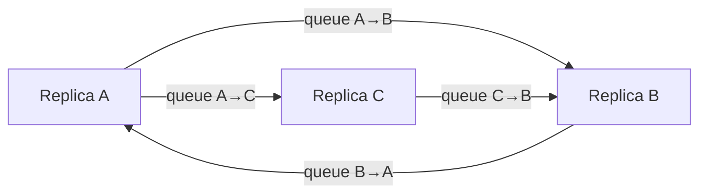
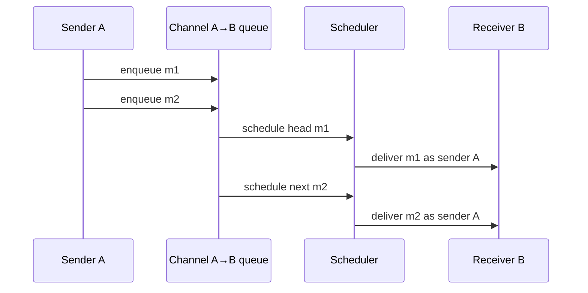
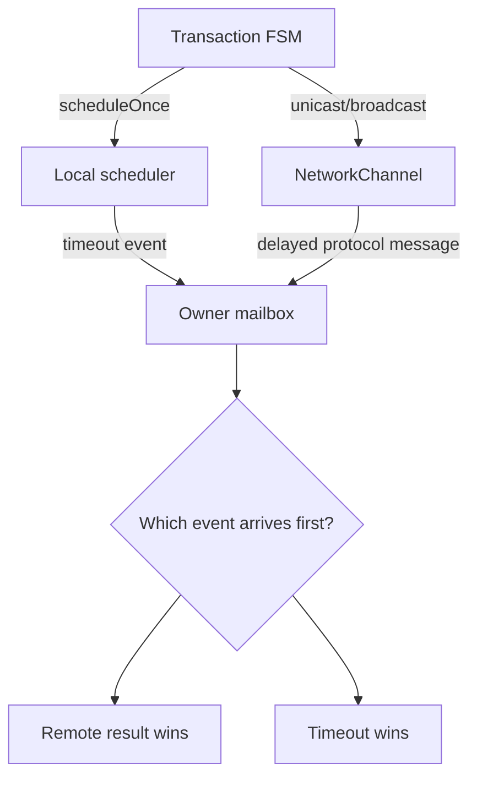
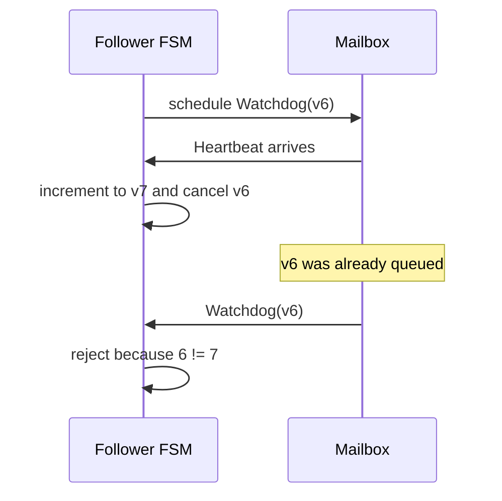
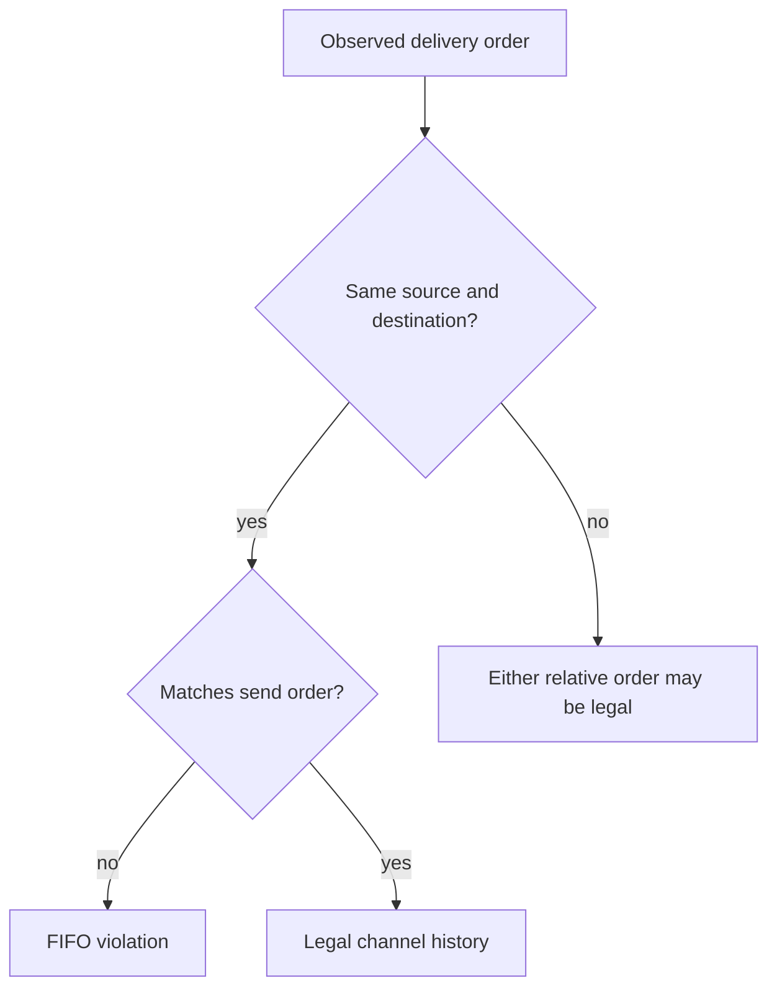

# Communication, FIFO Channels, and Time

> **Learning goal.** Learn which messages represent network traffic, which messages are local timer events, what FIFO really guarantees, and how those facts determine timeout design.

**Snapshot:** `feature/electionTransaction` at `d1222a2`.  
**Key files:** `AbstractReplica.java`, `NetworkChannel.java`, `Replica.java`, `DistributedActor.java`.

## 1. Two ways a message can move

The code has two importantly different delivery paths.

**Protocol network path:** a replica calls `broadcast` or `unicast`, which calls inherited `AbstractReplica.tell`. That method sends through a `NetworkChannel` actor, introducing configured latency while preserving FIFO order.

**Local path:** an actor sends to itself or uses `scheduleToItself`. The message enters the same actor's mailbox without passing through the simulated network.

These paths must not be confused. A heartbeat sent from the coordinator to followers is network traffic. A `HeartbeatTickMsg` telling the coordinator that it is time to send a heartbeat is a local scheduler event.

## 2. What `NetworkChannel` owns

Each replica lazily creates one `NetworkChannel` for each destination. Because the channel is a child of the sending replica, the effective identity is:

```text
(source replica, destination replica)
```

The channel owns:

- the destination `ActorRef`;
- minimum and maximum delay;
- a FIFO queue of `(message, originalSender)` pairs; and
- a flag showing whether a delivery is already scheduled.

When a message arrives, `onEnqueue` places it at the tail. If no delivery is active, the channel schedules a private `Deliver` message to itself. `onDeliver` removes the head, sends it to the real destination using the saved sender, and schedules the next delivery if the queue is non-empty.

Only one queued message is scheduled at a time. That is what prevents a later random delay from overtaking an earlier message on the same channel.

## 3. The exact scope of FIFO

FIFO means:

> If replica A sends message `m1` and then `m2` to replica B through the same channel, B receives `m1` before `m2`.

It does **not** mean:

- all messages in the entire system have one order;
- a message from A reaches B before a message from C reaches B;
- messages sent to different destinations arrive together; or
- a local timer message cannot be processed between two network messages.

Example:

```text
A -> B: UPDATE U1
A -> B: WRITEOK U1       guaranteed in this order
C -> B: ELECTION E       may arrive before, between, or after them
B -> B: timeout T        may also be interleaved by the mailbox
```

This is why IDs, states, and stale-timeout checks are still necessary even with FIFO channels.

## 4. Preserving the logical sender

Without special handling, B would see the channel actor as `getSender()`. `NetworkChannel` therefore saves the original sender and calls:

```text
destination.tell(message, originalSender)
```

Protocol message classes also contain an explicit `sender` field. The system therefore has two sender concepts:

- Akka envelope sender: supplied to `tell`;
- message metadata sender: stored inside `Msg`.

The implementation often uses explicit metadata because scheduled messages and forwarded transactions need stable, serializable correlation. A detailed code review should still check that the two identities cannot contradict each other in a security- or correctness-relevant way.

## 5. Broadcast and self-delivery

`Replica.broadcast(msg)` excludes the sender by default. This has an important consequence: a coordinator cannot rely on broadcasting `UPDATE` to count itself. The update FSM must represent the coordinator's local participation directly, normally by starting with ACK count one and applying locally when the quorum is reached.

`Replica.unicast` also returns without sending when the target is `getSelf()`. This prevents pointless network emulation but means any algorithm that logically sends to itself needs an explicit local path.

Both helpers stop sending once crash state is `CRASHED`.

## 6. Random delay range

`NetworkChannel.scheduleNextDelivery` computes:

```text
minLatency + random.nextInt(maxLatency - minLatency)
```

The generated values range from `minLatency` through `maxLatency - 1`. It requires `maxLatency > minLatency`; equal bounds would make `nextInt(0)` invalid. This is an implementation constraint worth recording even though normal test constants satisfy it.

## 7. Timers are messages, not interrupts

`DistributedActor.scheduleToItself(delay, msg)` asks Akka's scheduler to enqueue `msg` later. The scheduler does not call transaction code directly and does not interrupt the actor.

This preserves actor encapsulation:

```text
timer expires
  -> timeout message enters owner's mailbox
  -> owner dispatches it by TransactionId
  -> transaction checks its current state/version
```

The delay is only the earliest intended enqueue time. Mailbox backlog and runtime scheduling can make processing later.

## 8. Why cancelling a timer is insufficient

Calling `Cancellable.cancel()` helps if the timeout has not been enqueued. It cannot pull a timeout message back out after it entered the mailbox.

Heartbeat demonstrates the safe pattern:

1. follower schedules watchdog version 4;
2. heartbeat arrives;
3. follower cancels version 4 and schedules version 5;
4. version 4 was already queued;
5. transaction receives it but rejects it because `4 != currentVersion`.

Cancellation saves work; version/state validation provides correctness.

The same reasoning should be applied to election forwarding attempts and any update timeout that can be replaced.

## 9. Designing timeout budgets

A safe timeout must exceed the longest valid path it is monitoring, including network hops and scheduling tolerance.

Examples:

- A read response needs a client-to-replica send and a replica-to-client reply, although current client traffic does not use `NetworkChannel` in the same way as replica traffic.
- An election ACK covers one delayed election send plus one delayed ACK return.
- A follower watchdog must allow several coordinator heartbeat intervals plus maximum propagation and scheduling tolerance.

`AbstractReplica.getMaxLatencyPlusTolerance` adds a replica-count-dependent allowance. `HeartbeatTransaction` uses three missed heartbeat intervals plus that tolerance. These are implementation assumptions that should be justified against configured bounds rather than memorized as magic constants.

## 10. Failure and crash interaction

Reliable channels do not make a crashed destination reply. A queued message can still be delivered to its actor, but a correctly simulated crashed `Replica` ignores it. The sender then learns only through timeout.

Similarly, a replica may crash during a broadcast loop. `updateCrashStatusCallback` runs after sending activity, so a deterministic crash category can stop later protocol work. The exact point at which the crash counter changes is part of the fault model and belongs in the crash report.

## 11. Common misconceptions

- **“FIFO removes stale messages.”** No. It orders one channel; local timers and other senders can interleave.
- **“A scheduled message bypasses actor safety.”** No. It returns through the mailbox.
- **“A cancelled timeout cannot arrive.”** It may already be queued.
- **“Broadcast automatically includes the sender.”** This implementation excludes self unless requested.
- **“Reliable means immediate.”** It means eventual delivery under the model, still with delay.

## 12. What the tests currently establish

`TestDispatcher` checks transaction-ID routing behavior. `TestHeartbeatTransaction` checks periodic heartbeat broadcast and routing of heartbeat ticks. Election tests inspect timeout metadata and ring navigation. These are useful component checks, but they do not prove every cross-channel ordering or every timeout budget.

## 13. Exam rehearsal

If asked why `NetworkChannel` exists when Akka already sends messages, answer: it makes the course's network model visible—controlled random latency and FIFO order per source/destination pair—so tests can exercise distributed timing rather than zero-delay local actor delivery.

The invariant to remember is: **all replica-to-replica protocol traffic must use the simulated channel, while scheduler events remain local and must be validated when processed.**

## 14. A message's journey through the simulated network

<pre class="diagram">Replica A                  NetworkChannel                 Replica B
   |  tell(msg)                     |                            |
   |------------------------------->| enqueue(A,B,msg)            |
   |                                | choose delay d              |
   |                                | scheduler(d)                |
   |                                |----------------------------->| deliver
   |                                |              sender appears as A

same A -> B queue:  m1, m2, m3
guarantee: delivery(m1) happens before delivery(m2) before delivery(m3)</pre>

FIFO is scoped to one ordered pair. If A sends `m1` and C sends `m2` to B,
the channel may deliver either one first. This is why a protocol must put
ordering information in its messages instead of assuming that “the first
message I observe is the oldest update globally.”

## 15. Code microscope: delayed delivery versus local scheduling

The channel normally does three conceptually separate operations: append to
the source/destination queue, calculate a delay, and schedule a delivery
callback. A scheduler timeout in a transaction does not pass through this
queue. It is a local event, so its timestamp says nothing about when a remote
message was sent.

<pre class="code-microscope">Conceptual channel logic:
q = queues.get(key(sender, target))
q.add(Envelope(sender, target, message))  // FIFO insertion
d = randomDelay()
scheduleOnce(d, deliverNext(key))

At delivery, preserve the original sender:
target.tell(envelope.message(), envelope.sender())</pre>

The final line matters: a follower should not accept a heartbeat or ACK merely
because it arrived through a trusted channel; it should also verify the sender
encoded by the envelope. When inspecting the real implementation, identify
where `ActorRef.noSender()` is used and where the original sender is preserved.
A lost sender can make every participant look like the coordinator.

## 16. Timing arithmetic students can reuse

Let `L` be the maximum one-hop network delay and `H` the heartbeat period. A
follower that resets its watchdog after each heartbeat should use a timeout
strictly larger than `H + L` (usually with a safety margin). A two-hop quorum
round needs roughly `2L` network budget, plus scheduler and processing slack.
These are not proofs of liveness, but they expose obviously impossible
constants. If a timeout is smaller than one configured hop, healthy nodes will
spuriously start elections.

## 17. Experiment and review questions

1. Send two messages from A to B and one from C to B. Which orderings are
   legal, and which would violate the channel contract?
2. Cancel a watchdog after its event has entered the mailbox. What additional
   field (for example, a generation/version) lets the handler reject it?
3. In a test, how would you distinguish “the message was delayed” from “the
   receiver crashed” without sleeping for an arbitrary number of seconds?

<div class="page-break"></div>

## 18. Deep study plate: the channel matrix



Model the network as a matrix of directed queues. `A→B` and `B→A` are
different channels, as are `A→B` and `C→B`. FIFO says messages leave one cell
of that matrix in insertion order. It says nothing about which cell delivers
next. This mental model makes cross-sender interleavings obvious and prevents
the mistaken claim that one receiver mailbox sees a global send order.

For every protocol assumption, write its scope. Reliable means the simulated
channel eventually delivers unless the receiver's crash behavior ignores it.
FIFO means same source and destination. Random delay means a scheduled arrival,
not packet loss. Sender preservation means the receiver can validate who
originated the message even though the channel performed the physical `tell`.

<div class="page-break"></div>

## 19. Deep study plate: queue scheduling



The safe implementation pattern schedules only the head of a directed queue.
When delivery completes, it removes that envelope and schedules the next.
Scheduling every message independently with a random delay could let m2's
shorter delay overtake m1, violating FIFO. When reading `NetworkChannel`, find
the data structure that represents this responsibility handoff.

Sender identity is part of the envelope. If delivery uses the channel actor as
the sender, a participant cannot distinguish the coordinator from a follower.
If it uses `noSender`, sender validation becomes impossible. A channel wrapper
must therefore preserve the logical sender when it finally calls the target.

<div class="page-break"></div>

## 20. Deep study plate: timers live outside the channel



The mailbox is the meeting point of independent time sources. A timeout and a
network result may be queued close together; wall-clock timestamps do not
decide correctness. The FSM state and generation decide which event still has
authority. Whichever terminal event is processed first clears the active
transaction; the later one becomes stale.

Cancellation cannot retract an event already queued in the mailbox. This is
why heartbeat uses `watchdogVersion`, and why other retry timers benefit from
attempt IDs. Treat the timer payload like any remote message: validate it when
consumed.

<div class="page-break"></div>

## 21. Deep study plate: calculate a timeout budget

```mermaid
gantt
    title Example healthy update budget
    dateFormat X
    axisFormat %L
    section Network
    UPDATE outward      :0, 20
    ACK return          :20, 40
    WRITEOK outward     :40, 60
    section Local
    Mailbox and jitter  :60, 70
```



Let the maximum configured one-hop delay be `L`. An UPDATE/ACK round trip needs
about `2L`, while a final WRITEOK adds another `L` before a remote participant
applies. Processing, scheduler jitter, and test-probe delivery need additional
margin. This gives a reasoned lower bound; it is not a promise that the JVM
always schedules exactly at that instant.

For heartbeat, the bound includes heartbeat period plus delivery delay. A
watchdog shorter than that sum creates false suspicions in a healthy execution.
A watchdog many times larger preserves safety but slows liveness. Report both
trade-offs instead of presenting a constant without its units or derivation.

<div class="page-break"></div>

## 22. Deep study plate: stale-event race



This race is deterministic enough to test. Construct the older expiry
message, process a valid heartbeat that advances the version, and then inject
the old message. The absence of an election callback is the important
assertion. A test that only checks cancellation returns successfully does not
exercise the queued-event problem.

The same pattern applies to election neighbor retries: a timeout for attempt 2
must not invalidate an ACK for attempt 3. Name generations according to their
scope (`watchdogVersion`, `attempt`) rather than using one global counter with
ambiguous meaning.

<div class="page-break"></div>

## 23. Student workbook: legal and illegal histories



For each trace, mark channel keys rather than actor names alone. Then decide
whether an ordering is illegal. Create a trace where A sends m1 then m2 to B,
while C sends x to B. Legal deliveries include m1,x,m2 and x,m1,m2; m2 before
m1 is illegal. Repeat with A sending m1 to B and m2 to C: either delivery may
occur first because the destination changed.

Finish by designing three tests: FIFO under contrasting random delays, sender
preservation, and stale local timer rejection. Explain what each test proves
and what it does not prove about total-order broadcast.
