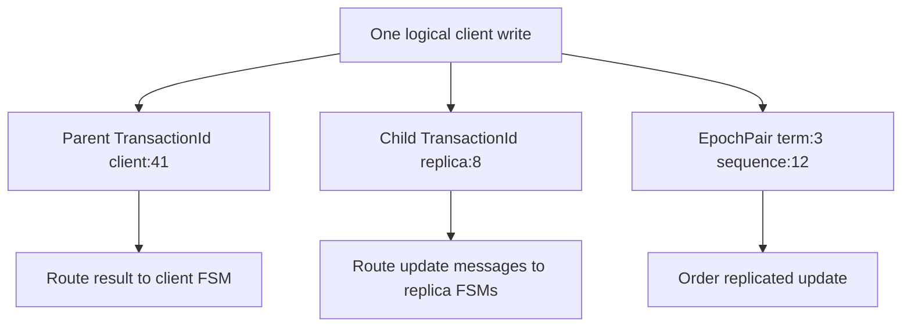
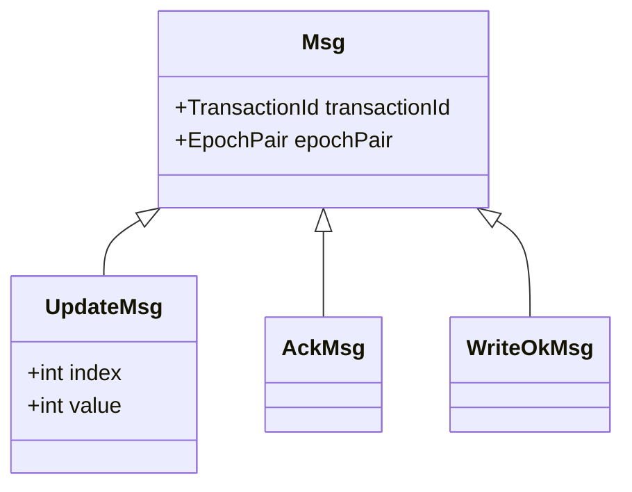
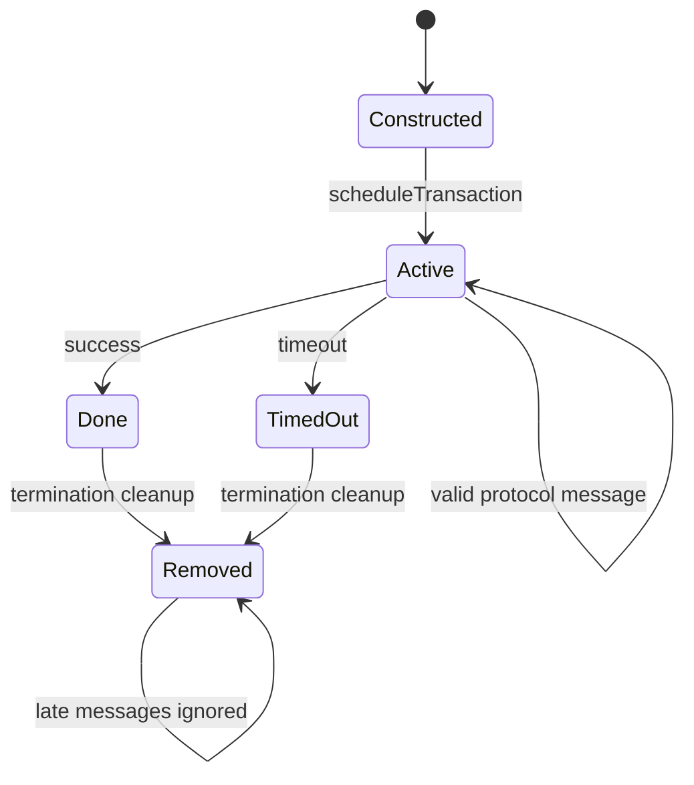
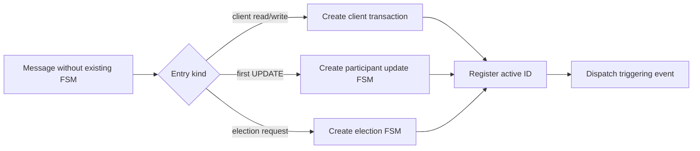
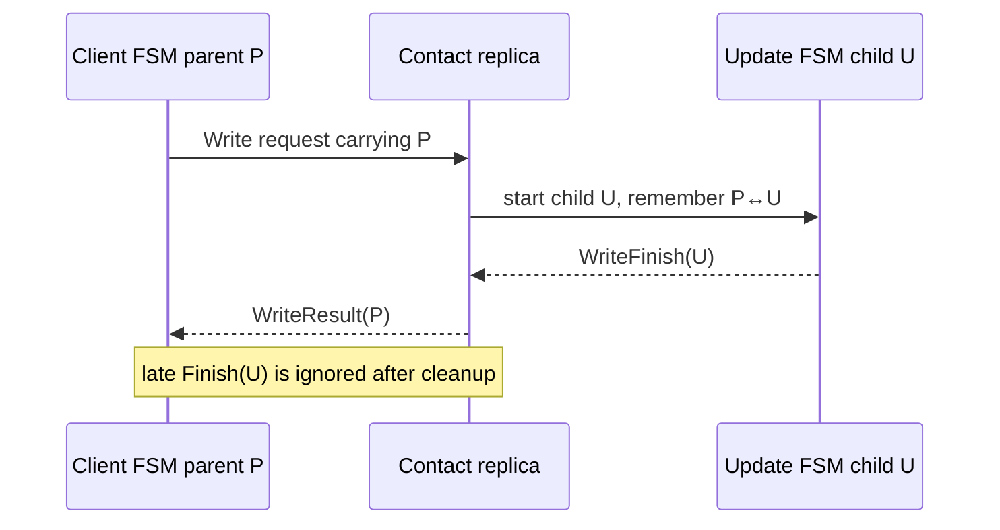
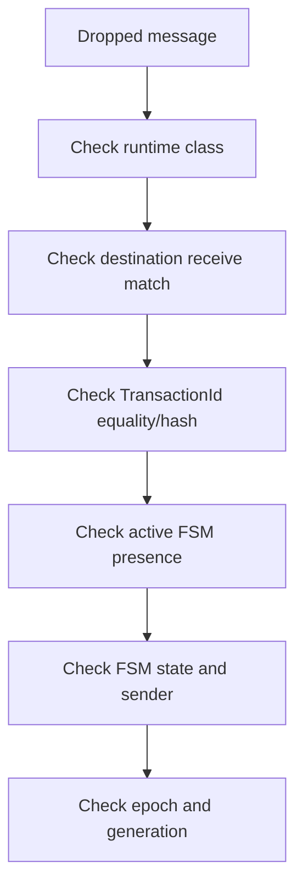

# Transaction, Message, and Dispatch Framework

> **Learning goal.** Understand how the project hosts several finite-state machines inside actors and routes each message to the right conversation.

**Snapshot:** `feature/electionTransaction` at `d1222a2`.  
**Key files:** `Transaction.java`, `Msg.java`, `EpochPair.java`, `DistributedActor.java`, `Client.java`, `Replica.java`, `ProbeTransaction.java`.

## 1. Why the project introduces transactions

Akka tells an actor which message arrived, but it does not automatically group messages into a higher-level operation. A write may involve request, update, acknowledgements, completion, and timeout. An election may involve forwarding attempts, ACKs, timeouts, and synchronization.

The project represents each such conversation as a `Transaction` finite-state machine. A transaction is an ordinary Java object owned by one actor. It provides:

- `start()` to begin the operation;
- `computeState(Msg)` to process an event;
- `getState()` for logging and debugging; and
- a shared identity, owner, start epoch, and optional cancellable timeout.

## 2. Three identities students often confuse

### Actor identity

An `ActorRef` identifies an Akka actor address. A numeric replica ID identifies its position in project membership. The two are connected by `Map<Integer, ActorRef>`.

### Transaction identity

`TransactionId` is `⟨initiator ActorRef, sequenceNumber⟩`. It correlates messages belonging to one transaction conversation. Client 1's sequence 0 and client 2's sequence 0 are different because their initiators differ.

### Update order identity

`EpochPair` is `⟨epoch, sequence⟩`. It orders replicated updates. It is not a routing key for every transaction.

Example:

```text
WriteTransaction ID: <Client_1, 3>
UpdateTransaction ID: <Replica_2, 8>
Committed update order: <epoch 4, sequence 12>
```

These can describe related work while remaining distinct. Reusing the parent write transaction ID for a simultaneously active child update on the same replica can make `Replica.onMessage` deliver to the wrong FSM.

## 3. Base message metadata

Every protocol message extending `Msg` carries:

- `transactionId`: which conversation should receive it;
- `epochPair`: term/update context, which may be null in incomplete branches; and
- `sender`: explicit logical sender metadata.

`Msg.equals` also requires the concrete message class to match. A `WriteTimeoutMsg` cannot equal a `WriteFinishMsg` merely because metadata is identical.

Subclasses add protocol payload: an index and value, coordinator ID, watchdog version, candidate list, or synchronized positions.

Messages crossing actor boundaries should be immutable. Election code copies candidate lists and position arrays so a sender cannot mutate data after transmission.

## 4. The owner interface

`DistributedActor` is the bridge between generic transactions and concrete actors. It provides the operations a transaction needs:

- obtain self/context;
- schedule a local message;
- unicast;
- allocate transaction IDs;
- schedule and complete transactions; and
- log/debug.

Both `Client` and `Replica` implement it, allowing `Transaction.owner` to use one interface. Individual transactions may still require a concrete owner—for example, heartbeat must read replica timing and coordinator fields.

## 5. Client transaction scheduling

The client maintains:

```text
currentTransaction
scheduledTransactions FIFO queue
```

Scheduling rules:

1. If idle, assign the new transaction to `currentTransaction` and call `start()`.
2. Otherwise, enqueue it.
3. On completion, poll the next transaction and start it.

Incoming protocol messages are accepted only when their transaction ID equals the current transaction's ID. Idle or foreign messages are discarded.

This is both a safety and ordering mechanism. A late result from an old operation must not finish the new operation.

## 6. Replica transaction scheduling

The replica keeps a list of `activeTransactions`. Scheduling adds and starts immediately. Routing scans a snapshot of that list and invokes the first transaction with a matching ID.

Using a copied `ArrayList` during iteration matters because `computeState` may complete and remove the transaction. Iterating the original list while modifying it could cause a concurrent-modification failure even though only one actor thread is involved.

The current dispatcher assumes active transaction IDs are unique locally. That invariant is not enforced by a map; it must be preserved by ID allocation and parent/child protocol design.

## 7. Special entry messages

Not every message can go directly to an existing transaction.

- A new `WriteMsg` causes the contacted replica to create a `WriteTransaction` with the client's transaction ID.
- A new `ElectionMsg` may create a participant election, join an existing one, replace a competing election, or be rejected.
- `SynchronizationMsg` is validated against replica-wide coordinator and epoch state before application.
- Other already-correlated messages pass through `defaultDispatcher` to `onMessage`.

This division separates **transaction discovery/creation** from **transaction event processing**.

## 8. Timers use the same routing path

A transaction schedules timeout messages carrying its own ID. Later, the owner receives the timeout like any other mailbox event and routes it back to that FSM.

Because the message can be late, a robust transaction checks more than the ID:

- current FSM state;
- timeout or attempt version;
- expected sender/target;
- expected coordinator term or epoch.

ID equality answers “which conversation?” It does not answer “is this event still valid now?”

## 9. Transaction completion

Completion has two parts:

1. The transaction updates its terminal state and cancels relevant timers.
2. It calls `owner.onTransactionComplete(this)`.

For a client, completion advances the queue. For a replica, completion removes the FSM from `activeTransactions`.

Order deserves care. If the owner removes or starts another transaction before the old FSM reaches its final state, a synchronous test or debug trace can observe surprising intermediate state. The code is not generally reentrant across actors, but actor-local method calls are immediate.

## 10. ProbeTransaction

`ProbeTransaction` is infrastructure for testing the generic transaction pipeline. It exchanges `start`, `ack`, and `done` strings to demonstrate scheduling, routing, reply, and completion.

It should not be presented as part of the distributed storage protocol. Its value is architectural: if probe routing fails, higher-level transactions cannot be trusted even if their individual FSM logic looks correct.

## 11. Current gaps and risks

- `EpochPair` metadata is still null in several branch implementations.
- The dispatcher is a linear scan and silently picks the first duplicate ID.
- Some unexpected transaction messages throw `IllegalArgumentException`, while other stale messages are ignored; that policy is not uniform.
- Client and replica transaction scheduling have intentionally different concurrency rules.
- Feature branches add message classes and receive handlers independently, so final integration can accidentally omit a handler.

## 12. Verification map

- `TestMsgClass`: equality, hashing, null metadata, and string representation.
- `TestEpochPair`: lexicographic ordering and hash/equality behavior.
- `TestDispatcher`: replica/client routing and dropping idle or foreign messages.
- `ProbeTransaction`: generic start/ack/done transaction plumbing.
- Protocol tests: verify that messages keep their transaction metadata.

These tests establish pieces of the framework. They do not prove global uniqueness of active IDs across every integrated protocol.

## 13. Exam rehearsal

**Why does `Replica` allow several active transactions?** It must run background heartbeat and possibly election/update work concurrently. Messages are separated by transaction IDs.

**Why is `EpochPair` not enough for dispatch?** Several local FSMs may relate to the same epoch, and a transaction may begin before a stable update pair is assigned. Epoch pairs order updates; transaction IDs correlate conversations.

The invariant to remember is: **every active local FSM needs an unambiguous routing identity, and every event must also be checked against the FSM's current state or generation.**

## 14. Follow one message through the framework

<pre class="diagram">Akka mailbox message
        |
        v
DistributedActor.receive
        |
        +-- special entry? (Init, crash, client request)
        |
        +-- transactionId lookup in activeTransactions
                              |
                              v
                    Transaction.onMessage
                              |
                 state + sender + payload checks
                              |
                 next state / outgoing message / callback</pre>

This is a two-level dispatch. First, the actor decides *which conversation*
should receive the message. Second, the transaction decides *whether that
conversation is ready* for the message. A message can therefore be correctly
addressed and still be invalid—for example, an ACK arriving after the
transaction already timed out.

## 15. Code microscope: identity is a routing key, not a timestamp

`TransactionId` usually contains an actor reference and a numeric value. The
actor reference identifies the owner; the number distinguishes several local
transactions. `EpochPair` has a different job: it orders replicated updates.
Do not replace one with the other just because both are small value objects.

<table><tr><th>Question</th><th>Use this field</th><th>Reason</th></tr>
<tr><td>Which local FSM should receive this message?</td><td><code>TransactionId</code></td><td>Dispatch is local to one actor.</td></tr>
<tr><td>Which update is newer?</td><td><code>EpochPair</code></td><td>Comparison provides replicated ordering.</td></tr>
<tr><td>Who sent the message?</td><td>Akka sender / channel envelope</td><td>Prevents an arbitrary actor from impersonating a role.</td></tr>
<tr><td>Is this timer still current?</td><td>generation or watchdog version</td><td>Cancellation cannot erase an already queued event.</td></tr></table>

<pre class="code-microscope">// Conceptual dispatch guard
Transaction t = activeTransactions.get(message.transactionId());
if (t == null) return;                 // unknown or already finished
if (!t.accepts(message, sender())) return; // stale/wrong-state message
t.onMessage(message);                  // only now mutate FSM state</pre>

The `t == null` branch is normal in an asynchronous system: a timeout and a
success may race, and the first terminal path removes the transaction. Tests
should assert that the second event is ignored, not that it can never exist.

## 16. Parent and child conversations

A write commonly creates a client-facing parent and a replica-local child.
They can have different owners and IDs. The child reports `WriteFinishMsg` to
the parent owner; the parent later sends `WriteResultMsg` to the client. Draw
both IDs in a trace. If a message contains only the child ID, the parent may
never find it; if every layer reuses the client ID, unrelated local FSMs can
collide.

### Practice

Add a test case for an ACK with a valid-looking epoch but the wrong
`TransactionId`. Predict which dispatch guard drops it and why accepting it
would corrupt a different update.

<div class="page-break"></div>

## 17. Deep study plate: identities form different namespaces



The three values refer to one logical operation but answer different questions.
Parent and child IDs live in actor-owner namespaces; the epoch pair lives in a
replicated ordering namespace. Reusing one value for all three jobs makes a
trace look simpler while removing information the dispatchers need.

Value-object quality matters here. Equality and hashing must use the same
fields because IDs are keys in collections. `toString` should expose enough
information for a log reader to distinguish owner and sequence. Null epoch
metadata may be legal before sequencing, but every method that compares or
records it needs a state guard.

<div class="page-break"></div>

## 18. Deep study plate: message anatomy



The base message carries correlation and ordering metadata; concrete messages
carry the facts needed by one transition. Immutability is important because a
message may wait in a channel queue while the sender continues processing.
If the sender later mutates a shared list or transaction object referenced by
the message, the receiver observes a value that did not exist at send time.

When examining a constructor, ask whether it defensively copies arrays and
collections. Actor isolation protects actor fields, not mutable objects placed
inside messages. This question is especially important for synchronization
snapshots and update history.

<div class="page-break"></div>

## 19. Deep study plate: the active-transaction lifecycle



Insertion into `activeTransactions` transfers routing responsibility to the
owner actor. Removal means no future message should mutate that FSM. Success
and timeout must converge on one cleanup path so they cannot both remove queue
entries or emit callbacks. A late message after removal is expected in an
asynchronous system and should normally be dropped safely.

Clients typically allow one active request to preserve session order. Replicas
allow several active FSMs because heartbeat, update, and election can overlap.
That difference is intentional policy, not inconsistent framework use.

<div class="page-break"></div>

## 20. Deep study plate: entry messages create conversations



Not every message can be routed by lookup because the first message may be the
reason the local FSM exists. The actor receive layer recognizes those entry
types, validates them, creates the correct transaction subclass, registers its
ID, and then starts or dispatches it. Missing an entry handler silently turns a
valid remote request into an unknown transaction.

Integration across feature branches is risky here: two branches may each add
message classes and receive matches. A merge that compiles can still omit one
match. The coverage map in report 13 should therefore be rechecked against the
final receive builder.

<div class="page-break"></div>

## 21. Deep study plate: parent-child completion



Correlation translation is explicit state. The contact replica must remember
which parent waits for which child. A child completion cannot simply reuse its
own ID as a client result because the client dispatcher knows the parent ID.
Conversely, routing all child network traffic with the parent ID can collide
with a different actor's local numbering.

Test both directions: a valid child completes exactly one parent, and a foreign
or already-completed child cannot complete the current parent. Include timeout
races because cleanup order is where mappings commonly leak.

<div class="page-break"></div>

## 22. Student workbook: debug one dropped message



Use this order because it moves from routing toward protocol semantics. Logging
only the message class is insufficient; include owner, sequence, epoch, sender,
receiver, and FSM state. Then reproduce the drop in a focused TestKit test.

Oral-exam prompts: explain why transaction objects are not actors; explain why
an epoch pair cannot replace a transaction ID; describe how entry messages
create an FSM; and show why removal is a correctness event rather than memory
cleanup alone. A strong answer includes a late-event example for each claim.
