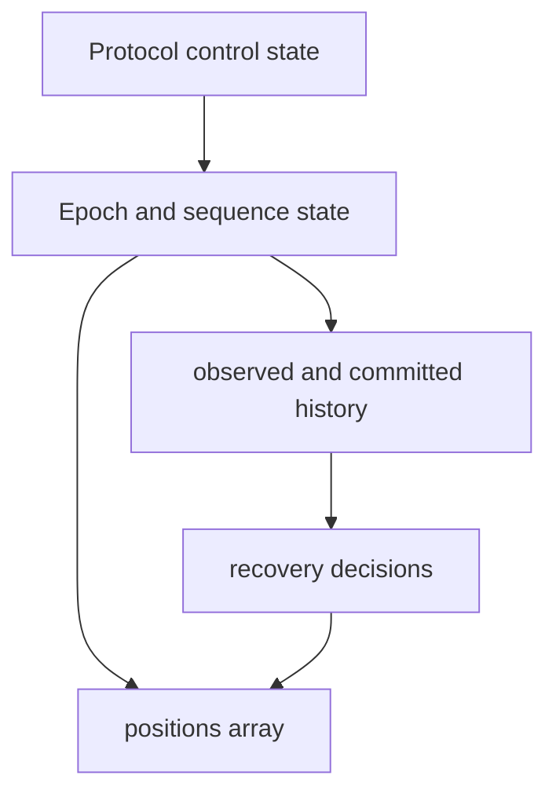
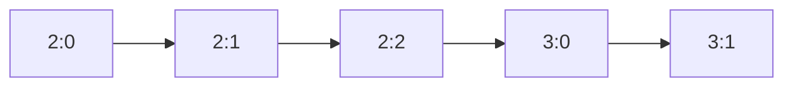
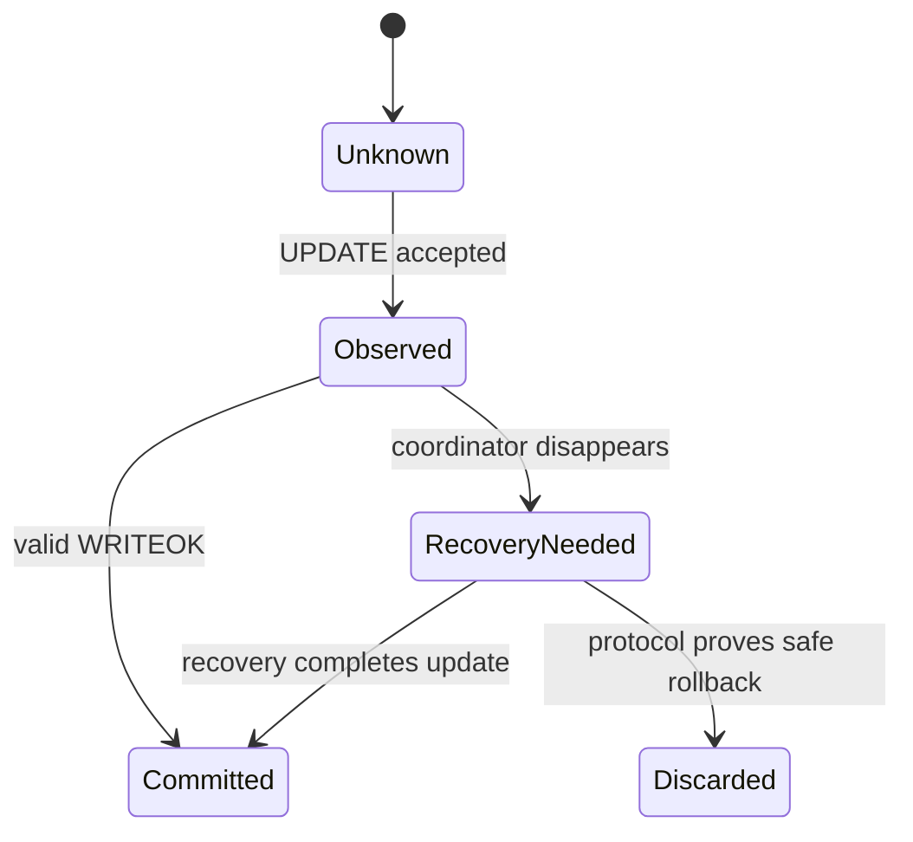
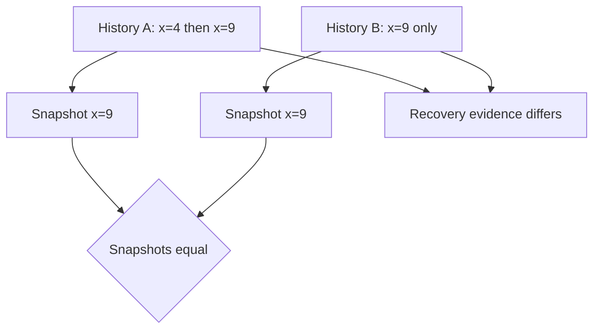
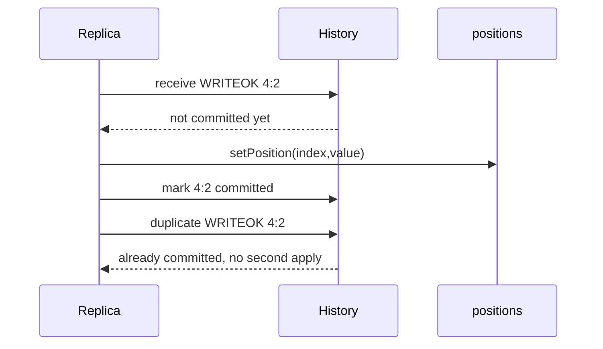
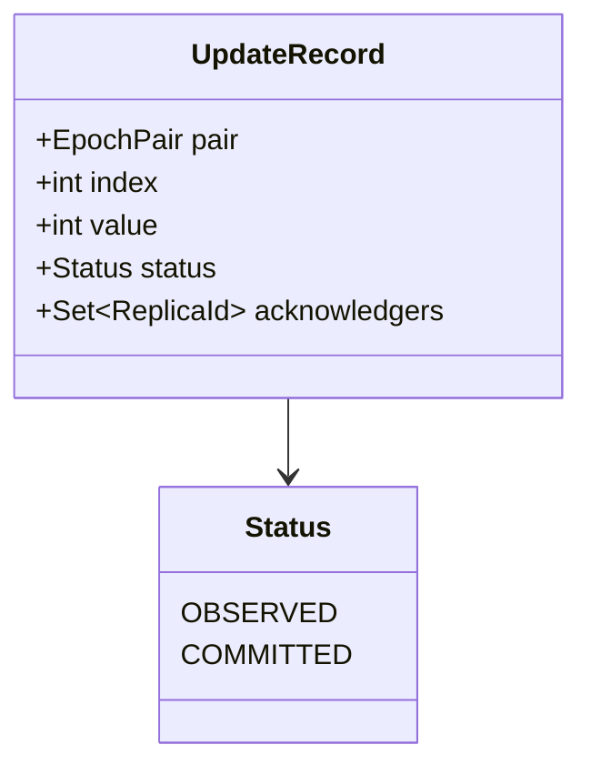

# Replicated State, Epochs, and Update History

> **Learning goal.** Understand what data each replica stores, how updates are ordered, and why a history is needed in addition to the current array.

**Current snapshot:** `feature/electionTransaction` at `d1222a2`.  
**History implementation inspected separately:** `origin/feat/UpdateTransaction` at `59bbe80`.

## 1. Four kinds of replica state

A replica stores several categories of state that answer different questions.

### Application state

`positions[]` is the database visible to reads. `getPosition` and `setPosition` validate indexes against the fixed list length.

### Leadership state

`coordinatorID` records which numeric replica ID this actor currently believes is coordinator.

### Ordering state

`epochPair` records the newest ordering position known locally. It combines coordinator term and sequence within the term.

### Protocol state

`activeTransactions`, heartbeat FSM, election sets/maps, crash status, and—on the update branch—`updateHistory` remember ongoing work and recovery evidence.

Do not treat all four as one “database.” The array is the current materialized value; history and protocol state explain how that value was reached and what may still need completion.

## 2. The position array

Every replica constructs an integer array of `AbstractReplica.POSITIONS_LIST_LENGTH`, currently 100. Java initializes it to zero.

A local read returns one element. A committed update eventually changes one element. The callback `callbackOnUpdateApplied(index, value)` must fire immediately after a real local application so tests can observe delivery.

Setting `positions[index]` is not by itself a distributed update. The total-order protocol determines when the write is allowed to become visible.

## 3. Lexicographic epoch ordering

`EpochPair.compareTo` first compares epoch, then sequence:

```text
<1, 9> < <1, 10>
<1, 999> < <2, 0>
```

The second comparison is valid because a newer coordinator term outranks every sequence from an older term.

`Replica.setEpochPair` rejects null and prevents moving backwards. Equal values are accepted. This protects one local monotonicity invariant but does not itself prove that every replica advances consistently.

## 4. A branch-level initialization mismatch

The update branch initializes `epochPair` to `<0,0>`. The current election branch leaves it at Java's default `null` until later behavior sets it. Heartbeat messages tolerate a null start pair during initial setup.

This is not a cosmetic difference. Candidate construction distinguishes “has observed an update” from “no observed update” based on whether the local epoch pair is null. Final integration must define one clear meaning for the initial pair:

- Does `<0,0>` mean no update yet?
- Or does it identify the first real update?
- Should no-history be represented separately?

The election code already models no observed update explicitly in `ElectionCandidate`, which avoids inventing history simply to remove null.

## 5. Update history

The specification says replicas retain observed updates for recovery. The update feature branch uses:

```text
Map<EpochPair, UpdateTransaction> updateHistory
```

Conceptually, a durable history record should contain immutable update facts:

```text
epochPair -> (index, value, observed/committed status)
```

Storing a mutable FSM object is convenient during development, but it couples recovery data to transaction lifecycle and owner state. A report must document what the actual map contains, not silently replace it with an ideal design.

The map is absent from the current election branch. Consequently, current synchronization cannot calculate a per-follower list of missing update records.

## 6. Observed versus committed

These terms must be kept separate.

- A replica **observes** an update when it receives enough information to remember the proposed `(index, value, epochPair)`.
- A replica **commits/applies** the update when it receives valid `WRITEOK` and mutates `positions[]`.

During coordinator failure, one replica may have observed an update without applying it. Another may have applied it before crashing. Uniform agreement requires recovery to determine whether that update must be completed across survivors.

The election candidate needs the freshest observed order information because the most useful new coordinator is the one with the best recovery evidence, not merely the one whose array happens to contain a value.

## 7. Why current values are insufficient

Suppose index 4 originally contains 10:

```text
U1: <2,7> sets index 4 to 20
U2: <2,8> sets index 4 back to 10
```

Looking only at `positions[4] == 10` cannot reveal whether neither update occurred or both occurred. History preserves order and identity, which are required for duplicate prevention and recovery.

Similarly, sending only a final snapshot can make arrays converge but cannot necessarily prove that all required update deliveries and ordering semantics were honored.

## 8. Snapshot synchronization in the current branch

`SynchronizationMsg` contains:

- failed coordinator ID;
- new coordinator ID;
- new epoch pair;
- a copied positions array; and
- transaction/sender metadata.

The constructor copies the input array, and `getPositions()` returns another copy. This protects actor encapsulation: the sender and receiver cannot mutate the same array object.

Followers validate sender identity, expected failed coordinator, strictly newer epoch, and array length before copying the snapshot into local state.

This is useful state convergence, but it is narrower than full history-based replay of incomplete updates required by the specification.

## 9. Choosing the new epoch

The current election winner scans candidates for the maximum observed epoch and chooses:

```text
newEpoch = maximumObservedEpoch + 1
newSequence = 0
```

That makes the new term newer than all candidate terms. A full recovery design must decide whether sequence zero is reserved as the starting marker or used for the first new update, and whether incomplete old-epoch work is completed before advancing.

The specification's key requirement is that old incomplete work is resolved before normal writes in the new epoch.

## 10. State invariants worth memorizing

1. A replica's epoch pair never moves backwards.
2. One `EpochPair` identifies at most one logical update.
3. An applied update must have been previously proposed.
4. The same update is applied at most once per replica.
5. New-epoch updates do not overtake recovery of required old-epoch updates.
6. Message payloads crossing actors do not expose mutable arrays or lists.
7. Current array values alone are not a sufficient recovery history.

## 11. Verification and missing evidence

`TestEpochPair` checks ordering and equality. Election tests check candidate ordering and defensive copying of synchronization arrays. Callback contract tests check that update application is reported somewhere in code.

Missing or incomplete evidence includes:

- integrated history persistence;
- replay of missing updates after election;
- duplicate application prevention across retries;
- concurrent writes to the same index;
- consistent initialization semantics for the first epoch pair; and
- end-to-end convergence after a partially disseminated WRITEOK.

## 12. Exam rehearsal

**Why keep history if every replica already has `positions[]`?** The array contains only the latest materialized values. Recovery needs update identity, order, and information about incomplete work; two different histories can produce the same array.

**What does `<epoch, sequence>` guarantee?** It supplies a total ordering key for updates when correctly assigned and propagated. The class comparison alone does not enforce broadcast, quorum, or delivery.

The invariant to remember is: **the array answers “what value do I expose now?”, while history answers “which ordered updates justify and may still affect that value?”**

## 13. Three layers of replica state

<pre class="diagram">protocol state: coordinator, FSM phase, pending ACK set
        |
        v
ordering state: current EpochPair, next sequence, term ownership
        |
        v
materialized state: positions[index] values exposed to reads
        |
        v
recovery evidence: committed history + observed/incomplete updates</pre>

Students often inspect only `positions[]`. That is the materialized cache, not
the whole replicated state. A coordinator can have evidence that an update
reached a quorum even when one follower's array is still old. During recovery,
the candidate needs the evidence and ordering metadata to decide whether to
replay, install, or ignore that update.

## 14. Code microscope: compare an epoch pair by meaning

An `EpochPair` can be read as `(term, sequence)`. A larger term means a newer
coordinator generation; within one term, a larger sequence means a later
update. A comparison helper is useful only if every caller uses the same
ordering and rejects malformed values.

<pre class="code-microscope">// Study pseudocode, not a replacement implementation
int compare(EpochPair a, EpochPair b) {
    if (a.term() != b.term()) return compare(a.term(), b.term());
    return compare(a.sequence(), b.sequence());
}

if (incoming.compareTo(local) &lt;= 0) {
    ignoreAsStale();       // duplicate delivery is harmless
} else {
    rememberForRecovery(incoming);
}</pre>

The `&lt;= 0` test gives idempotence: a retransmitted update must not be applied
twice. It does not, by itself, prove that a missing intermediate sequence can
be skipped. If the protocol requires contiguous history, add a separate
“expected next pair” check and a recovery path.

## 15. Snapshot versus replay: a concrete example

Start with `positions[2] = 0`. Update A sets it to 4, then update B sets it to
9. A snapshot containing only `9` lets a new replica answer a current read,
but it cannot prove whether B followed A, whether A was committed, or whether
another index was changed between them. A history containing `(term,1,A)` and
`(term,2,B)` answers those questions and can be checked against another
replica's history. This is why recovery reports must discuss both arrays and
history rather than treating them as interchangeable.

## 16. Initialization and nullability checklist

Trace the first update from `InitSystem`. What is the starting epoch? Is it a
real pair such as `(0,0)`, or a nullable field that is filled later? A nullable
starting pair may be acceptable in a constructor, but it becomes dangerous if
the update protocol calls comparison, history insertion, or serialization before
the field is assigned. For every nullable protocol field, document the state in
which null is legal and the guard that prevents earlier use.

### Practice

Construct two histories that produce the same final `positions[]` array but
have different update order. Explain why a recovery algorithm that copies only
the array cannot distinguish them, then name the metadata it should transfer.

<div class="page-break"></div>

## 17. Deep study plate: four views of replica state



Protocol control state says whether the replica is a coordinator, follower,
electing, or synchronizing. Ordering state assigns meaning to update IDs.
Materialized state answers current reads. History explains how the replica
reached that materialized value and which incomplete work it observed. Debugging
only the array hides the evidence needed for recovery.

Write each layer separately in a trace. A follower may have observed pair 3:7
without applying it, so its history knowledge is newer than its visible array.
That is not automatically an inconsistency; it is an intermediate protocol
state that must be resolved by WRITEOK or recovery.

<div class="page-break"></div>

## 18. Deep study plate: lexicographic epoch ordering



Compare term first, then sequence. Pair 3:0 is newer than 2:999 because term 3
represents a later coordinator generation. Within term 3, only its coordinator
should assign increasing sequence numbers. This rule gives a total comparison;
it does not guarantee that all numbers were assigned correctly or that gaps
are safe.

Document the initial pair. If the field begins null, name the transition that
creates the first real pair and reject comparison before it. A sentinel such
as 0:0 simplifies code only if the specification reserves that meaning.

<div class="page-break"></div>

## 19. Deep study plate: observed versus committed



An observed update is recovery evidence, not necessarily a readable value. A
committed update has crossed the protocol's visibility boundary. Conflating
the two lets a follower expose an update that may later be discarded or lets
recovery erase an update that was already visible somewhere.

History entries should therefore carry status or live in collections whose
meaning is explicit. A mutable `UpdateTransaction` object is a poor durable
record because later FSM transitions can rewrite what history appears to say.
Prefer immutable update records containing pair, index, value, and status.

<div class="page-break"></div>

## 20. Deep study plate: two equal snapshots, different histories



Snapshots collapse history. This is useful for efficient reads but dangerous
for proving update order. In history A, another replica may have acknowledged
the first update; in history B, that identity never existed. Copying x=9 makes
arrays converge yet cannot reconstruct which callbacks, retries, or incomplete
quorum decisions remain valid.

Snapshot synchronization can still be part of a correct design when paired
with a checkpoint certificate or a retained suffix of ordered history. The
inspected code should be described according to what it actually transfers,
not what a complete recovery protocol might transfer.

<div class="page-break"></div>

## 21. Deep study plate: idempotent materialization



The order of state mutation and history marking must survive duplicate
delivery and crashes at simulated injection points. Within one actor turn the
two Java operations are serialized, but the crash model may intentionally stop
between logical steps. Tests should assert one visible mutation and one
history entry after duplicate WRITEOK.

If application is simply assigning a value, applying twice looks harmless.
Do not rely on that accident: callbacks, sequence advancement, and future
operations may not be idempotent. The protocol should enforce at-most-once by
identity.

<div class="page-break"></div>

## 22. Student workbook: design a recovery record



Propose an immutable record and justify every field. Decide whether ACK sender
sets belong in every replica's record or only coordinator recovery evidence.
Define equality so duplicate messages find the same logical update. Then write
invariants: one payload per pair, monotonic status, committed records applied
once, and no newer-term write before required old-term recovery completes.

Finally, compare that design with the inspected branch. Mark implemented
fields, nullable fields, and missing transitions. This comparison is more
educational than presenting ideal pseudocode as if it were current behavior.
