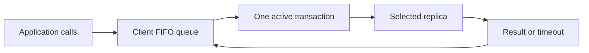
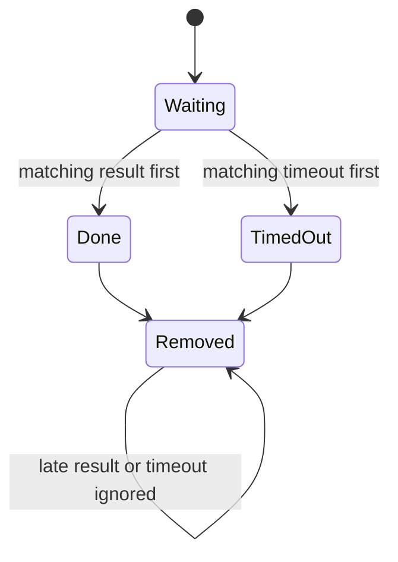
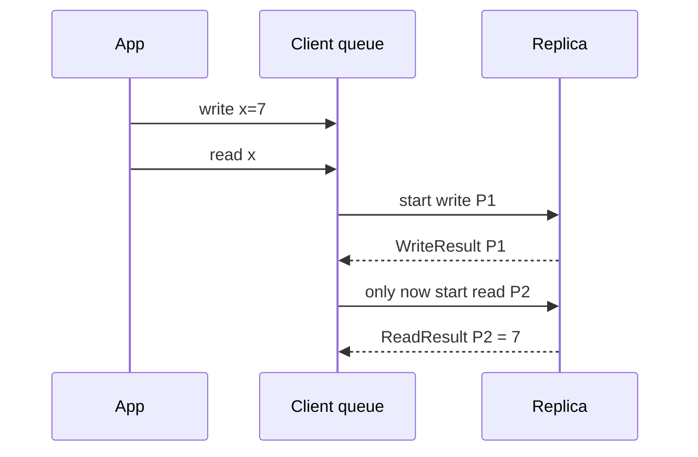
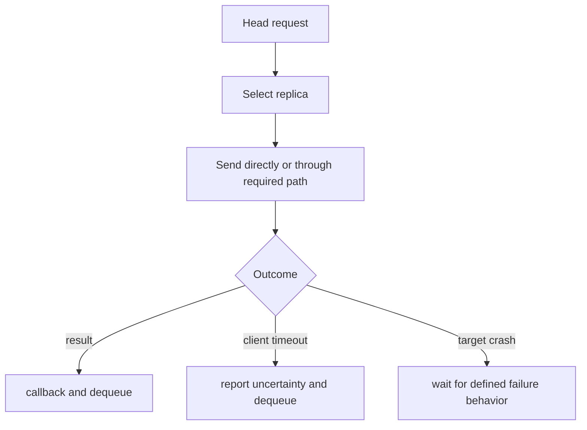
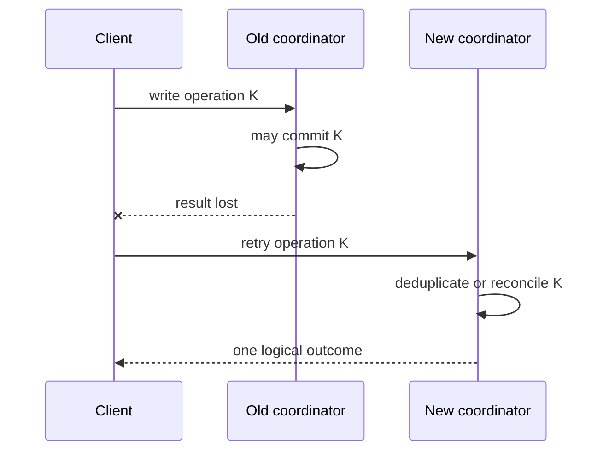
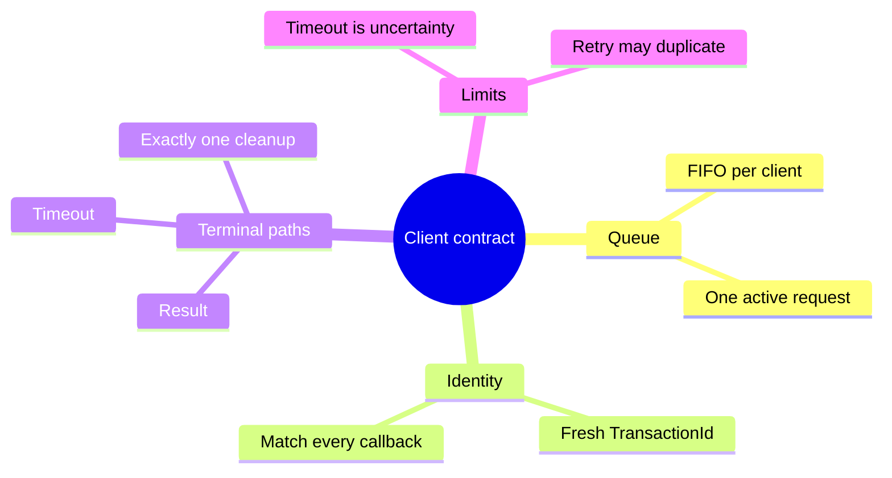

# Client API and Request Manager

> **Learning goal.** Follow a request from the public course API into a client transaction, understand why clients queue operations, and see how callbacks and timeouts turn internal events into observable results.

**Base/current snapshot:** `feature/electionTransaction` at `d1222a2`.  
**Read implementation reference:** `origin/feat/readTransaction` at `1ed58b6`.  
**Write implementation reference:** `origin/feat/UpdateTransaction` at `59bbe80`.

## 1. The client has two audiences

`Client` serves both application callers and protocol code.

Application callers use course-defined messages:

- `ReadRequest(index, optionalReplica)`
- `WriteRequest(index, value, optionalReplica)`

Protocol code uses transaction messages:

- read request/result/timeout messages;
- write request/result/timeout messages; and
- probe messages used by tests.

`AbstractClient` is the adapter between these worlds. It receives the public request and calls the abstract `sendRead` or `sendWrite` method implemented by `Client`.

## 2. Target selection

A request may name a replica directly. If it does not, `AbstractClient` uses `defaultTargetReplica`, supplied when the client actor is created.

Selection logic is:

```text
if request.replica exists:
    use it
else if client.defaultTargetReplica exists:
    use it
else:
    throw because no target exists
```

This lets tests build a client permanently associated with one replica while still allowing an individual request to override the target.

The default target is an `Optional<ActorRef>`, but request fields use null to mean absent. Students should recognize this as mixed null/Optional style inherited from the API rather than a distributed-systems concept.

## 3. Creating a client transaction

`Client.getNextTransactionId` combines the client's own `ActorRef` with a monotonically increasing local counter. The first request is `<client,0>`, the next `<client,1>`, and so on.

`sendRead` constructs `ReadTransaction`; `sendWrite` constructs `WriteTransaction`. The transaction stores request-specific fields and the chosen destination, then enters the client's scheduler.

The current election branch still has `sendRead` as TODO. The read feature branch implements it. The write path is present on the current branch but only becomes end-to-end meaningful when the update branch behavior is integrated.

## 4. Why the client serializes transactions

The client keeps one `currentTransaction` and a FIFO `scheduledTransactions` queue.

Suppose the application quickly submits:

```text
write(0, 10)
write(0, 20)
read(0)
```

The client starts the first write and queues the other two. Completion starts the next. This preserves the order in which that client exposes operations to its chosen replica and avoids one result being matched against another request.

This queue does not globally serialize all clients. Client A and client B can still submit concurrent writes. The coordinator/update protocol must impose their global order.

## 5. Sending from the client

`Client.unicast` calls `target.tell(msg, getSelf())` directly. Unlike replica-to-replica sends, it does not use `NetworkChannel`.

That means the simulated FIFO latency infrastructure primarily controls replica traffic. Client timeout values are still configurable and tests can crash the destination so no result returns. A report or exam answer should describe the implemented path exactly rather than claiming every message in the system crosses `NetworkChannel`.

## 6. Receiving and correlating results

The client's receive builder recognizes write results/timeouts explicitly on the current branch and sends them to `onMessage`. The read branch relies on the fallback `Msg` dispatcher for read messages.

`onMessage` checks:

```text
currentTransaction != null
AND currentTransaction.id == message.transactionId
```

If both hold, it calls `computeState`. Otherwise, the message is discarded as inactive or foreign.

This protects against a delayed result from transaction 3 arriving while transaction 4 is current. The check does not validate the result sender or payload; those validations belong to the transaction if required.

## 7. Timeout lifecycle

A read or write transaction schedules a timeout message to the client itself after sending the request.

On success:

1. cancel the timeout if possible;
2. invoke the success callback;
3. mark the transaction done; and
4. release the next queued transaction.

On timeout:

1. invoke the timeout callback with client, replica, index, and possibly value;
2. mark the transaction timed out; and
3. release the queue.

A timeout is a client-local observation: “I did not receive a result before my deadline.” It does not prove whether the distributed update committed elsewhere.

## 8. Callbacks are part of the API

The mandatory callbacks log and forward an event to an optional test listener:

- `callbackOnReadResult(ReadResult)`
- `callbackOnWriteResult(WriteResult)`
- `callbackOnReadTimeout(ReadTimeout)`
- `callbackOnWriteTimeout(WriteTimeout)`

The callback objects include enough data for tests to associate the outcome with its request and target. They are not protocol messages exchanged with replicas.

The static `callbackContract` check only proves that compiled code calls each callback somewhere. Runtime tests are still needed to prove it is called at the correct time with correct data.

## 9. Request/result layering

It helps to name the layers explicitly:

```text
Public request:    AbstractClient.WriteRequest
Wire request:      WriteTransaction.WriteMsg
Wire result:       WriteTransaction.WriteResultMsg
Public callback:   AbstractClient.WriteResult
```

The public classes are stable test/API objects. The wire classes carry transaction metadata. The transaction converts between them.

## 10. Failure cases

- **No target:** request handler throws before creating a transaction.
- **Destination crashed:** it ignores the request; client timeout eventually fires.
- **Late success after timeout:** after queue advancement, its old ID is foreign and is discarded.
- **Wrong ID:** discarded by `Client.onMessage`.
- **Unexpected message with correct ID:** the transaction may throw, depending on its FSM implementation.
- **Client actor failure:** not modeled by the project specification.

## 11. What current tests prove

`TestDispatcher` checks idle and foreign-message dropping. Read and write regression tests check success/timeout callback shapes. Write tests on the standalone write branch manually inject `WriteFinishMsg`, so they prove the wrapper, not a real quorum update.

The base tests are more demanding: repeated operations, different targets, crashes, and callback timing. At the current split-branch state, they cannot be treated as an integrated pass.

## 12. Exam rehearsal

**Why queue client requests?** To preserve that client's request order and keep one unambiguous active result/timeout context.

**Does a write timeout mean the write definitely failed?** No. It means the client did not observe completion by its deadline; distributed work might have partially or fully progressed.

The invariant to remember is: **a client reports an outcome only for its current transaction ID, then advances its FIFO request queue exactly once.**

## 13. The client as a small, sequential machine

<pre class="diagram">application call
      |
      v
request queue: [R1, R2, R3]
      |
      +--> start R1 + remember active TransactionId
                       |
              result or timeout callback
                       |
                       v
                 remove R1 exactly once
                       |
                       +--> start R2</pre>

The queue is not merely a performance detail. If R2 is a read that follows a
write R1, starting both at once could let the read observe the old value. A
single active request gives the client a clear session order even though many
replicas are running concurrently.

## 14. Code microscope: callback and timeout ownership

When reading a client handler, identify four operations and their order:

1. verify the callback's `TransactionId` equals the active request;
2. cancel or invalidate the request's timer;
3. invoke the application callback with the result or timeout;
4. dequeue the request and start the next one.

If step 1 is missing, a late result from an older request can complete the
new request. If step 4 is performed in both a success handler and a timeout
handler without an idempotence guard, one request can dequeue two entries.

<pre class="code-microscope">// Conceptual client completion
if (!activeId.equals(msg.transactionId())) return; // stale callback
activeTimer.cancel();
callback.onResult(msg.value());
activeId = null;
startNextQueuedRequest();
</pre>

The real code may use a callback message instead of a direct method call, but
the ownership questions stay the same: which actor owns the queue, who creates
the timer, and which path clears the active slot?

## 15. Timeout is an uncertainty result

Suppose the client times out after sending a write. The coordinator may have
already collected a majority and crashed before the result returned. Reporting
“timeout” is honest about client knowledge; it is not a rollback command. A
user interface should therefore avoid silently retrying a non-idempotent write
unless the protocol supplies an operation ID and duplicate detection. This is
also why the reports distinguish a client-visible outcome from replicated
commit state.

### Practice

Write a three-row trace for `write(5)`, `read()`, and a late write result. Mark
the active ID at every row and explain which message must be ignored. Then
design a test that proves the queue advances once when success and timeout are
delivered in either order.

<div class="page-break"></div>

## 16. Deep study plate: request queue ownership



The client actor owns both the queue and the active slot. Application calls do
not synchronously return replicated results; they enqueue work. Starting only
the head preserves that client's program order and gives every callback one
unambiguous context. Multiple clients still run concurrently because each owns
its own queue.

Inspect the point where a queued request becomes a transaction. The client must
assign a fresh ID, select a target, schedule a timeout, and remember enough
data to produce the typed callback. Those operations should occur in one actor
turn so a result cannot race an only-partly-installed active context.

<div class="page-break"></div>

## 17. Deep study plate: success and timeout race



The two terminal events are mutually exclusive by FSM state, not because the
losing event vanishes. Cleanup must cancel or invalidate the timer, emit one
callback, clear the active ID, and start the next request once. Centralizing
those actions reduces double-dequeue bugs.

Write tests in both orders. Inject success then timeout and timeout then
success. Assert the exact callback count and the ID of the next started
transaction. Testing only the happy order misses the core asynchronous race.

<div class="page-break"></div>

## 18. Deep study plate: client session order



This order supports a read-your-own-write argument when write completion
actually means the contacted replica has applied the commit. The queue cannot
repair a premature server callback. Therefore, client ordering and replica
completion semantics must be proved together.

A different client may issue a read concurrently and observe a different legal
point in the global sequential history. Sequential consistency preserves each
client's order; it does not require wall-clock real-time order between clients.

<div class="page-break"></div>

## 19. Deep study plate: target selection and failures



Target selection affects latency and observable state. A read is local to its
target. A write sent to a follower creates a wrapper that reaches the
coordinator. Replica-to-replica traffic must use `NetworkChannel`, while the
client boundary follows the project's explicit API path. Mixing these paths
can accidentally add delay twice or bypass FIFO emulation.

After target crash, the client may know only that no response arrived. Do not
invent a rollback result. A timeout is an uncertainty outcome unless the
protocol provides stronger evidence.

<div class="page-break"></div>

## 20. Deep study plate: retries need operation identity



Without a stable operation key, the retry looks like a new write. Assignment
may be harmless for the same value but callbacks and sequence history still
duplicate. The current reports should not claim exactly-once client semantics
unless the code stores and recognizes such keys across coordinator change.

For exam discussion, separate request ID, transaction ID, and update epoch.
A retry may create a new transaction while retaining a logical operation ID;
the inspected implementation may not yet model that distinction.

<div class="page-break"></div>

## 21. Student workbook: client observability



Trace queue contents, active ID, timer generation, and emitted callbacks after
every event. Add foreign-result, duplicate-result, result-after-timeout, and
timeout-after-result tests. Explain why silence from the wrong ID is correct
behavior, while silence from the matching healthy request may be a liveness
failure.
