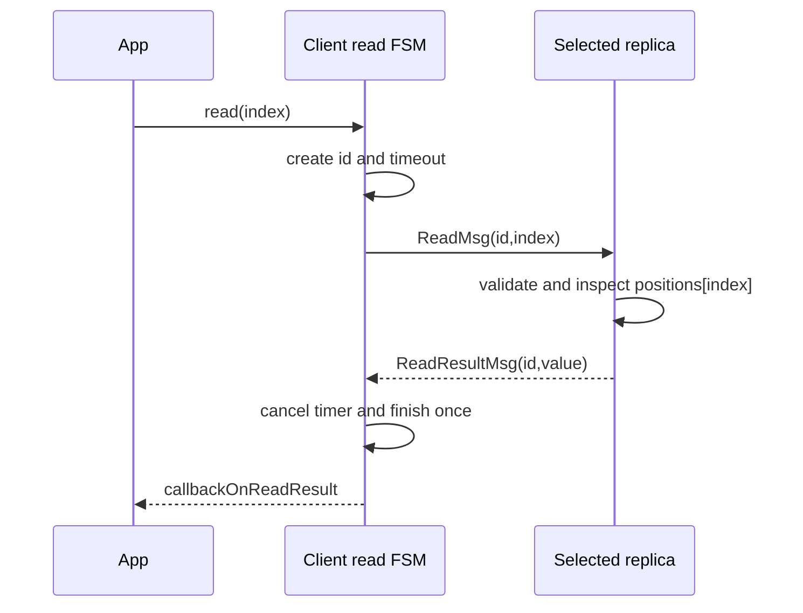
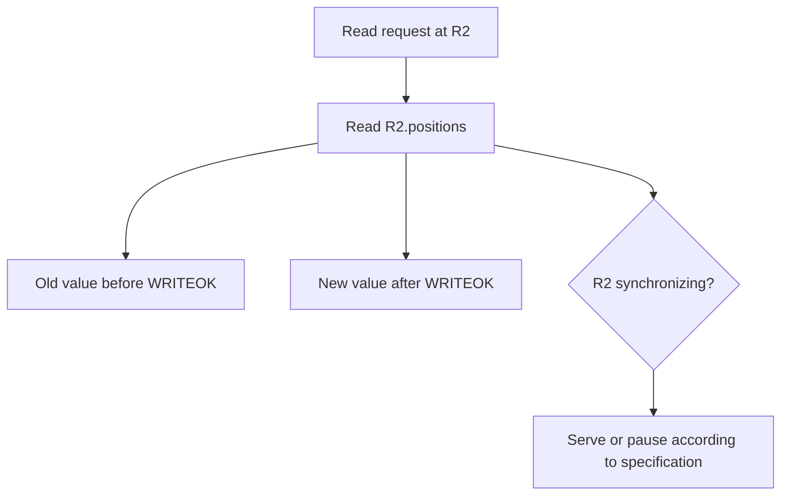
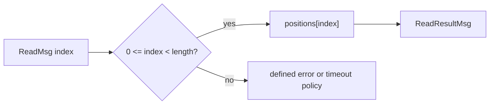
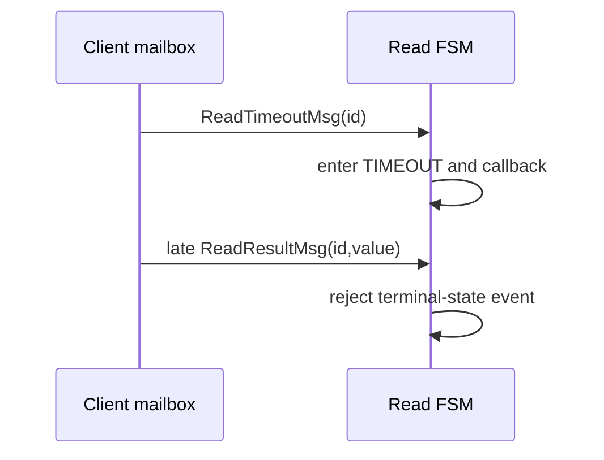
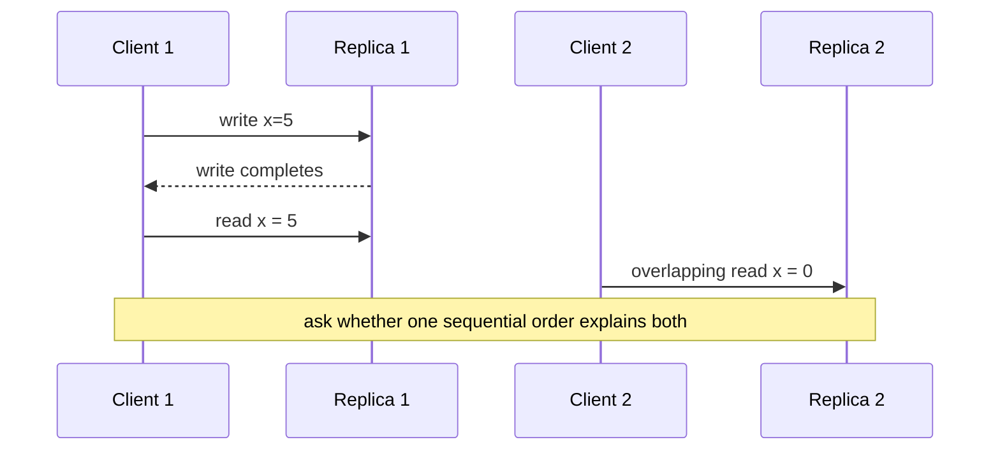
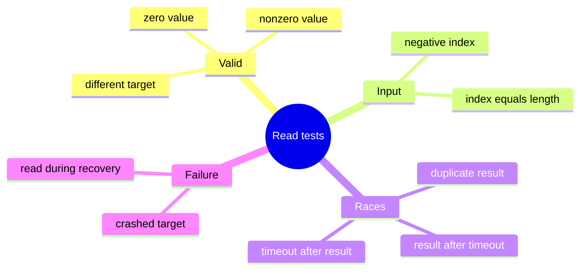

# Read Protocol

> **Learning goal.** Trace the smallest complete application protocol in the project and use it to practice actor messages, transaction states, local state access, and timeout handling.

**Implementation inspected:** `origin/feat/readTransaction` at `1ed58b6`.  
**Integration status:** implemented on a feature branch, absent from `feature/electionTransaction` at `d1222a2`.

## 1. Why read is the best first protocol

A read has one request hop and one reply hop. It does not involve the coordinator, a quorum, epochs, or recovery. That makes it a good place to learn the transaction framework before studying writes.

The protocol asks one replica: “What value is currently in your local array at this index?”

## 2. Message vocabulary

`ReadTransaction` defines three messages:

- `ReadMsg(transactionId, epochPair, sender, index)` travels from client to replica.
- `ReadResultMsg(transactionId, epochPair, sender, value, replicaId)` travels back.
- `ReadTimeoutMsg(transactionId, epochPair, sender)` is scheduled locally to the client.

The result contains the numeric replica ID because `ActorRef` alone is not the result format required by `AbstractClient.ReadResult`.

## 3. FSM states

The read FSM has:

```text
INIT -> WAITING_RESULT -> DONE
                       -> TIMEOUT
```

- `INIT`: object constructed but request not sent.
- `WAITING_RESULT`: `ReadMsg` sent and timeout scheduled.
- `DONE`: valid result converted to a public callback.
- `TIMEOUT`: deadline expired first.

There is no retry or election transition in this transaction. A timeout ends this client request.

## 4. Happy-path trace

Assume client C reads index 3 from replica R2.

1. Application sends `ReadRequest(3, R2)` to C.
2. `AbstractClient.onReadRequest` calls `Client.sendRead(R2, 3)`.
3. C allocates transaction ID `<C,0>`.
4. C creates and schedules `ReadTransaction(<C,0>, index=3, destination=R2)`.
5. `start()` sends `ReadMsg(<C,0>, sender=C, index=3)`.
6. The FSM enters `WAITING_RESULT` and schedules `ReadTimeoutMsg(<C,0>)` locally.
7. R2's receive builder matches `ReadMsg` and calls `onReadMsg`.
8. R2 reads its local `positions[3]`, suppose 44.
9. R2 replies with `ReadResultMsg(<C,0>, value=44, replicaId=2)`.
10. C routes it to the current transaction by ID.
11. The transaction cancels the timeout, enters `DONE`, invokes `callbackOnReadResult`, and completes.
12. C starts the next queued request, if any.

The replica does not create a `ReadTransaction`; only the client owns this FSM. The replica handles the request as one immediate operation.

## 5. Timeout trace

Now suppose R2 is already crash-simulated.

1. C sends the same `ReadMsg` and schedules the timeout.
2. R2 receives or has the message delivered, but its crashed behavior sends no reply.
3. Akka scheduler later enqueues `ReadTimeoutMsg(<C,0>)` to C.
4. C routes the timeout to the waiting transaction.
5. The transaction enters `TIMEOUT` and invokes `callbackOnReadTimeout(client=C, replica=R2, index=3)`.
6. The next client operation can start.

The timeout is local and intentionally does not use the network channel.

## 6. Sequential consistency meaning

Reads return local replica state. If one client always sends operations to R2 and the client queue preserves order, that client sees R2's values in R2's application order.

This is not linearizability. A read on R3 can return an older value while a valid update is still in transit. The specification accepts this local viewpoint while requiring eventual ordered application of writes.

## 7. Index validation issue

`Replica` provides `getPosition(index)`, which checks that the index is between zero and the fixed array length minus one. The inspected read branch's `onReadMsg` directly accesses `positions[msg.index]` instead.

For a valid course request, behavior is the same. For an invalid index, direct access can throw `ArrayIndexOutOfBoundsException` rather than following the explicit validation policy. This is a real implementation detail to preserve in documentation, not a feature of the intended protocol.

The specification does not clearly define invalid-client-index semantics, so a final implementation should state whether invalid input is rejected, times out, or returns a failed result.

## 8. Epoch metadata

The read branch creates `ReadMsg` with a null epoch pair and copies that metadata into the result. This is reasonable if reads are deliberately outside update ordering, but it remains a contract decision that should be explicit.

A read does not need an epoch pair to return a local value. It may still be useful to include the replica's observed epoch in a richer API, but that is beyond the supplied callback contract.

## 9. Stale result behavior

Suppose the timeout fires, the transaction completes, and then a delayed result arrives. The client now has no matching current ID—or has advanced to a newer ID—so `Client.onMessage` discards the result.

That prevents two callbacks for one request. It also means a timeout cannot later be “corrected” into success.

## 10. Tests and their limits

`TestReadTransaction.testReadTransaction` sets a replica's position to 35, sends a read, and checks success, index, and value.

`testReadTransactionTimeout` crashes the target and checks the timeout's index, replica, and client.

Useful missing cases include:

- verifying the returned `fromReplica` field in the success test;
- invalid negative and too-large indexes;
- a late result after timeout;
- several queued reads preserving order;
- reading while updates are being applied; and
- running the feature in the final integrated branch.

## 11. Code map

- `AbstractClient.ReadRequest`: public entry object.
- `Client.sendRead`: constructs and schedules the FSM.
- `ReadTransaction.start`: sends request and schedules timeout.
- `Replica.onReadMsg`: performs local lookup and replies.
- `ReadTransaction.computeState`: handles result or timeout.
- `AbstractClient.callbackOnReadResult/Timeout`: observable output.
- `TestReadTransaction`: focused branch tests.
- `charts/Transactions/transaction_Read.mmd`: success and crash sequences.

## 12. Exam rehearsal

**Why does the replica not ask the coordinator?** The project specifies local reads and sequential consistency per replica, so coordination would add cost beyond the required contract.

**Why does the timeout carry the transaction ID?** It must return through the same client dispatcher and affect only the request that scheduled it.

The invariant to remember is: **a read returns exactly one local snapshot result or one timeout callback for the currently active client transaction.**

## 13. Read FSM as a traceable state machine

<pre class="diagram">INIT --start--> WAITING_RESULT --ReadResultMsg--> DONE
                         |
                         +--------ReadTimeoutMsg--------> TIMEOUT

DONE/TIMEOUT: cancel timer, callback once, remove active transaction</pre>

The read protocol is intentionally smaller than the write protocol. It sends
one request to a chosen replica and waits. “Local read” means the selected
replica reads its own materialized array; it does not mean the client bypasses
the transaction framework or that every replica already has the same value.

## 14. Code microscope: request, validation, completion

Read the implementation in this order:

1. **Construction:** record client, target replica, index, and transaction ID.
2. **Start:** schedule a timeout and send `ReadMsg` to the target.
3. **Replica handler:** validate the message belongs to this read and obtain
   the value at the requested index.
4. **Result handler:** stop accepting duplicate results, cancel the timer, and
   call `callbackOnReadResult`.
5. **Timeout handler:** use the same cleanup path but call
   `callbackOnReadTimeout`.

In the read feature branch, the replica-side `onReadMsg` directly indexes the
positions array in one path. That is a useful code-review lesson: a protocol
can have a correct happy-path FSM while still lacking input validation. A
negative or too-large index should produce a controlled failure/timeout rather
than an accidental `ArrayIndexOutOfBoundsException`.

<pre class="code-microscope">// Safer conceptual boundary
if (index &lt; 0 || index &gt;= positions.length) {
    replyInvalidIndexOrTimeout(msg.transactionId());
    return;
}
reply(new ReadResultMsg(msg.transactionId(), positions[index]));</pre>

## 15. Sequential consistency and stale results

If one client queues `write(x=7)` followed by `read(x)`, the client queue
prevents the read from starting before the write transaction completes. If a
different client reads a lagging follower, the result can still be older; that
is a system-level replication question, not a read-FSM bug. During recovery,
the read target should also be checked against the protocol's “safe to serve”
state if the specification forbids reads from a stale replica.

### Practice

Add tests for invalid index, duplicate `ReadResultMsg`, result-after-timeout,
and a read sent to a crashed target. For each, state whether the expected
outcome is a callback, a timeout, or silent stale-message rejection.

<div class="page-break"></div>

## 16. Deep study plate: complete read path



The replica obtains the value at handling time. The client owns the timeout
and externally visible callback. Keeping these responsibilities separate makes
it clear why a replica cannot complete the next client request and why the
client cannot safely index replica state directly.

Record sender and target in a trace. A result with the correct ID but from a
different replica should be evaluated against the protocol's sender policy,
not accepted merely because the value type is correct.

<div class="page-break"></div>

## 17. Deep study plate: local-read meaning



Local means no coordinator round trip. It does not mean the value is always
globally latest. The consistency argument chooses a sequential point compatible
with the value R2 currently exposes. If R2 is in recovery, the design must say
whether its state can still be placed in a legal history or whether reads are
paused until installation completes.

Avoid calling local reads linearizable. Linearizability adds real-time order;
the project targets sequential consistency, which preserves program order but
can place overlapping operations differently.

<div class="page-break"></div>

## 18. Deep study plate: invalid index boundary



Input validation belongs immediately before array access. In the inspected read
branch, a direct indexing path can throw before a controlled protocol outcome.
That exception is not an acceptable distributed reply: the client may only see
silence and the actor may restart according to supervision rules outside the
intended model.

Tests should cover `-1`, exactly `length`, and a very large index. State the
desired callback contract first; then modify or assess the handler. Validation
helpers are useful only if every path calls them.

<div class="page-break"></div>

## 19. Deep study plate: terminal race



Reverse the order and success must win. Transaction removal may cause the
dispatcher to drop the late event before the FSM sees it; either layer is safe
if callback count remains one. The report should name which layer the real
branch uses.

Timeout payloads need the transaction ID because they share a dispatcher with
network results. A bare “read timed out” event risks terminating whatever read
happens to be active when it arrives.

<div class="page-break"></div>

## 20. Deep study plate: read consistency history



To judge the history, include the write's replication/commit interval and both
clients' program orders. C1's later read must follow its write. C2's read may
be placed before the write if the operations overlap and the implementation's
visibility rules permit it. If C2 reads 0 after observing another later write,
the required order may become impossible.

This reasoning is more precise than comparing wall-clock log lines, whose
timestamps do not define a global serialization.

<div class="page-break"></div>

## 21. Student workbook: test matrix



For each leaf, specify initial positions, target actor, messages injected,
expected callback, and forbidden second callback. Then state whether the test
proves the local FSM, the client queue, or a cross-subsystem consistency claim.

<div class="page-break"></div>

## 22. Lecture synthesis: a local read still has a distributed meaning

The read protocol has few messages, but its semantics depend on the rest of the
system. A contacted replica obtains `positions[index]` from actor-owned state
and returns it. That operation is local and does not contact a quorum. The
answer is meaningful only because the update protocol defines when values may
enter `positions`, and recovery defines which state may be served after a term
change. Simple mechanics therefore sit on top of a nontrivial consistency
argument.

This is a useful lesson in interface design: “read the local array” describes
an implementation step, not a consistency level. To explain the contract, we
must relate the result to a legal ordering of operations. The specification
uses sequential consistency from each replica/client perspective, so the task
is to find a single sequential history that preserves required program orders
and produces the observed values. Wall-clock completion order alone does not
construct that history.

### 22.1 Sequential consistency as a history exercise

Imagine C1 sends `write(x,5)` and waits for success before sending `read(x)`.
The client queue orders the read after the write, so a legal history for C1
must preserve that order. If the read returns 0 from the same logical session,
either the write callback was emitted too early or visibility/session routing
is wrong. By contrast, an overlapping read by C2 may be placed before the write
in the sequential explanation if no required program-order edge forbids it.

Sequential consistency is weaker than linearizability. It does not require the
chosen order to respect every real-time precedence between independent
clients. That does not make it arbitrary: each participant's required order
must be preserved, and every returned value must match the latest preceding
write to that index in the proposed sequence. Writing the candidate history is
more reliable than describing an outcome as merely “fresh” or “stale.”

### 22.2 The visibility point comes from WRITEOK

A participant may know about an UPDATE before it applies it. If reads exposed
the proposed value immediately, one replica could return a value from an
update that never gained quorum. The intended visibility point is the valid
commit/materialization transition associated with WRITEOK. Therefore the read
handler can be simple only if the state layer respects observed-versus-
committed separation.

During recovery, the system also needs a read policy. Serving the old snapshot
may be safe for some defined histories but surprising; serving a partially
installed snapshot can expose combinations never committed together. Blocking
or rejecting reads during synchronization is often easier to reason about, but
the exact policy must be stated and tested rather than inferred from the
presence of a read handler.

### 22.3 Validation belongs before array access

An invalid index is not a distributed timeout. It is an input-domain error
that can be detected synchronously within the receiving actor turn. Bounds
must be checked before direct array indexing so the actor does not throw and
enter Akka's supervision behavior. The callback or error policy should be
consistent with the course API and should still release the client's current
transaction.

This boundary case teaches a broader rule: validate data at the point where it
crosses into an assumption-heavy operation. The array assumes `0 <= index <
length`; the FSM assumes a matching ID; the result handler assumes the expected
sender. Each guard turns a runtime accident into an explicit protocol outcome.

### 22.4 Result and timeout form a terminal race

The replica's reply and the client's scheduled timeout travel independently.
A result can be enqueued just before the deadline but handled after a timeout
already in the mailbox. The client does not need a universal clock to resolve
this race. It needs a local rule: the first valid terminal transition wins,
completion clears the active FSM, and the later event is ignored by ID/state.

Tests should assert both the chosen callback and the absence of a second one.
They should also inject foreign and duplicate results explicitly. A test that
only performs one healthy read establishes the happy path but says nothing
about the protocol boundary where most asynchronous bugs occur.

### 22.5 What a read test can and cannot prove

A focused read test can prove request construction, routing, local bounds
handling, result correlation, timeout behavior, and one callback. It cannot by
itself prove that prior writes were committed in total order or that recovery
installed a safe snapshot. To make that claim, start from a multi-replica
history containing writes and failures, then use reads as observations of the
resulting state. The read is the measuring instrument; the update and recovery
protocols create the property being measured.
