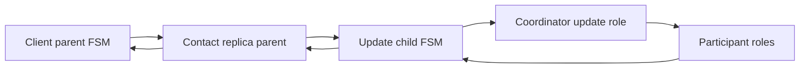
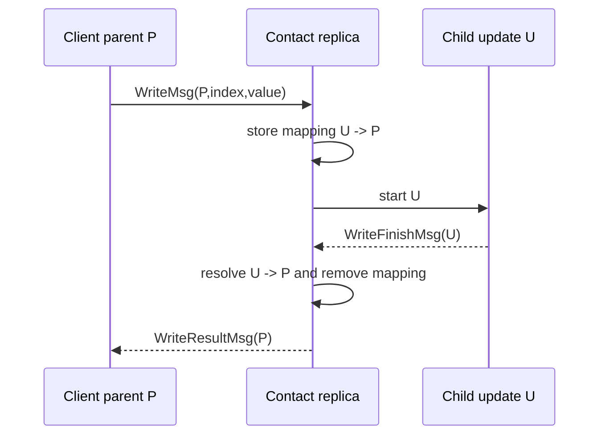
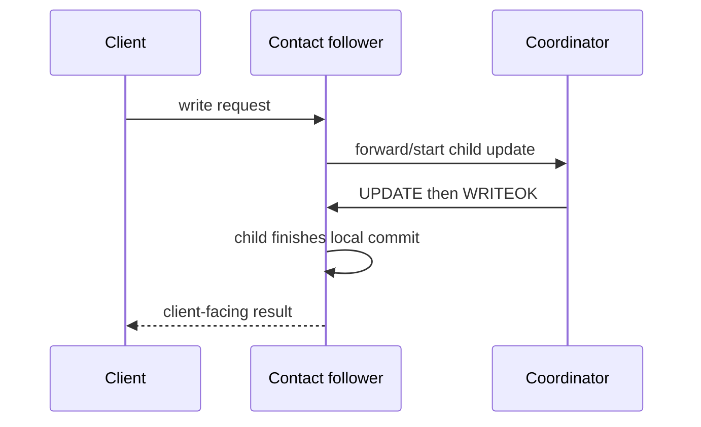
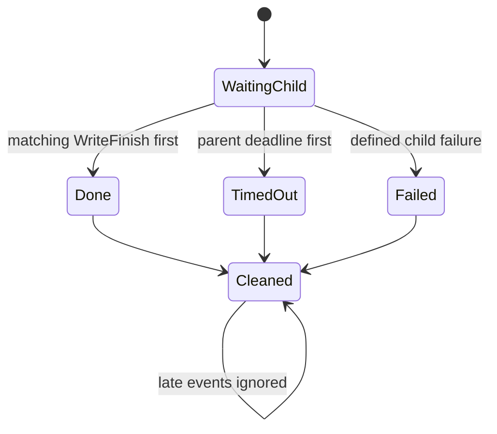
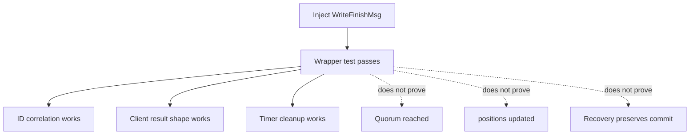
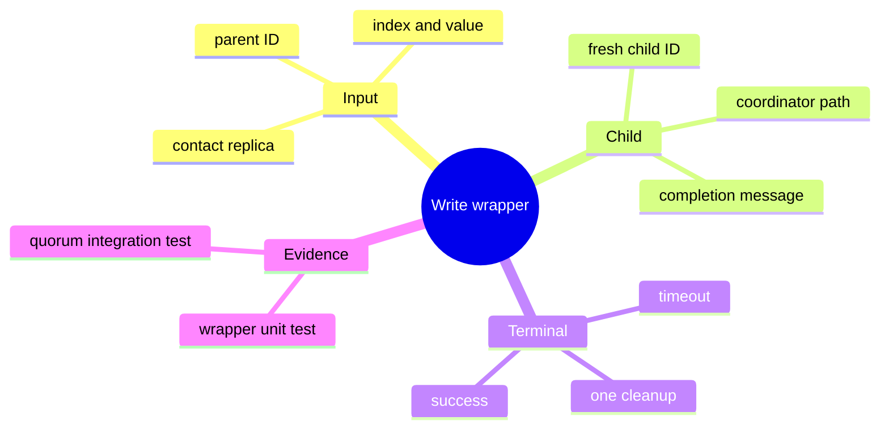

# Write Request Orchestration

> **Learning goal.** Separate the client-facing write conversation from the distributed UPDATE/ACK/WRITEOK algorithm and understand how parent and child transactions coordinate.

**Wrapper implementation:** `origin/feat/WriteTransaction` at `8c42a18`.  
**Child-update integration reference:** `origin/feat/UpdateTransaction` at `59bbe80`.  
**Current election branch:** contains the wrapper but leaves child update creation as TODO.

## 1. Two protocols hide behind “write”

When a client says `write(index, value)`, two different conversations begin:

1. **WriteTransaction:** client ↔ contacted replica. It owns the client's result and timeout.
2. **UpdateTransaction:** replicas ↔ coordinator ↔ replicas. It owns quorum broadcast and application.

Keeping them separate makes each FSM smaller. It also creates a correlation problem: the child update must eventually finish the correct parent write.

## 2. Write message vocabulary

`WriteTransaction` defines:

- `WriteMsg`: client request sent to the contacted replica.
- `WriteFinishMsg`: local notification that the replica-side parent may finish.
- `WriteResultMsg`: contacted replica's reply to the client.
- `WriteTimeoutMsg`: client-local timeout.

`WriteTransactionMsg` is a shared message base containing index and value.

The client public API objects `WriteRequest`, `WriteResult`, and `WriteTimeout` remain separate from wire messages.

## 3. FSM roles

The same class runs with two owner types.

### Client-owned instance

```text
INIT -> WAITING_RESULT -> DONE
                       -> TIMEOUT
```

It sends `WriteMsg`, schedules the client's deadline, and produces the public callback.

### Replica-owned instance

```text
INIT -> WAITING_UPDATE -> DONE
```

It starts the child `UpdateTransaction`. When it receives `WriteFinishMsg`, it returns `WriteResultMsg` to the original client.

## 4. Happy-path trace across both layers

Assume client C contacts follower R2 while R0 is coordinator.

1. C creates `WriteTransaction` ID `<C,0>` and sends `WriteMsg(<C,0>, index=4, value=99)` to R2.
2. C enters `WAITING_RESULT` and schedules `WriteTimeoutMsg(<C,0>)`.
3. R2 receives the new write and creates its own replica-side `WriteTransaction`, deliberately using parent ID `<C,0>` so later completion routes to it.
4. R2 allocates a separate child ID, for example `<R2,0>`, and starts `UpdateTransaction` with both IDs:
   - child ID `<R2,0>` for update messages;
   - parent write ID `<C,0>` stored as `writeTid`.
5. The update protocol reaches commit on R2.
6. The child sends local `WriteFinishMsg(transactionId=<C,0>)` to R2 itself.
7. R2 routes that message to the parent `WriteTransaction`.
8. Parent sends `WriteResultMsg(<C,0>, index=4, value=99, replicaId=2)` to C.
9. C routes by `<C,0>`, cancels its timeout, invokes `callbackOnWriteResult`, and advances its queue.

## 5. Why parent and child need different IDs

R2 hosts both parent and child at the same time. `Replica.onMessage` scans active transactions and stops at the first matching ID.

If both used `<C,0>`, an `UpdateAckMsg` or `WriteFinishMsg` could be delivered to whichever object appears first. Distinct IDs preserve local dispatch:

```text
<C,0>  -> parent WriteTransaction
<R2,0> -> child UpdateTransaction
```

`writeTid` is an explicit return address from child FSM to parent FSM.

## 6. The coordinator-contact case

If C contacts the coordinator directly, the replica-side parent still creates a child update ID owned by that replica. The child recognizes that its owner is coordinator and starts the coordinator role directly rather than sending an update request through the network to itself.

This avoids the `Replica.unicast` self-send guard. Algorithms must not assume self-unicast will deliver.

## 7. Client timeout semantics

The client's write timer covers the whole operation: contacted replica processing, coordinator forwarding, quorum exchange, completion return, and possibly recovery.

If the timer fires, C reports `WriteTimeout`. This does not undo update work. A partially completed update may be recovered later. The client API has no query transaction to resolve an uncertain timeout.

The timeout branch should cancel or otherwise invalidate any success path so only one callback appears. Late `WriteResultMsg` is discarded once the client advances to another ID.

## 8. Crash cases by layer

- **Contacted replica crashes before receiving `WriteMsg`:** no child update exists; client times out.
- **Contacted replica crashes after forwarding:** update may continue, but the client may not receive the result because the parent owner is dead.
- **Coordinator crashes before `UPDATE`:** initiating replica's child update timeout should trigger election/retry.
- **Coordinator crashes after quorum:** recovery must preserve uniform agreement; client outcome may still be uncertain.
- **Client times out while replicas continue:** distributed correctness and client-observed success are different properties.

## 9. Current implementation status

The standalone write branch tests the wrapper by manually scheduling `WriteFinishMsg` at the replica. That proves request/result/timeout plumbing but does not prove a real update occurred.

The update branch wires child creation into replica-owned `WriteTransaction`, but it remains partial. The current election branch regressed to a TODO at that exact integration point because the update feature has not been merged there.

Therefore documentation must not say “WriteTransaction implements quorum broadcast.” It delegates quorum broadcast to another subsystem.

## 10. Tests and missing cases

Existing wrapper tests cover:

- result conversion after an injected finish message; and
- timeout when the contacted replica is crashed.

Needed integrated cases include:

- child update really applies the value before finish;
- follower and coordinator contact paths;
- separate parent/child ID routing;
- crash after forwarding but before returning result;
- multiple queued client writes;
- late finish after client timeout; and
- the result's `replicaId` meaning the contacted replica, not necessarily coordinator.

## 11. Code map

- `AbstractClient.WriteRequest`: public request.
- `Client.sendWrite`: creates the client parent.
- `Replica.onWriteMsg`: creates the replica parent.
- `WriteTransaction.start`: chooses client or replica role.
- `UpdateTransaction(..., writeTid)`: child link on update branch.
- `WriteFinishMsg`: child-to-parent local completion.
- `WriteResultMsg`: replica-to-client completion.
- `TestWriteTransaction`: wrapper-level tests.

## 12. Exam rehearsal

**Why not use one transaction object from client through every replica?** Objects are actor-local mutable FSMs. Messages cross actor boundaries; each actor owns its own transaction instance.

**What does `WriteFinishMsg` prove?** Only that the child says the replica-side write may finish. Correctness depends on sending it after valid local update completion.

The invariant to remember is: **the client-facing parent completes only after its separately identified child update reports completion, and correlation returns through the original parent ID.**

## 13. Why the write wrapper has two levels

<pre class="diagram">Client
  |
  +--> WriteTransaction (parent, client-owned)
          |
          +--> UpdateTransaction (child, replica/coordinator-owned)
                         |
                  quorum + WRITEOK
                         |
          WriteFinishMsg (child -> parent)
          WriteResultMsg (parent -> client)</pre>

The parent gives the client a stable lifecycle: one timeout and one final
callback. The child speaks the replica protocol and may need many network
messages. Keeping them separate prevents a network ACK from being mistaken for
a client result.

## 14. Code microscope: correlation across an actor boundary

At parent start, the code should create a fresh child ID and retain a mapping
from child to parent. The child must include enough metadata in
`WriteFinishMsg` for the parent to verify that it is the expected child. The
parent then sends `WriteResultMsg` using the original client-facing ID.

<pre class="code-microscope">// Conceptual correlation table
parentId = (clientRef, 41)
childId  = (coordinatorRef, 8)
children.put(childId, parentId)

onWriteFinish(msg):
    if (!children.containsKey(msg.childId())) return; // stale/foreign
    completeClient(children.remove(msg.childId()), msg.value())</pre>

Do not infer that two IDs are equal because they represent one logical write.
They live in different actor namespaces. This is the same identity lesson as
`TransactionId` versus `EpochPair`, now applied to a parent/child boundary.

## 15. Timeout races and honest outcomes

There are at least three completion races: child success before parent timeout,
parent timeout before child success, and child failure while the timer is being
cancelled. A robust wrapper makes completion idempotent. After the parent has
entered `DONE` or `TIMEOUT`, a late `WriteFinishMsg` is ignored and cannot call
the application callback a second time.

The standalone write branch's tests that inject `WriteFinishMsg` are useful,
but they do not prove that a real `UpdateTransaction` reached a quorum. Treat
them as wrapper tests and pair them with integration tests for the child.

### Practice

Draw the three races above and label which actor owns each timer. Then explain
why a client retry needs an idempotency key if the first child may have already
committed after the parent timed out.

<div class="page-break"></div>

## 16. Deep study plate: wrapper boundaries



The wrapper translates a simple client operation into a distributed protocol.
The parent cares about one terminal result and deadline; the child cares about
coordinator routing, quorum, epochs, and WRITEOK. A wrapper test can validate
translation even when the child is replaced by an injected completion message.
It cannot prove the quorum protocol.

Identify the owner of every arrow. Objects remain local; only messages cross
actor boundaries. This prevents accidental assumptions that the client and
replica share one mutable `WriteTransaction` instance.

<div class="page-break"></div>

## 17. Deep study plate: ID translation



The mapping is protocol state. It should be installed before child work can
complete, removed exactly once, and rejected if a foreign child ID arrives.
Logging both IDs on every transition makes branch-level tests far easier to
interpret.

If multiple parent writes can coexist at a replica, a single `writeId` field is
insufficient. The active transaction map or explicit correlation map must keep
each relationship separate.

<div class="page-break"></div>

## 18. Deep study plate: contacting a follower



The follower is not allowed to invent the global order. It forwards the update
to the current coordinator and later participates like other replicas. The
client result should not be sent merely because forwarding succeeded; it must
wait for the child completion condition defined by the update protocol.

Coordinator changes complicate this path. A stored coordinator reference may
be stale, so timeout and election integration must define whether the wrapper
waits, retries, or reports uncertainty.

<div class="page-break"></div>

## 19. Deep study plate: three completion races



Every terminal path must remove parent-child correlation, invalidate timers,
emit at most one callback, and release the client queue. Model these effects as
one termination routine or prove equivalent guards in each handler.

Test a finish and timeout in both orders. Then inject a second finish. The
expected result is not an exception; it is stable terminal state and one
observable callback.

<div class="page-break"></div>

## 20. Deep study plate: what wrapper tests establish



This evidence boundary should appear in every report that cites
`TestWriteTransaction`. A test double is valuable because it isolates the
parent. Integration tests must later run a real child across several replicas
and verify both callbacks and state.

When a test manually manufactures completion, inspect whether it could create
an impossible sender or ID. A permissive wrapper might pass the test yet accept
messages no real child should be able to send.

<div class="page-break"></div>

## 21. Student workbook: design the wrapper contract



Write preconditions and postconditions for parent start, child completion, and
parent timeout. Include the mapping state in each postcondition. Then draw a
trace in which the client times out but the child commits later; explain why
the callback remains timeout and why replicated recovery must still preserve
the update.
