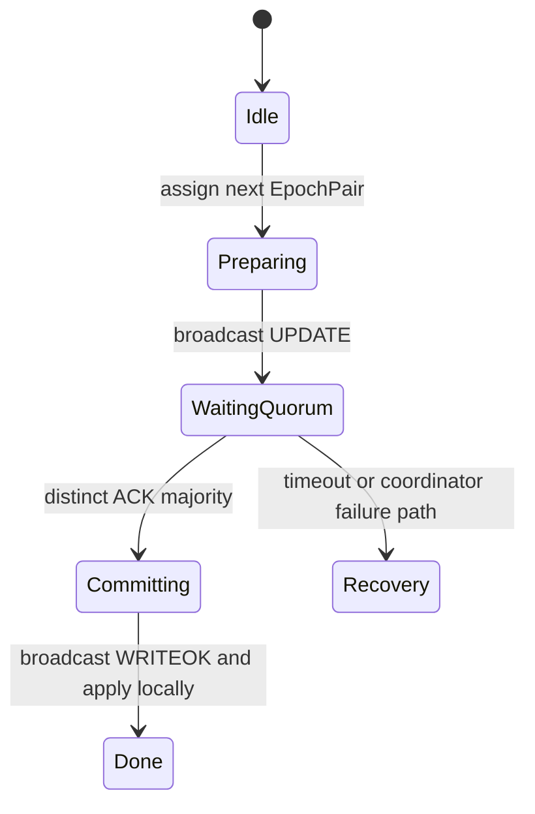
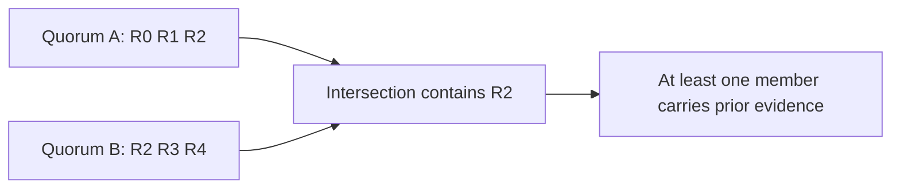
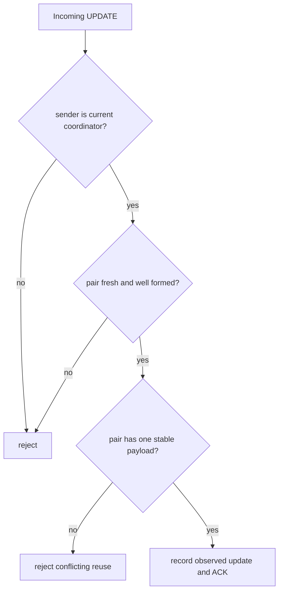
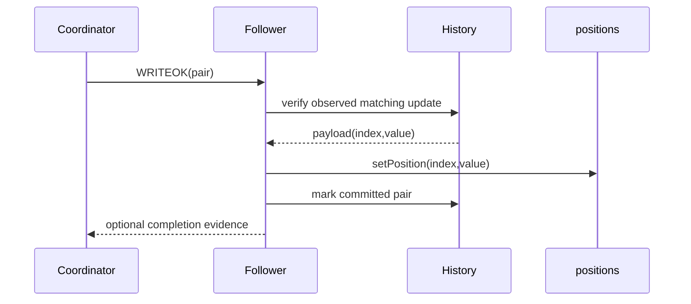
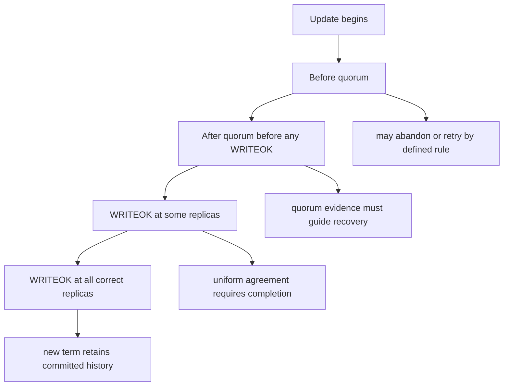
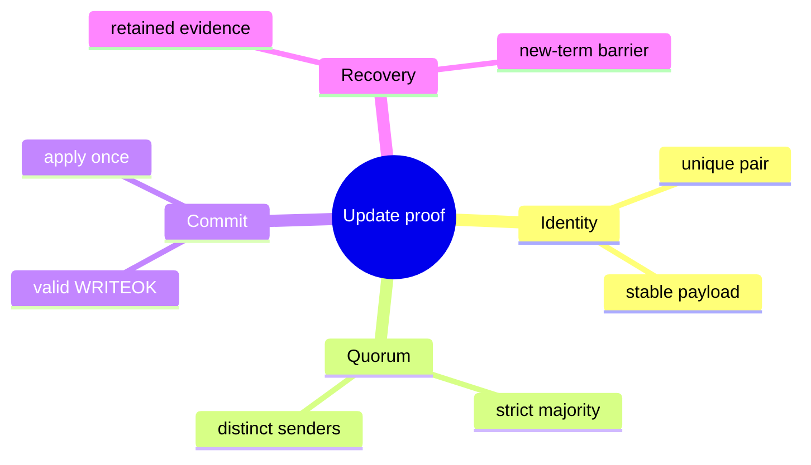

# Quorum Update and Total-Order Broadcast

> **Learning goal.** Understand the central distributed algorithm—why it has UPDATE, ACK, and WRITEOK phases; how a quorum helps; and which parts of the inspected branch remain incomplete.

**Partial implementation inspected:** `origin/feat/UpdateTransaction` at `59bbe80`.  
**Integration status:** not present on `feature/electionTransaction` at `d1222a2`.

## 1. The purpose of the update protocol

Writes must be applied in the same order by every correct replica. The coordinator acts as the sequencing point. It does not immediately tell replicas to mutate their arrays; it first ensures a strict majority knows about the proposed update.

The two phases are:

```text
Phase 1: UPDATE -> ACK until quorum
Phase 2: WRITEOK -> apply/commit
```

The ACK phase creates recovery evidence. Because any two strict majorities intersect, a future surviving majority contains at least one member of an earlier majority. Under the project's assumptions, election can find knowledge of the newest relevant update.

## 2. Three local roles

One logical update creates local `UpdateTransaction` FSMs with different roles.

### Trigger replica

The contacted replica owns the parent `WriteTransaction`. Its child update forwards the request to the coordinator, waits for the coordinator's broadcast, then behaves as a participant. It stores `writeTid` so it can finish the parent later.

### Coordinator

The coordinator broadcasts `UpdateMsg`, counts itself as one ACK, collects participant ACKs, broadcasts `WriteOkMsg` after quorum, and commits locally.

### Other participant

A follower creates a local FSM when it first receives `UpdateMsg`, replies with ACK, waits for WRITEOK, and commits when it arrives.

## 3. Message vocabulary

- `UpdateMsg(id, epochPair, sender, index, value)` proposes the update.
- `UpdateAckMsg(id, epochPair, sender)` acknowledges knowledge of it.
- `WriteOkMsg(id, epochPair, sender, index, value)` authorizes application.
- `UpdateTimeoutMsg` detects silence before expected UPDATE progress.
- `WriteOkTimeoutMsg` detects a coordinator that sent UPDATE but did not finish.

All replicas participating in one update use the same update transaction ID so messages route to their local representations of that conversation.

## 4. Healthy five-replica trace

Assume R0 is coordinator, R2 is contacted, and quorum size is 3.

1. R2 creates child update `<R2,0>` and sends `UpdateMsg` to R0.
2. R2 enters `WAITING_UPDATE` and schedules `UpdateTimeoutMsg`.
3. R0 receives the message, creates coordinator FSM `<R2,0>`, and broadcasts UPDATE to R1–R4.
4. R0 sets ACK count to one for itself.
5. R2 receives the coordinator broadcast, cancels its first timeout, sends ACK, and waits for WRITEOK.
6. R1, R3, and R4 each create participant FSMs, ACK, and wait for WRITEOK.
7. After any two distinct follower ACKs, R0 has count three and reaches quorum.
8. R0 broadcasts WRITEOK and commits locally.
9. Each follower commits on WRITEOK.
10. R2 sends local `WriteFinishMsg` to its parent write transaction.
11. The parent returns success to the client.

Late ACKs after quorum are no longer needed for the decision. Late replicas should still receive reliable WRITEOK and eventually apply.

## 5. Quorum mathematics

The implementation computes:

```text
replicaCount / 2 + 1
```

with integer division, which equals `floor(N/2)+1`.

For `N=3`, quorum is 2. For `N=5`, quorum is 3. A strict majority matters because two majorities intersect. Two sets of size 2 in a four-node system can be disjoint, but strict majorities of size 3 cannot.

Quorum intersection supplies at least one shared witness. It does not automatically implement recovery; the witness must retain and communicate sufficient immutable update history.

## 6. Total order requires more than FIFO

FIFO from the coordinator ensures each follower receives coordinator messages in send order. Total order additionally requires the coordinator to serialize concurrent update decisions and assign stable `EpochPair`s.

A sound normal-term design is:

1. coordinator accepts one update ordering decision at a time, or otherwise maintains an explicit ordered pipeline;
2. it assigns a unique next pair before broadcasting UPDATE;
3. the same pair travels in UPDATE, ACK, and WRITEOK;
4. replicas buffer or reject out-of-order operations according to a defined rule; and
5. duplicates are recognized by the pair.

The inspected branch does not yet establish all these points.

## 7. What the branch currently implements

The branch contains role selection, broadcast, ACK counting, quorum calculation, WRITEOK broadcast, timeouts, parent completion plumbing, epoch advancement, history insertion, and update callbacks.

This is meaningful scaffolding, but the following observed limitations prevent treating it as a complete total-order implementation:

- The proposed update is broadcast with `startEpochPair`, which can be null; a stable next update pair is not assigned before phase one.
- ACK count increments per message without a set of distinct ACK senders, so duplicate ACKs are not explicitly prevented from counting twice.
- `termination` advances the epoch pair and invokes `callbackOnUpdateApplied`, but the inspected method does not call `setPosition(index, value)`; the array itself is not visibly mutated there.
- Timeout branches that should trigger election/recovery are commented out.
- History stores the mutable `UpdateTransaction` rather than a small immutable update record.
- Concurrent coordinator updates are not shown as serialized.
- No validation rejects stale epoch, wrong coordinator, mismatched value, or malformed sender.

These are implementation-status facts, not changes made by this documentation task.

## 8. Coordinator failure windows

### Before broadcasting UPDATE

Only the trigger replica knows the client request. Its `UpdateTimeoutMsg` should detect silence, trigger election, and retry after a new coordinator is synchronized.

### After some UPDATE deliveries, before quorum

Some replicas have observed the update. Recovery must decide whether it could have been or must become committed. The specification emphasizes not losing any update that may have been applied.

### After quorum, before all WRITEOK deliveries

The update has majority evidence. Some replica may already apply it. The new coordinator must complete it across correct replicas to preserve uniform agreement.

### After all WRITEOK deliveries, before client result

The database update can be successful even though the client times out because the contacted replica or return path failed.

## 9. Duplicate and late-message policy

A finished design needs explicit behavior for:

- repeated UPDATE with the same pair;
- repeated ACK from the same replica;
- repeated WRITEOK;
- WRITEOK received without known UPDATE;
- old-epoch messages after election;
- ACKs arriving after the transaction completed; and
- two payloads claiming the same `EpochPair`.

Integrity requires at-most-once application. Silent ignoring is appropriate for some stale messages; conflicting payloads may indicate an invariant violation and deserve logging or rejection.

## 10. Tests and evidence

`TestUpdateTransaction` checks successful `WriteResult` for three/five replicas and coordinator IDs zero/one. It also checks client timeout when the contacted replica or coordinator is crashed.

Those tests do not inspect every replica's `positions[]`, update history, epoch equality, distinct ACK set, duplicate application, concurrent updates, or recovery. A success callback alone cannot prove total-order broadcast.

The base `NoCrashes` and `WithCrashes` tests express stronger end-to-end expectations, but the split feature state means their passing status must be re-established on the final integrated commit.

## 11. Code map

- `WriteTransaction.start` on replica: creates the child update.
- `UpdateTransaction.start`: selects trigger/coordinator/participant role.
- `Replica.onUpdateMsg`: creates a local FSM or routes to an existing one.
- `startAsCoordinator`: phase-one broadcast and self-count.
- `coordinatorStateMachine`: ACK quorum and WRITEOK.
- `replicaStateMachine`: UPDATE ACK and WRITEOK wait.
- `termination`: current commit/callback/history path.
- `TestUpdateTransaction`: focused branch scenarios.
- `transaction_Write.mmd`: intended healthy exchange.

## 12. Exam rehearsal

**Why ACK before applying?** The coordinator first establishes majority knowledge, creating fault-tolerant recovery evidence. WRITEOK is the ordered commit instruction.

**Why does the coordinator count itself?** It is also a replica and knows the update it is broadcasting, so its local participation belongs to the quorum.

**Does quorum alone guarantee total order?** No. It must be combined with one stable coordinator term, unique ordered update IDs, serialized decisions, FIFO dissemination, and recovery across term changes.

The invariant to remember is: **a replica applies an update only once, after valid WRITEOK for a unique ordered pair, and quorum evidence must survive coordinator replacement.**

## 13. The two-phase update on one page

<pre class="diagram">Coordinator                    Followers
     | -- UPDATE(index,value,epoch) ---------> |
     | <------------- ACK -------------------- |
     |                                         |
  quorum reached                              |
     | -- WRITEOK(epoch) --------------------> |
     | <------ apply once + callback --------- |
     v
  record committed history</pre>

`UPDATE` is a prepare/knowledge message: the follower can record that it has
seen the proposed value. `ACK` says “I accepted this proposal,” not “the
application has become visible everywhere.” `WRITEOK` is the commit instruction
that lets each replica materialize the value. This distinction explains why a
quorum count alone cannot be used as a read result.

## 14. Code microscope: coordinator and participant roles

When studying `UpdateTransaction`, first classify the role selected by the
incoming message. The coordinator creates the ordered pair, tracks responders,
and decides when the strict majority is met. A participant validates sender,
index, epoch, and duplicate status before ACKing. Both roles must converge on
the same “already committed?” check before applying WRITEOK.

<pre class="code-microscope">// Conceptual quorum decision
acks.add(sender)
if (acks.size() &gt; replicas.size() / 2) {
    committed = true
    broadcast(WriteOK(epoch))
}

// Participant-side idempotence
if (history.contains(epoch)) return; // duplicate WRITEOK
if (!committedEpochIsValid(epoch)) return;
applyOnce(index, value)
history.add(epoch)</pre>

The concrete branch has important review points: the starting epoch pair may
be nullable or reused, ACKs need a distinct sender set rather than a raw count,
and the observed termination path must actually call `setPosition(index,
value)`. A callback or history append without that materialized-state mutation
would report success while reads still return the old value.

## 15. Quorum arithmetic and failure windows

For `N=5`, a strict majority is 3. If the coordinator counts itself, it needs
two remote ACKs; if it does not, it needs three remote ACKs. Write this down
before reading a test, because the two interpretations produce different crash
tolerance. A quorum that survives a coordinator crash is useful only if the
new coordinator can identify the committed or partially prepared epoch.

The dangerous window is “quorum reached, WRITEOK not everywhere.” Election and
recovery must preserve that update or deliberately prove it was not committed.
Starting a new sequence number before resolving the window can create two
orders for the same logical history.

### Practice

For three, five, and six replicas, calculate the strict-majority threshold and
the maximum number of failures tolerated before progress stops. Then write a
test that delivers duplicate ACKs from one sender and proves they count once.

<div class="page-break"></div>

## 16. Deep study plate: coordinator sequencing



Only the active coordinator term may assign the next pair. Concurrent client
writes therefore need serialization or an explicit rule that reserves unique
sequence numbers before their broadcasts overlap. A mutable “current pair”
shared by several coordinator FSMs can make ACKs or WRITEOKs refer to the wrong
payload.

Read coordinator code with a ledger: assigned pair, payload, ACK sender set,
state, and timeout attempt. Every handler should mutate one row of that ledger,
not a global field whose meaning changes when another update starts.

<div class="page-break"></div>

## 17. Deep study plate: strict-majority intersection



With five replicas, any two sets of three intersect. This mathematical fact
supports recovery only if ACK knowledge is actually retained and election can
prefer a candidate carrying it. Counting three messages is not enough when one
sender can appear twice. Use a set keyed by stable replica identity and validate
membership before insertion.

For six replicas, the threshold is four; sets of three are not a strict
majority. Write the formula `floor(N/2)+1` and calculate it rather than relying
on a constant tailored to five-node tests.

<div class="page-break"></div>

## 18. Deep study plate: participant validation



Participant ACK is a promise that it can help recover this proposal. It should
not acknowledge an invalid index, null pair, stale term, or conflicting payload.
Sender validation ties sequencing authority to the installed coordinator.

When UPDATE is retransmitted with the same pair and payload, idempotent ACK may
be appropriate. The same pair with a different value is a protocol violation,
not a newer update. Tests should distinguish these cases.

<div class="page-break"></div>

## 19. Deep study plate: WRITEOK materialization



The inspected update branch's termination path must be checked for the actual
`setPosition` call. Advancing an epoch, appending history, and emitting a
callback without changing materialized state creates a false success: the next
read returns the old value.

Commit identity also makes duplicate WRITEOK harmless. If the pair is already
committed, do not apply, advance, or callback again. Validate that the stored
payload belongs to the pair rather than trusting fields in a mutable FSM.

<div class="page-break"></div>

## 20. Deep study plate: coordinator crash windows



The recovery obligation grows across these windows. Once a correct replica has
applied, losing the update violates uniform agreement. Before visibility, the
protocol may have more freedom, but it must still avoid reusing the pair or
producing contradictory callbacks.

Tests should inject the crash at named transitions, not approximate them with
sleep. Listener callbacks and controlled message injection make the window
observable.

<div class="page-break"></div>

## 21. Student workbook: prove one update



Build a five-replica trace including duplicate ACK, delayed ACK after commit,
duplicate WRITEOK, and one crashed follower. For every event, write the ACK set,
FSM state, pair, and visible arrays. The exercise is complete only when you can
explain why each ignored message is harmless and why the surviving majority
still makes progress.
