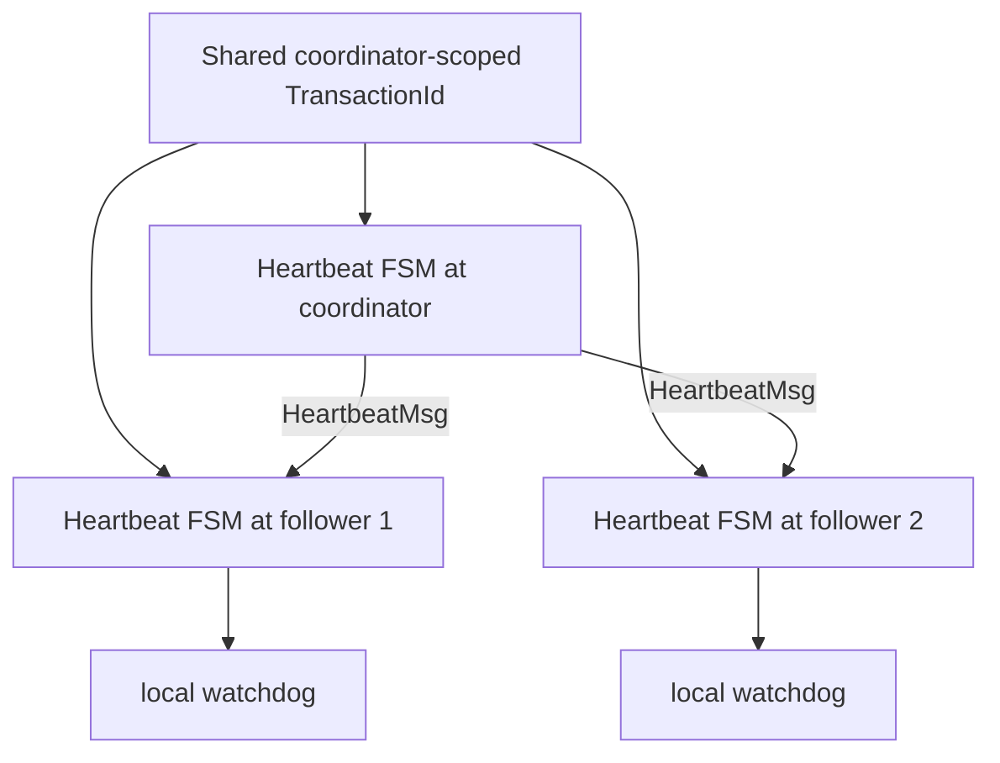
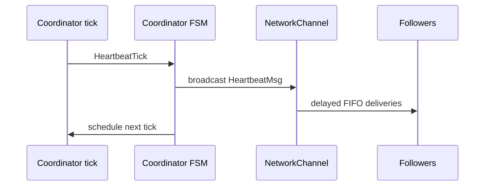
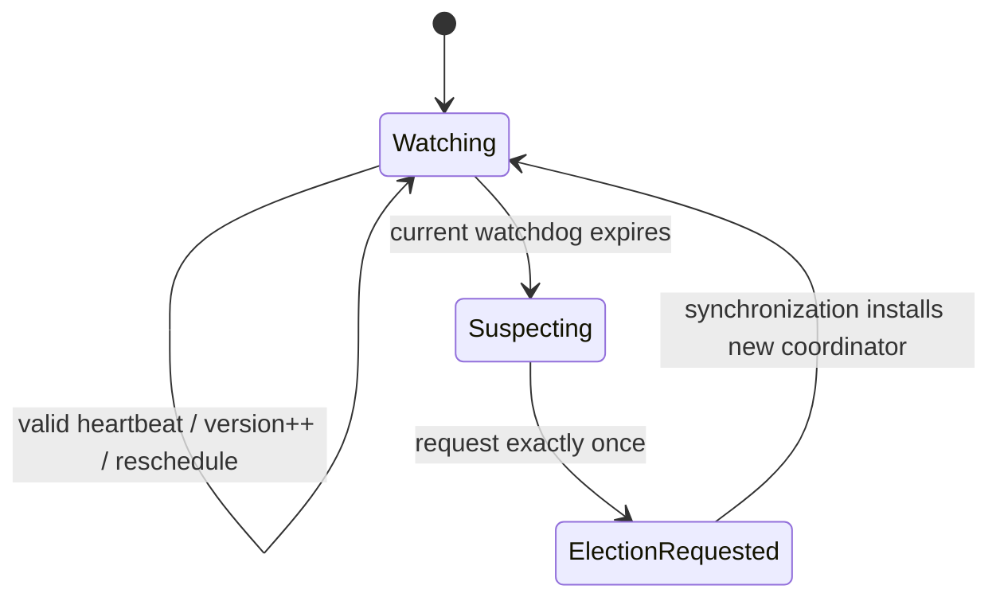
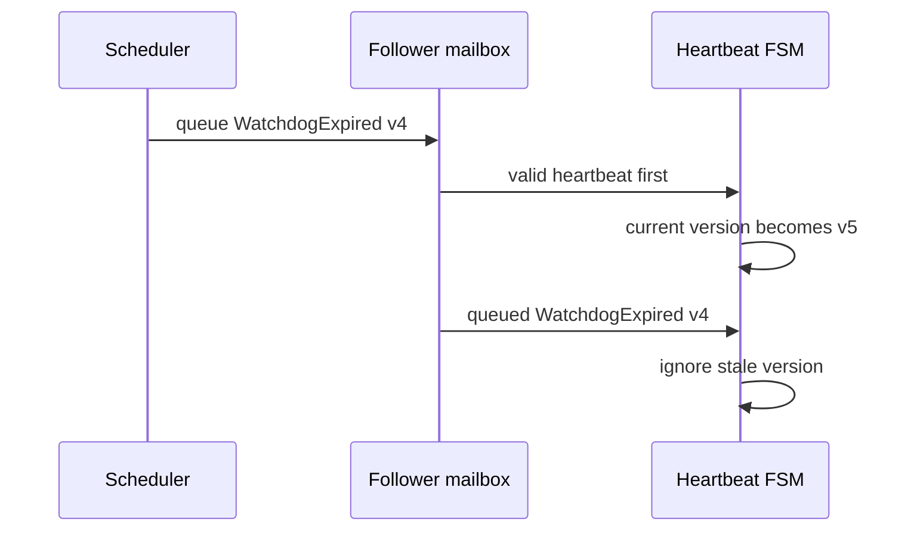
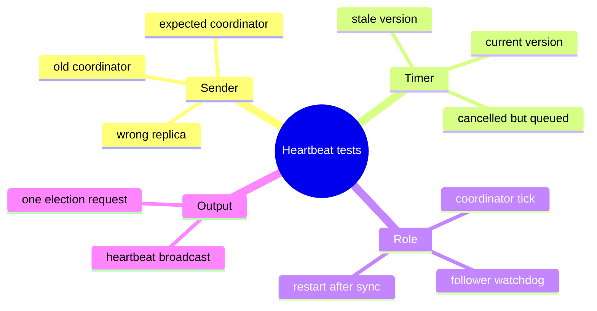

# Heartbeat and Silent-Failure Detection

> **Learning goal.** Understand how a quiet system detects a dead coordinator, why every replica owns a local heartbeat FSM, and how stale watchdog messages are prevented from starting false elections.

**Implementation base:** `origin/main` at `84846dc`.  
**Election handoff inspected:** `feature/electionTransaction` at `d1222a2`.  
**Key files:** `HeartbeatTransaction.java`, `Replica.java`, heartbeat diagrams and tests.

## 1. The failure that application timeouts cannot see

If clients are actively writing, missing UPDATE or WRITEOK can reveal coordinator failure. But what if nobody sends a write for ten minutes? A dead coordinator would remain unnoticed.

Heartbeat solves this silent-period problem. The coordinator periodically broadcasts “I am alive.” Followers restart a watchdog whenever they receive a valid heartbeat. If a follower's current watchdog expires, it asks the replica to start an election.

Heartbeat does not replace UPDATE or WRITEOK timeouts. It detects absence of general coordinator liveness, while those timers detect failure at specific update stages.

## 2. One local FSM per replica

After `InitSystem`, every replica constructs a local `HeartbeatTransaction`. These are separate Java objects with separate state and timers:

- coordinator's local FSM sends heartbeats;
- each follower's local FSM watches them.

They all use the same coordinator-scoped `TransactionId`:

```text
<coordinator ActorRef, 0>
```

The shared ID is a correlation key, not a shared object. A heartbeat sent by the coordinator routes to the follower's own local heartbeat FSM because both represent the same coordinator term.

## 3. Message vocabulary

### `HeartbeatTickMsg`

A local scheduler message. It tells the coordinator FSM to emit the next heartbeat. It never crosses `NetworkChannel`.

### `HeartbeatMsg`

A network message broadcast from coordinator to followers. It includes the expected numeric `coordinatorId`.

### `WatchdogExpiredMsg`

A local scheduler message on a follower. It includes `watchdogVersion` so an old timeout can be identified.

This split makes the system easy to reason about: only `HeartbeatMsg` is remote evidence; tick and expiry are local clocks.

## 4. FSM states

```text
STOPPED -> COORDINATOR
STOPPED -> WATCHING -> ELECTION_REQUESTED
```

- `STOPPED`: constructed, not started.
- `COORDINATOR`: schedules ticks and broadcasts.
- `WATCHING`: follower maintains watchdog.
- `ELECTION_REQUESTED`: a current watchdog expired; do not request repeatedly.

Repeated `start()` calls outside `STOPPED` are ignored, preventing duplicate periodic timer chains.

## 5. Coordinator trace

1. `HeartbeatTransaction.start` compares owner replica ID with `coordinatorID`.
2. If equal, state becomes `COORDINATOR`.
3. It schedules one `HeartbeatTickMsg` after the configured beat interval.
4. When the tick arrives, replica routing returns it to this FSM.
5. The FSM verifies it is still in `COORDINATOR`.
6. It broadcasts `HeartbeatMsg` to every other replica through delayed FIFO channels.
7. It schedules the next one-shot tick.

Using repeated one-shot scheduling avoids maintaining a second periodic callback mechanism. Each iteration returns through the actor mailbox.

## 6. Follower trace

1. Start sees that owner is not coordinator.
2. State becomes `WATCHING`.
3. `restartWatchdog` increments the version and schedules expiry.
4. A valid heartbeat with the currently expected coordinator ID arrives.
5. The follower cancels the old timer if possible.
6. It increments version and schedules a new watchdog.

Heartbeats received in any other state or naming another coordinator do not reset the watchdog.

## 7. Watchdog budget

The current formula is:

```text
3 * coordinatorBeatInterval + maxLatencyPlusTolerance
```

The intention is to tolerate several missed opportunities plus one delayed delivery/scheduling allowance. With a 1000 ms beat interval, the follower does not elect after a single heartbeat is late.

The formula is an implementation assumption. To defend it in an exam, relate each term to an actual path and configured network bound. Do not say merely “three seemed safe.”

## 8. The stale-timeout race

This is the most important educational detail.

```text
watchdog version 4 scheduled
heartbeat arrives
version 4 timer cancelled
version 5 scheduled
version 4 expiry was already placed in mailbox
```

If the FSM reacted only to the message class, version 4 could start an election even though a heartbeat just arrived. It therefore compares `expired.watchdogVersion` with the current field. Mismatch means stale; ignore it.

This pattern is transferable to retries, leases, election attempts, and request generations.

## 9. Election handoff

When the current version expires in `WATCHING`:

1. state becomes `ELECTION_REQUESTED` first;
2. FSM calls `Replica.startElection(currentCoordinatorID)`.

Changing state first prevents a second queued expiry from triggering another request. `Replica.startElection` adds further deduplication and a deterministic delayed start based on ring distance.

On `origin/main`, this handoff was a TODO. The current election branch replaces it with the concrete call, so report provenance matters.

## 10. Restart after a new coordinator

Synchronization updates `coordinatorID` and epoch, removes the old heartbeat transaction from active routing, constructs a new local FSM with the new coordinator's ActorRef and sequence zero, and starts the correct role.

Old queued tick/expiry messages carry the old coordinator-scoped transaction ID. Because the old FSM is no longer active, they are dropped by dispatch. A new coordinator ActorRef also changes the ID.

## 11. Failure and validation boundaries

The FSM checks numeric coordinator ID but the inspected `handleHeartbeat` does not independently compare `heartbeat.sender` with the membership ActorRef for that coordinator. In the trusted course model, messages are not Byzantine, but sender validation still makes stale/malformed input behavior clearer.

A follower already in `ELECTION_REQUESTED` ignores heartbeats. Recovery must install a new heartbeat transaction rather than trying to revive the old term.

## 12. Tests and missing cases

Current regression tests show:

- coordinator broadcasts periodic heartbeat messages; and
- a scheduled tick routes to the heartbeat transaction by ID.

Important missing focused tests include:

- follower watchdog expiry starts exactly one election;
- a valid heartbeat postpones expiry;
- stale watchdog versions are ignored;
- wrong-coordinator and wrong-sender heartbeats do not reset;
- every replica initializes one local FSM with the shared ID; and
- heartbeat restarts correctly after synchronization.

## 13. Exam rehearsal

**Why not create one shared HeartbeatTransaction object?** Actor state cannot be shared mutably. Each replica needs its own role and timer, while a shared ID correlates their messages.

**Why is cancel plus version needed?** Cancel may fail to remove an event already queued. Version validation decides whether the event is still current at handling time.

The invariant to remember is: **only a current follower watchdog for the currently expected coordinator may trigger one election request.**

## 14. Heartbeat as a local FSM plus a distributed signal

<pre class="diagram">Follower local FSM                         Coordinator
      |                                         |
      |-- schedule heartbeat tick ------------> |
      |                                         |
      |<----------- HeartbeatMsg ---------------|
      | reset watchdog(version=7)               |
      |                                         X silent/crashed
      | watchdog(version=7) expires             |
      | validate expected coordinator + version |
      | request ElectionTransaction             |
</pre>

There is one `HeartbeatTransaction` object per replica, not one globally
shared object. The coordinator instance sends heartbeats; follower instances
maintain watchdogs. They share a coordinator-scoped `TransactionId` so routing
can identify the term, while their timers and state remain actor-local.

## 15. Code microscope: why the version field exists

Consider this event order: watchdog v6 is scheduled; a heartbeat arrives and
installs v7; cancellation of v6 races with the scheduler; v6 is delivered to
the mailbox. A boolean “watchdog exists” is insufficient because v6 and v7 are
both real queued events. The handler must compare the event's version with the
current field and ignore v6.

<pre class="code-microscope">onHeartbeat(msg):
    if (msg.sender() != expectedCoordinator) return;
    watchdogVersion++;
    cancel(oldTimeout);
    timeout = schedule(WatchdogExpired(watchdogVersion));

onWatchdogExpired(expired):
    if (expired.version() != watchdogVersion) return; // stale event
    requestElectionOnce();
</pre>

This is a general asynchronous-programming pattern: cancellation is an
optimization; validation at consumption time is the correctness mechanism.

## 16. Timing and false suspicions

With heartbeat period `H` and channel delay bound `L`, a timeout near `H` can
fire during a healthy delayed delivery. Add scheduler jitter and processing
time when choosing the safety margin. Conversely, an enormous timeout delays
election after a genuine crash. Explain the chosen bound in terms of the
configuration, then test it with deterministic delay values rather than relying
on one lucky random run.

### Practice

Write a test where a wrong sender sends a heartbeat, then the real coordinator
sends one. The wrong message must not reset the timer. Add a second test that
delivers an old watchdog version after a fresh heartbeat and proves no duplicate
election request is emitted.

<div class="page-break"></div>

## 17. Deep study plate: one FSM per replica



Shared identity lets corresponding local FSMs route the same protocol term.
It does not imply shared mutable state. Each follower owns its timer and version;
the coordinator owns its periodic tick. Creating a separate arbitrary ID on
every replica would prevent incoming heartbeat messages from finding the local
FSM.

At initialization, verify that every replica installs one heartbeat FSM with
the coordinator-scoped ID and then chooses its local role from coordinator
identity.

<div class="page-break"></div>

## 18. Deep study plate: coordinator periodic broadcast



The tick is local and should not travel through `NetworkChannel`. The heartbeat
message is remote and must use it. Separating the two message types prevents a
follower from accidentally handling a coordinator's scheduling instruction.

After a simulated coordinator crash, queued ticks may still arrive. The crash
guard and role/state checks must stop new broadcasts. Otherwise, a logically
dead coordinator keeps followers alive.

<div class="page-break"></div>

## 19. Deep study plate: follower watchdog reset



Only heartbeats from the expected coordinator reset the watchdog. A stale old
coordinator or arbitrary replica must not suppress detection. On expiry, the
FSM validates current version and role, then transfers responsibility to the
election subsystem once.

Synchronization must restart heartbeat with the newly elected coordinator and
invalidate old timers. Carrying the old role into a new term can make two
coordinators broadcast or make the new coordinator monitor itself.

<div class="page-break"></div>

## 20. Deep study plate: versioned cancellation



Cancellation is best effort because the scheduler may already have delivered
to the mailbox. Comparing the payload version at handling time closes this
race. Nulling a timer handle does not identify which queued event fired.

Use the same reasoning for repeated restarts: each generation must be greater
than all events created by the previous coordinator role.

<div class="page-break"></div>

## 21. Deep study plate: timing envelope

```mermaid
gantt
    title Healthy heartbeat cycle
    dateFormat X
    axisFormat %L
    section Coordinator
    Wait heartbeat period :0, 30
    Send heartbeat        :30, 35
    section Channel
    Maximum delivery      :35, 55
    section Follower
    Safety margin         :55, 70
```



The watchdog must exceed heartbeat period plus worst configured delivery and
reasonable scheduler margin. Derive this from constants used by the fixture.
A test with zero delay cannot validate the production bound.

False suspicion is excluded by the assignment's assumptions, but the
implementation still needs constants consistent with that assumption. If
healthy configured delays exceed the watchdog, the model violates itself.

<div class="page-break"></div>

## 22. Student workbook: heartbeat fault matrix



For every leaf, define the initial role, ID, version, incoming sender, and
expected callback/message count. Include negative assertions: no watchdog reset
for wrong sender and no second election request for repeated stale expiries.

<div class="page-break"></div>

## 23. Lecture synthesis: failure detectors produce suspicions, not facts

A process that receives no message cannot distinguish “the coordinator
crashed” from “the coordinator is slow” in a fully asynchronous system. The
assignment makes detection workable by assuming controlled delays and accurate
timeouts. Within that model, the heartbeat protocol turns prolonged silence
into a suspicion strong enough to start election. The detector does not inspect
the coordinator's memory or operating-system state; it reasons from missing
evidence within a configured time bound.

Two classic properties help organize this reasoning. **Completeness** asks
whether a crashed coordinator is eventually suspected. **Accuracy** asks
whether a healthy coordinator avoids suspicion. Periodic ticks, delivery, and
watchdog expiry support completeness. A watchdog budget larger than the
maximum healthy heartbeat gap supports accuracy. The code and tests should
make both arguments, because fast detection with false elections is not a
correct implementation of the assignment's assumptions.

### 23.1 One logical role, many local state machines

Every replica owns a local `HeartbeatTransaction`. At the coordinator, its FSM
schedules ticks and broadcasts heartbeat messages. At a follower, its FSM
watches for messages from the expected coordinator and restarts a watchdog.
The coordinator-scoped transaction ID allows an arriving heartbeat to route to
the corresponding local FSM; it does not mean the replicas share one Java
object or one timer.

This design keeps mutable state confined. Each follower can have a different
remaining timeout because messages arrive at different times. They still agree
on the coordinator identity and protocol term. When synchronization announces
a new coordinator, every local FSM must transition role and install a new
coordinator-scoped identity coherently.

### 23.2 Why application timeouts are insufficient

A write timeout detects failure only while a write is active at a vulnerable
stage. If the coordinator crashes during an idle period, no request FSM exists
to notice. Heartbeat is background liveness traffic: it maintains evidence of
leadership even when clients are silent. Conversely, heartbeat should not be
used to decide whether one update committed; the update FSM and history own
that question.

Keeping these detectors separate avoids tangled semantics. A write timeout may
start election because expected coordinator progress stopped. A watchdog may
start election because all coordinator traffic stopped. Both hand off to the
same election subsystem, but their triggering evidence and timer budgets are
different.

### 23.3 Versioning closes the cancellation race

Suppose watchdog version 8 expires and its message enters the follower's
mailbox. Before that message is processed, a valid heartbeat is handled,
version 8 is cancelled, and version 9 is scheduled. Cancellation cannot pull
the already-enqueued version-8 message out of the mailbox. If the handler
checks only its class or transaction ID, it starts a false election.

Embedding the version in `WatchdogExpiredMsg` lets the handler compare the
event with current actor-owned knowledge. Only expiry for the current version,
current coordinator, and current watching state is actionable. This is an
instance of a general asynchronous pattern: tag delayed work with the
generation that authorized it, and validate that generation when consuming the
result.

### 23.4 Timing is a protocol parameter

Let `H` be the coordinator heartbeat period, `D` the maximum one-way simulated
delay, `S` scheduler/mailing jitter allowed by the environment, and `B` a
bounded mailbox-processing allowance. A follower watchdog must be greater
than the largest legal observed gap, roughly `H + D + S + B`. If ticks or
delivery can bunch differently, derive the bound from that implementation
rather than copying this expression blindly.

Changing latency configuration without revisiting the watchdog can invalidate
accuracy. Tests should include a heartbeat delivered near the maximum healthy
gap and verify that it renews the watchdog, followed by true silence that
causes exactly one election request. This demonstrates the boundary rather
than merely exercising the easy zero-delay path.

### 23.5 Heartbeat is not a lease

A follower receiving recent heartbeat traffic believes the coordinator is
alive; it does not grant the coordinator an exclusive time-bounded lease that
prevents another actor from claiming leadership. Leadership safety comes from
election identity, candidate choice, epoch transition, and synchronization.
Calling the watchdog a lease would teach a stronger guarantee than the code
implements.

The official Akka [*Classic
Scheduler*](https://doc.akka.io/libraries/akka-core/current/scheduler.html)
documentation also warns that scheduled events are not exact and cancellation
cannot abort work that already began. The version guard in this project is the
protocol-level response to that runtime behavior.
