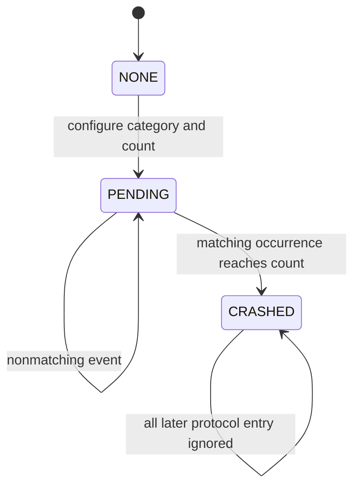
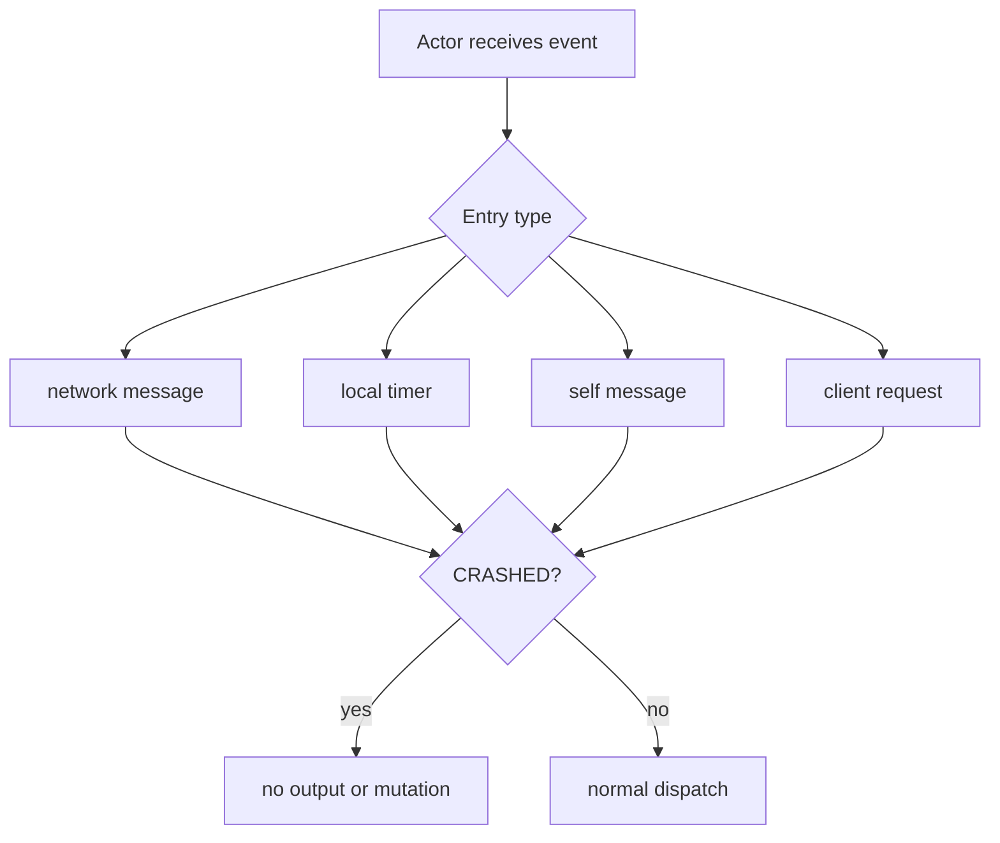
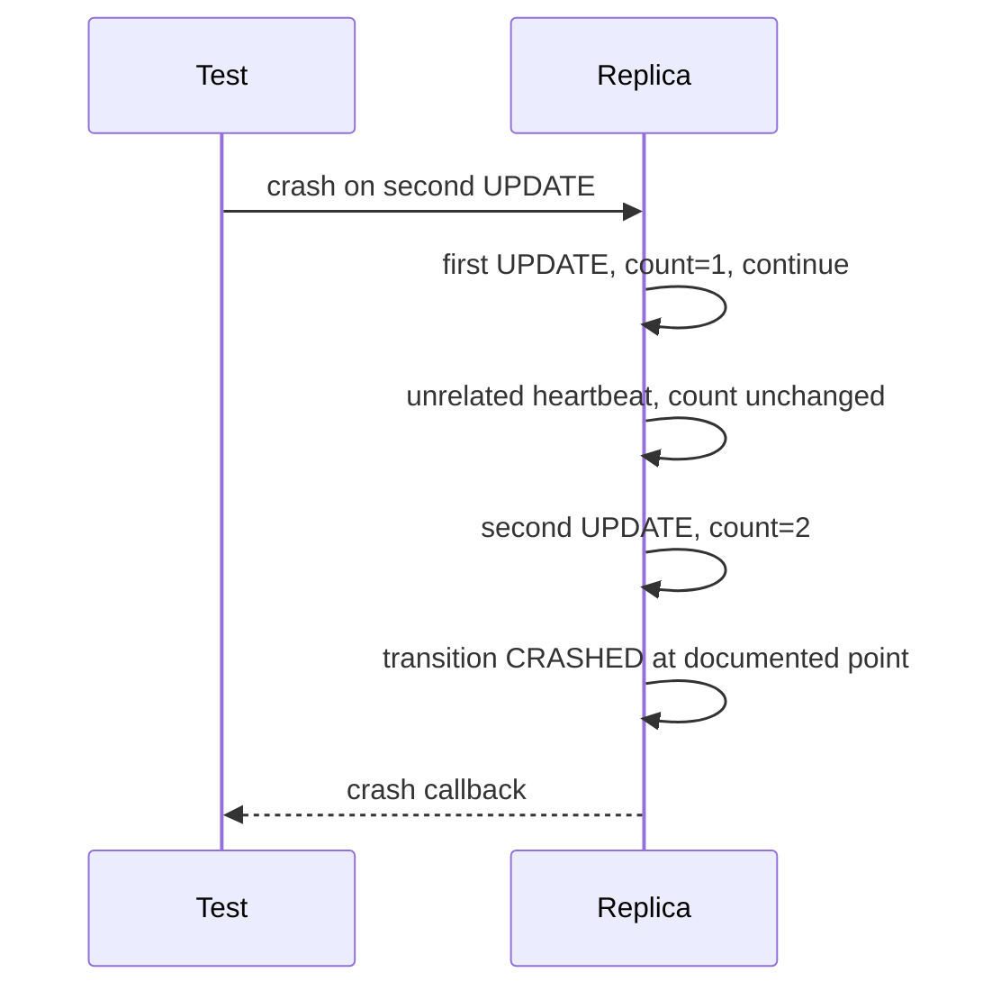
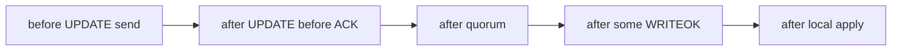
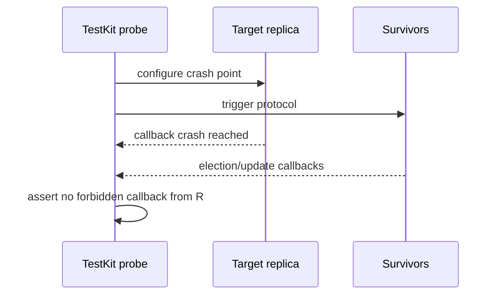
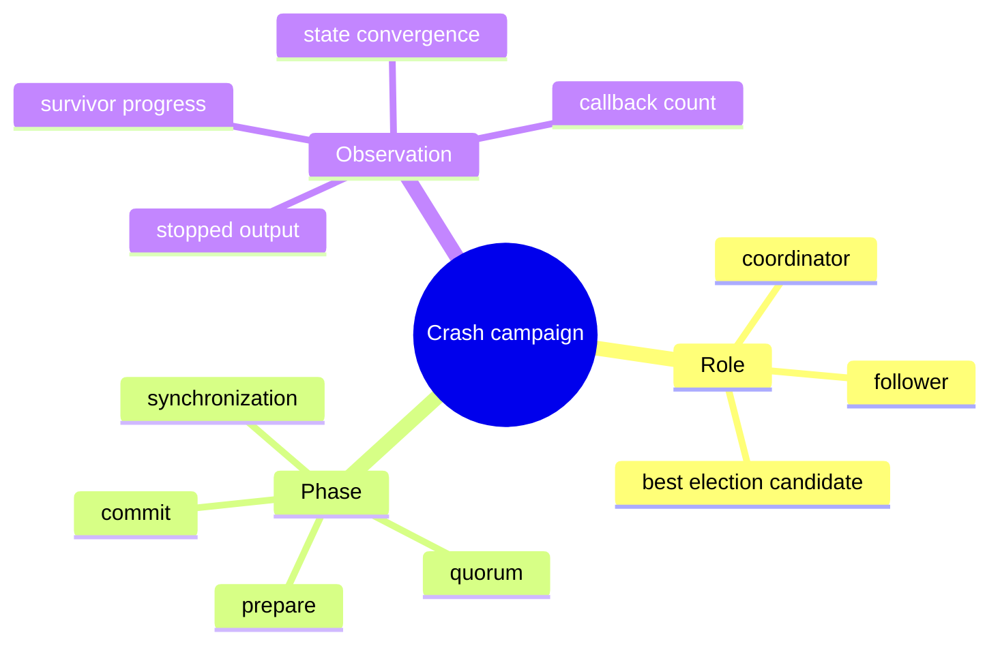

# Crash Model and Deterministic Fault Injection

> **Learning goal.** Understand how the repository simulates crash-stop nodes without killing Akka actors and how tests request failures at precise protocol moments.

**Current implementation inspected:** `feature/electionTransaction` at `d1222a2`.  
**Update-category reference:** `origin/feat/UpdateTransaction` at `59bbe80`.

## 1. A simulated crash is a behavior mode

The project does not terminate the Akka actor process. `Replica` instead tracks:

```text
NONE -> PENDING -> CRASHED
```

- `NONE`: normal behavior.
- `PENDING`: a test requested a crash after a selected number/type of messages.
- `CRASHED`: protocol receives and sends are ignored.

This models the external effect of a crash-stop replica while keeping the actor address stable for tests.

## 2. Crash request object

`AbstractReplica.Crash` contains:

- `type`: the protocol point to monitor;
- `after_n_messages_of_type`: the threshold.

Defined categories include:

- `Now`
- `Heartbeat`
- `Update`
- `WriteOK`
- `Election`

The specification needs such instrumentation because failures must be demonstrated not only between operations, but during broadcast, after observation, during commit dissemination, and during election.

## 3. Immediate crash

For `Crash.Type.Now`, `Replica.crash` moves directly to `CRASHED` and logs it. No protocol event counter is needed.

The actor remains alive and can still receive mailbox messages, including old scheduled events. Protocol handlers and send helpers must check crash state so those messages have no external effect.

## 4. Pending crash counters

For other categories, the replica stores the request, resets `crashCount`, and enters `PENDING`.

`updateCrashStatusCallback(Msg)` classifies selected messages. When a message matches the requested category, it increments the count. At or above the threshold, it marks the replica crashed.

This creates a deterministic test instruction such as:

```text
Crash after processing/sending the second election-related event.
```

The exact location of the callback determines whether “after” means before forwarding, after forwarding one message, or after an entire broadcast loop.

## 5. Incoming and outgoing counting

The callback is invoked in two broad places:

- after the transaction dispatcher successfully delivers an incoming `Msg`; and
- after `broadcast` or `unicast` sends protocol traffic.

Therefore a category can count both received and sent events depending on class and control path. `broadcast` invokes the callback once after iterating destinations, not once per recipient. A crash threshold counts broadcast operations, not individual network enqueues.

This detail must be documented because a test expecting “crash after two recipients” would not get that behavior from the current helper.

## 6. Current category mappings

On the election branch:

- heartbeat category matches `HeartbeatMsg` and `WatchdogExpiredMsg`;
- WRITEOK category currently matches `WriteFinishMsg`;
- election category matches election token, ACK, ACK timeout, rejection, and synchronization.

The update feature branch additionally classifies `UpdateMsg`, `UpdateTimeoutMsg`, `UpdateAckMsg`, `WriteOkMsg`, and `WriteOkTimeoutMsg` as update-category events.

Because the branches are not integrated, the current branch cannot inject every update-stage crash required by the final specification. Also note that `WriteFinishMsg` is a local parent-completion signal, not the distributed `WriteOkMsg`; category naming and mapping should be reconciled in final integration.

## 7. Ignoring outgoing traffic

`Replica.broadcast` and `unicast` return immediately when status is `CRASHED`. This ensures a queued timer cannot make a dead coordinator emit a heartbeat or continue an election.

`unicast` also refuses self-delivery. Protocol-local notifications that must occur on the owner use direct `getSelf().tell(...)` and therefore need their own crash-aware receive path.

## 8. Ignoring incoming traffic

`Replica.onMessage`, election entry handlers, and synchronization handlers check crash state. A complete integration must make every special receive handler equally crash-aware; otherwise a message that bypasses generic dispatch can still mutate dead-replica state.

The actor is not removed from membership. Other replicas continue sending until their timeout logic marks it unavailable or elects around it.

## 9. Timers after crash

Crashing does not cancel every active `Cancellable`. Old ticks and timeouts may still enter the mailbox. Correct crashed behavior ignores them before they send or change externally visible state.

This approach is simpler than tracking and cancelling every timer, but it means crash guards are a correctness boundary. One missing guard can resurrect behavior.

## 10. Crash-stop versus pause or recovery

The state machine has no transition out of `CRASHED`. That matches the specification: replicas fail by crashing and do not recover.

This is different from:

- a temporary network partition;
- a slow node;
- Akka actor restart under supervision;
- process recovery from disk; or
- Byzantine behavior sending false messages.

Do not claim the protocol tolerates these stronger models.

## 11. Fault scenarios to demonstrate

A strong exam demonstration set includes:

1. follower crashes immediately; quorum update still completes;
2. coordinator crashes before phase-one broadcast; initiating replica detects missing UPDATE;
3. coordinator crashes after some UPDATEs; election collects freshest observed state;
4. coordinator crashes during WRITEOK; recovery completes uniform delivery;
5. next ring neighbor crashes; election ACK timeout skips it;
6. best candidate crashes; remaining candidates still terminate;
7. stale watchdog arrives after heartbeat and is ignored.

The current split implementation does not yet support every scenario end to end. The gap itself must be recorded.

## 12. Testing principles

For a deterministic crash test, assert four things:

- the crash was requested at the intended state;
- the expected count was reached;
- no later outbound protocol event came from that replica; and
- surviving replicas reached the required result within a justified bound.

Sleeping and hoping is weaker than observing callbacks/messages with TestKit. Time-based assertions should derive from configured latency and protocol hops.

## 13. Exam rehearsal

**Why keep the actor alive after a simulated crash?** It gives tests a stable address and deterministic instrumentation while handlers emulate the observable behavior of a dead node.

**What is the main implementation risk?** A special handler or direct self-message path can forget the crash guard and let a supposedly dead replica act.

The invariant to remember is: **after transition to `CRASHED`, no incoming or queued event may cause protocol output or application-state progress.**

## 14. A crash is a state-machine transition

<pre class="diagram">NONE --crash event--> PENDING --apply at configured point--> CRASHED
  |                                               |
  +-------------- normal protocol ---------------+

CRASHED: ignore client requests, network messages, timers, and callbacks
         until the test/model explicitly restarts or replaces the actor</pre>

The three categories describe *when* a fault is injected, not three different
Java exceptions. A pending crash may allow an already queued event to finish;
the crashed state must then block subsequent work. Read the category mapping
carefully because feature branches may count “crash after update” at a different
instruction than the base implementation.

## 15. Code microscope: guard every entry point

Checking `crashed` in the ordinary network handler is not enough. Akka actors
also receive special entry messages, self-sent messages, scheduler callbacks,
and client requests. A useful review table is:

<table><tr><th>Entry point</th><th>What a crashed replica must do</th></tr>
<tr><td><code>NetworkChannel</code> delivery</td><td>ignore without ACK or state mutation</td></tr>
<tr><td>heartbeat tick/watchdog</td><td>do not emit a new heartbeat or election twice</td></tr>
<tr><td>client read/write</td><td>return the specified failure/timeout, or remain silent</td></tr>
<tr><td>crash control message</td><td>transition once; duplicate control is idempotent</td></tr>
<tr><td>queued protocol message</td><td>re-check status at handling time</td></tr></table>

<pre class="code-microscope">void onMessage(Message m) {
    if (crashStatus == CRASHED) return; // central safety guard
    if (m instanceof CrashNow) {
        crashStatus = CRASHED;
        return;
    }
    routeToTransaction(m);
}</pre>

The real design may distribute these checks across handlers. During review,
trace every special path and ask whether it can call a callback or mutate
`positions[]` after the status changes.

## 16. Fault injection as a deterministic experiment

A strong test names the injection point and observes a protocol consequence:
“crash coordinator after receiving the third ACK; surviving replicas elect a
candidate and preserve the committed epoch.” It is weaker to sleep and assert
that “something eventually happened.” Use TestKit probes, callback messages,
and explicit actor status where possible. Record both what the crashed actor
did not do and what the survivors did do.

### Practice

For each crash category, choose one message that may complete before the crash
and one that must be rejected after it. Explain why the answer changes when the
crash is injected before versus after a WRITEOK.

<div class="page-break"></div>

## 17. Deep study plate: crash status lifecycle



`PENDING` makes injection repeatable: the test names a semantic event and an
occurrence count rather than racing a wall-clock sleep. The transition to
`CRASHED` should be observable through a callback or status probe so the next
test action starts from known state.

Document whether the triggering event completes before the crash takes effect.
“Crash on first WRITEOK” is ambiguous unless the implementation says before
send, after send, before apply, or after apply.

<div class="page-break"></div>

## 18. Deep study plate: entry-point audit



Use the receive builder as an audit checklist. A central guard is easier to
reason about, but special handlers may run before it. Trace callbacks too: a
crashed actor must not report update application or election success from a
queued event.

The stable ActorRef is a testing convenience. Do not confuse addressability
with liveness; messages can still be sent to a simulated dead node and then
ignored.

<div class="page-break"></div>

## 19. Deep study plate: occurrence counting



Count only the selected semantic category. If helper methods increment at
slightly different positions across feature branches, the same test name can
inject different windows. Reports must tie the category to concrete code and
branch provenance.

Reset counters between tests and avoid static mutable instrumentation. Otherwise
execution order changes the injected failure.

<div class="page-break"></div>

## 20. Deep study plate: crash windows in an update



Each edge produces a different recovery obligation. Before dissemination,
survivors may know nothing. After quorum, a majority contains evidence. After
one correct replica applies, uniform agreement requires eventual preservation.
After local apply but before callback, client knowledge and system state differ.

Name the chosen window in every test assertion. “Coordinator crash test” is too
broad to explain what property was exercised.

<div class="page-break"></div>

## 21. Deep study plate: deterministic observation



Positive and negative observations belong together. Verify the crash occurred,
the dead actor stopped output, and survivors made the expected progress. Use a
bound derived from protocol delay rather than an arbitrary long sleep.

TestKit silence assertions should be scoped narrowly: too short misses late
violations, while too long slows the suite without adding evidence.

<div class="page-break"></div>

## 22. Student workbook: fault campaign



Choose one leaf from each branch and form a scenario. Record initial state,
exact injection transition, allowed final states, and forbidden output. Repeat
the same scenario on the relevant feature ref because crash-category placement
may differ across branches.

<div class="page-break"></div>

## 23. Lecture synthesis: a fault model defines the experiment

Distributed protocols are never “fault tolerant” without qualification. They
tolerate faults from a stated model. This assignment uses crash-stop replicas,
static membership, reliable FIFO channels, bounded simulated delay, and the
assumption that a strict majority remains correct. It does not model Byzantine
messages, disk corruption, arbitrary network partition, or a crashed replica
recovering with stale storage. Every correctness claim in the reports is scoped
to those choices.

The simulated crash keeps the Akka actor alive but changes its externally
observable behavior to resemble a stopped node. This gives the test harness
precise control: it can request a crash after the second ACK or during WRITEOK
dissemination without killing a JVM. The model is valid only if all protocol
entry and exit paths honor the crashed mode.

### 23.1 Crash state is a cross-cutting guard

Incoming network messages, public request handlers, special election entries,
self-scheduled timeout messages, broadcast helpers, and direct unicast helpers
are distinct paths. Guarding only the generic message dispatcher leaves holes.
A previously scheduled heartbeat tick could still broadcast, or a special
`SynchronizationMsg` handler could mutate state after the nominal crash.

An audit should enumerate the receive builder and every method that sends
traffic. For each path, state whether it is blocked in `CRASHED`, whether it can
advance a pending crash counter, and whether it can emit a listener callback.
This turns the cross-cutting requirement into a finite checklist.

### 23.2 Deterministic triggers make failures reproducible

“Crash after three outgoing UPDATE messages” is a protocol-relative trigger.
It survives reasonable timing variation because it counts a named event.
“Sleep 80 ms and crash” is wall-clock-relative and may hit a different state
on a loaded machine. Deterministic injection is therefore not only a testing
convenience; it is experimental control.

The counter semantics must be exact. Decide whether the event that reaches
zero is sent/processed before the crash or suppressed by it. Decide which
message subclasses belong to each category and whether self-delivery counts.
An off-by-one rule moves the fault window and can make a test appear to cover
post-quorum failure while actually crashing before quorum.

### 23.3 Injection machinery must not become protocol evidence

The crash controller decides when a replica stops acting. It should not choose
the election winner, fabricate ACKs, or repair history. Otherwise the test hook
quietly changes the algorithm being tested. Callbacks such as “crash point
reached” are observations for the harness; protocol peers should continue to
learn failure only through the permitted timeout and message behavior.

This separation lets the same production FSM run in normal and faulted tests.
Only the environment's event schedule changes. It also makes traces easier to
interpret: a survivor's election output is evidence of the protocol reacting,
not the harness calling election directly.

### 23.4 Negative evidence is essential

After the crash callback, assert that the target sends no heartbeat, ACK,
WRITEOK, election token, or synchronization response that the model forbids.
Then separately assert that surviving replicas make progress. Observing only
the survivor's success can miss a “zombie” crashed actor whose extra message
helped the test pass. Observing only silence can miss a system that simply
deadlocked.

Silence assertions need a justified interval. It should cover the maximum
legal delay for forbidden queued output without making the suite sleep
arbitrarily. Where possible, combine listener events and FSM-specific timeout
bounds to make the observation window explainable.

### 23.5 Understand what the model leaves out

A real Akka actor failure may involve supervision, restart, mailbox suspension,
dead letters, and loss of in-memory fields. The course crash mode models none
of those lifecycle mechanics. Similarly, keeping all actors in one JVM does
not exercise serialization failure or physical host partition. These are not
defects in a focused educational model, but they are limits that should be
stated when transferring conclusions to production systems.

A good oral explanation begins with the fault assumptions, shows the exact
injection point, and ends with both safety and liveness observations. It does
not claim that passing one crash scenario proves arbitrary resilience.
