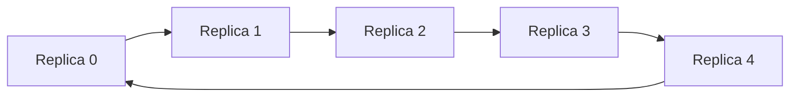
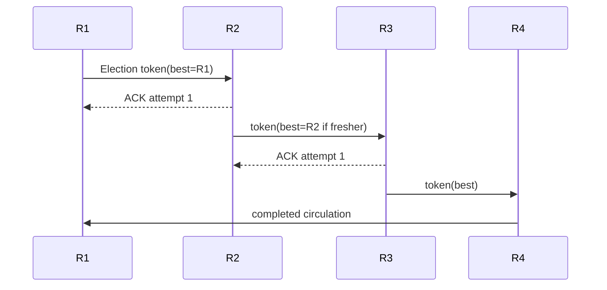
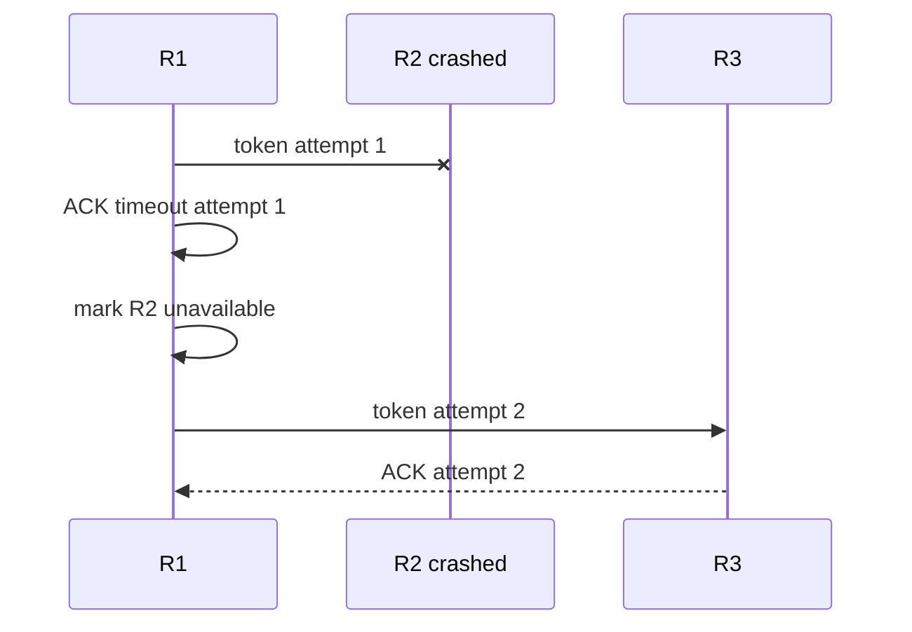
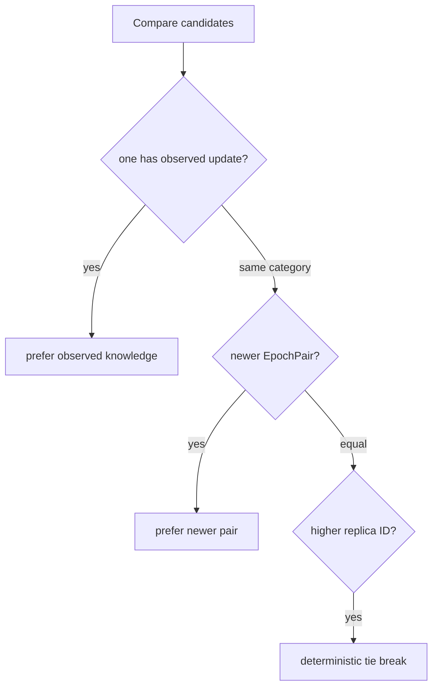
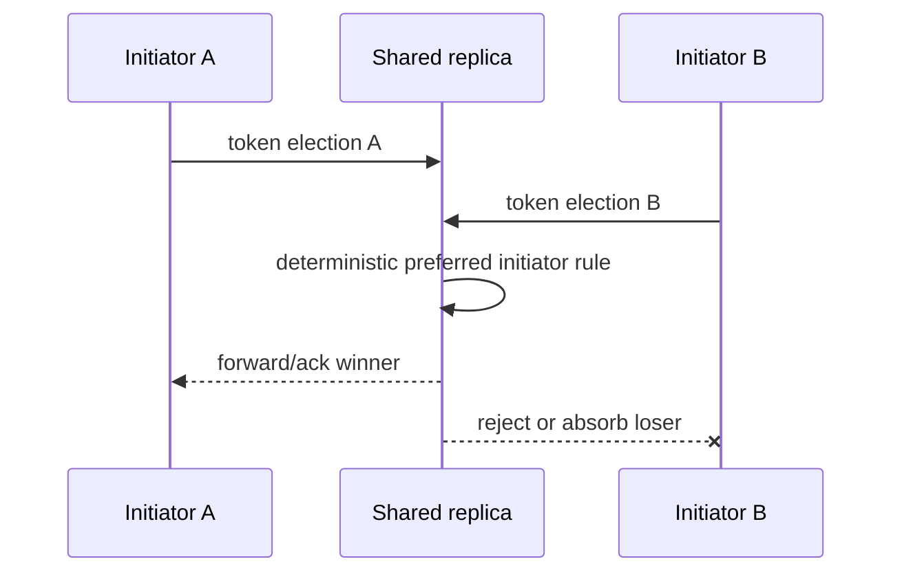
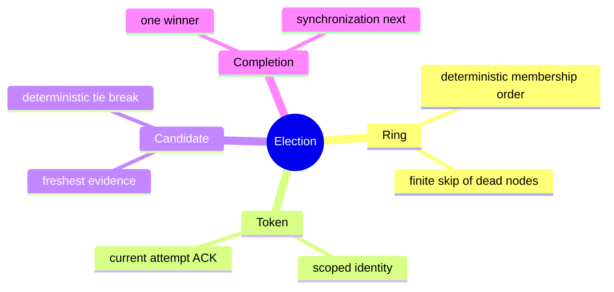

# Ring Election Protocol

> **Learning goal.** Follow the election token around an ID-ordered ring, understand candidate selection and ACK timeouts, and see how the code suppresses competing elections.

**Implementation inspected:** `feature/electionTransaction` at `d1222a2`.  
**Key files:** `ElectionTransaction.java`, election sections of `Replica.java`, `TestElectionTransaction.java`, election diagrams.

## 1. What election must decide

After coordinator failure, replicas must choose one new coordinator. This is not simply “highest replica ID wins.” The winner should be the surviving replica with the freshest observed update so it has the best recovery knowledge. Replica ID breaks equal-freshness ties.

The logical ring sorts numeric replica IDs. Physical actor creation order or map iteration order does not define the ring.

## 2. Candidate ordering

`ElectionCandidate` contains:

- numeric replica ID;
- whether it has observed any update; and
- latest observed `EpochPair` when present.

Comparison rules, from strongest to weakest, are:

1. a candidate with real observed-update information beats one with none;
2. newer epoch pair beats older;
3. higher replica ID breaks a tie.

Examples:

```text
R2 at <3,9> beats R4 at <3,8>
R4 at <3,9> beats R2 at <3,9>
R1 with <0,0> beats R5 with no observed update
```

The candidate list is copied into `ElectionMsg`, preventing mutation while the token is in flight.

## 3. Message vocabulary

- `ElectionStartMsg`: local delayed trigger after failure detection.
- `ElectionMsg`: network token carrying failed coordinator ID and candidates.
- `ElectionAckMsg`: confirms the next replica received/forwarded the token.
- `ElectionAckTimeoutMsg`: local attempt timeout with expected target and version.
- `ElectionRejectMsg`: tells a losing competing initiator to cancel.
- `SynchronizationMsg`: leadership/recovery announcement, covered mainly in the recovery report.

## 4. Local FSM states

```text
NEW -> PARTICIPATING -> ELECTED -> SYNCHRONIZING -> DONE
                   \------------------------------> DONE on rejection/failure
```

`PARTICIPATING` covers both an initiator and a replica that joined an incoming token. `ELECTED` means this local candidate won. `SYNCHRONIZING` acknowledges that leadership is not operational until recovery work is initiated.

## 5. Staggered election start

Every follower can notice the same failed coordinator. Starting all tokens simultaneously would create unnecessary competition.

`Replica.startElection` calculates ring distance from the failed coordinator and schedules start after:

```text
ringDistance * maxLatencyPlusTolerance
```

The closest successor starts first. Sets prevent repeated scheduling, repeated participation, or restarting an already completed failure term.

Staggering reduces competition; it does not eliminate it. The code still defines deterministic competition resolution.

## 6. Healthy-ring trace

Suppose R1 failed and ring survivors are R2, R3, R4.

1. R2 begins first, creates a negative-sequence election transaction ID, and places its local candidate in the token.
2. R2 sends token to R3 and schedules ACK timeout for that target/attempt.
3. R3 adds its candidate, forwards to R4, then ACKs R2.
4. R4 adds its candidate, forwards to R2, then ACKs R3.
5. R2 sees its own candidate already present: the collection phase completed a ring.
6. It computes the best candidate.
7. If R2 is winner, it ACKs previous sender and starts winner completion. Otherwise, it sends the full candidate list directly toward the winner.
8. The winner recognizes itself and starts synchronization.

Forward-before-ACK ensures that receiving an ACK means the next participant accepted responsibility for continuing the token.

## 7. Skipping a crashed neighbor

When a sender forwards, it stores:

- pending target ID;
- pending message;
- incremented attempt version; and
- timeout message containing target/version.

If the expected ACK does not arrive:

1. reject stale timeout if target/version no longer match;
2. mark the target unavailable;
3. remove that target's candidate evidence from the pending list;
4. choose the next available ring ID; and
5. resend with a new attempt version.

Removing a crashed candidate matters. Otherwise a dead but freshest candidate could be elected forever.

## 8. ACK validation

An ACK is accepted only if there is a pending message and its sender maps to the current pending target. Valid ACK cancels the timer and clears pending state.

The attempt version protects against this race:

```text
attempt 4 to R3 times out
attempt 5 starts toward R4
old timeout or late event from attempt 4 arrives
```

Only attempt 5 may affect current forwarding.

## 9. Competing elections

`Replica` tracks the current election transaction ID per failed coordinator. If another token arrives, it compares initiators:

- lower numeric initiator ID is preferred;
- for the same initiator, lower election sequence number is preferred.

Election IDs use negative sequence numbers, separated from ordinary non-negative replica transactions and heartbeat sequence zero.

The preferred incoming election replaces the current transaction. A non-preferred token is rejected. An initiator receiving `ElectionRejectMsg` completes and unregisters its losing FSM.

## 10. Input validation

Before creating/routing a token, `Replica.isValidElectionMessage` rejects:

- null transaction/sender/initiator;
- senders or initiators outside membership;
- unknown failed coordinator;
- the failed coordinator trying to participate locally;
- candidates outside membership;
- the failed coordinator in candidates; and
- duplicate candidate IDs.

Validating before routing prevents malformed messages from poisoning transaction maps or causing null dereferences.

## 11. Termination reasoning

The ring contains a finite static set. Each failed forwarding target is added to `unavailableReplicaIds`, so a local attempt does not retry the same dead target forever. A strict majority survives, so at least one candidate should remain.

The branch also removes a selected winner if it cannot be contacted and recomputes from remaining candidates. This addresses the case where the best candidate crashes after token collection.

End-to-end termination still depends on timeout accuracy, valid membership, and integration with heartbeat/crash behavior.

## 12. Current scope limitations

- Candidate freshness uses the local `epochPair`; integrated immutable update history is absent.
- Synchronization is a snapshot broadcast rather than full update replay.
- There is no explicit global election deadline beyond per-hop progress and competition rules.
- The branch's focused tests emphasize data structures/validation and do not simulate every healthy/crashing ring sequence end to end.

## 13. Test map

`TestElectionTransaction` checks:

- epoch/sequence/ID candidate ordering;
- no-update candidate behavior;
- ring wraparound and skipped IDs;
- message immutability;
- ACK and timeout metadata;
- synchronization defensive copy/validation; and
- malformed election rejection.

Needed additional tests include full token circulation, neighbor crash skip, best-candidate crash, two initiators converging, and exactly-once callbacks on all survivors.

## 14. Exam rehearsal

**Why use freshness before replica ID?** The new coordinator must possess the best recovery knowledge. ID is only a deterministic tie-breaker.

**Why ACK after forwarding?** It transfers responsibility for progress; the previous sender may stop retrying only after the receiver has continued the token.

The invariant to remember is: **for each failed coordinator, correct replicas converge on one surviving election token and one best available candidate, while each failed next hop is eventually skipped.**

## 15. Walk a token around a five-replica ring

<pre class="diagram">R0 -> R1 -> R2 -> R3 -> R4 -> R0
 |                               |
 +-- election token: candidate=R0, observed=(2,4)

R1 compares its state, keeps newer candidate if any, forwards
R2 does the same ... R4 forwards to R0
R0 sees its own token again -> install winner -> synchronize</pre>

The ring gives each survivor a chance to contribute recovery knowledge. It is
not a broadcast tree: a crashed next hop must be skipped, and an ACK means the
next participant accepted responsibility for forwarding. The election result
is still incomplete until the synchronization phase installs a consistent
snapshot/history.

## 16. Code microscope: candidate comparison and token identity

Candidate comparison should be deterministic and explainable: prefer a
non-empty observed epoch, then a newer `EpochPair`, then a higher replica ID as
a tie-breaker. A token also needs an attempt/generation so an old ACK cannot
advance a newer circulation after a timeout.

<pre class="code-microscope">if (incoming.observed().isNewerThan(best.observed()))
    best = incoming;
else if (sameEpoch(incoming, best)
         && incoming.replicaId() &gt; best.replicaId())
    best = incoming; // deterministic tie-break

if (ack.attempt() != currentAttempt) return; // stale ACK
forwardToNextLive(token.with(best));</pre>

When a candidate or next hop is dead, the sender needs a bounded traversal
strategy. Blindly retrying a dead actor can keep the mailbox busy forever;
skipping it without recording the skip can make the proof of ring coverage
unclear. Tests should observe both the skip and eventual completion.

## 17. Competing elections and convergence

Two followers may detect silence close together and start tokens. The protocol
must make both circulations converge on one winner rather than install two
coordinators. Typical tools are a deterministic candidate order, token identity,
and forwarding rules that absorb an inferior token. Draw two tokens crossing
the same edge and mark which one survives; if the design cannot explain that
picture, it is not yet a convergence argument.

### Practice

Create a table for replicas with observed epochs `(3,8)`, `(3,10)`, and `(4,0)`
and IDs 1–3. Which candidate wins, and why? Then repeat with the best candidate
crashed before synchronization and explain what the recovery layer must do.

<div class="page-break"></div>

## 18. Deep study plate: ring construction



The ring is a deterministic ordering of static membership, commonly by replica
ID. Every survivor must calculate the same successor relation. Actor creation
order or map iteration order is not a safe substitute unless explicitly
normalized.

Ring navigation should terminate after considering finite membership. When a
next hop is unavailable, advance to the next candidate; when every other member
is unavailable, the majority assumption determines whether progress is still
permitted.

<div class="page-break"></div>

## 19. Deep study plate: token circulation



ACK transfers forwarding responsibility. The previous sender stops retrying
only after a valid ACK for the current target and attempt. The token accumulates
or carries the best candidate according to one deterministic comparison.

Transaction ID and failed-coordinator scope distinguish this circulation from
an old or competing election. A token returning to its initiator means
collection completed; it does not yet mean recovery completed.

<div class="page-break"></div>

## 20. Deep study plate: skip a crashed neighbor



The timeout payload must identify target and attempt. A late ACK from R2 for
attempt 1 cannot cancel responsibility already transferred to R3 in attempt 2.
The unavailable set prevents endless retries of the same dead neighbor.

Tests should inject the late ACK as well as the missing one. That establishes
generation validation, not merely timeout progress.

<div class="page-break"></div>

## 21. Deep study plate: candidate freshness order



Replica ID alone elects deterministically but may choose a node missing the
latest recovery evidence. Freshness comes first because coordinator selection
is coupled to interrupted-update recovery. ID only breaks genuine ties.

Define comparison for null or absent history explicitly. Malformed candidates
must be rejected before routing so they cannot win by an accidental null-order
rule.

<div class="page-break"></div>

## 22. Deep study plate: competing elections



Staggered starts reduce collisions but are not a correctness proof. When two
tokens coexist, all replicas must apply the same preference scoped to the same
failed coordinator. Completed-election memory then rejects a late loser after
the new term begins.

Separate token preference from final candidate preference: the chosen token is
the mechanism that collects candidates; the freshest candidate may be another
replica entirely.

<div class="page-break"></div>

## 23. Student workbook: election proof obligations



Prove termination under the stated surviving-majority assumption, then explain
where the proof relies on bounded timeout and static membership. Construct a
trace with two initiators, one dead neighbor, a late ACK, and the freshest
candidate crashing. Mark which behavior is implemented and which recovery step
still needs evidence.

<div class="page-break"></div>

## 24. Lecture synthesis: election chooses a safe continuation point

Leader election is often introduced as “pick the process with the highest
ID.” That is not sufficient here. The next coordinator will order and recover
replicated updates, so it should be the surviving candidate with the freshest
known update evidence; replica ID breaks ties only when freshness is equal.
Election is therefore a data-safety decision as well as a leadership decision.

The ring supplies a deterministic route for gathering candidates. Sort static
replica IDs, send to the next available ID, receive an ACK, and continue until
the token has completed its traversal. The ring is logical: messages still use
Akka actor references and channel actors rather than a physical ring network.

### 24.1 Candidate ordering must be total and shared

Every participant must compare candidates with the same rule. First compare
the latest known `EpochPair`; then compare replica ID as a deterministic tie
breaker. Handle “no known update” explicitly so that `null` does not create
different local interpretations. A comparator that is reflexive,
antisymmetric, and transitive gives all replicas the same best candidate for
the same candidate set.

Freshness is meaningful only if candidate records accurately represent
observed/committed history. Election cannot repair missing update metadata. It
selects from the evidence supplied by replicas, which is why the state-history
and election reports depend on each other.

### 24.2 ACK means the token has a next custodian

After forwarding the token, a replica waits for an ACK from the selected next
ring neighbor. If that exact attempt times out, it marks the neighbor
unavailable and tries the next ID. The ACK is not a vote for the final winner;
it confirms handoff/progress for one hop. Confusing these meanings can make a
quorum-based election implementation appear where the code actually uses ring
circulation.

Target ID and attempt version belong in the timeout message. A late ACK from a
previous neighbor or a queued timeout for an earlier attempt must not alter the
current handoff. This is the same generation principle used by heartbeat, now
scoped to a ring edge rather than a watchdog.

### 24.3 Termination depends on explicit assumptions

With finite static membership, bounded detection time, and at least one
reachable surviving path, repeated skipping cannot continue forever: each
failed attempt adds a previously untried unavailable ID, and the ring contains
a finite number of IDs. Eventually the token reaches a correct next
participant or returns to the completion condition.

That proof needs care when the candidate selected as winner crashes or when
several tokens circulate. The surviving-majority assumption ensures many
correct replicas exist but does not by itself define which token wins or how a
half-completed announcement is superseded. The implementation needs explicit
rules for competing election identities and completed-election memory.

### 24.4 Competing elections require convergence

Heartbeat expiry can occur at several followers near the same time. Staggered
startup reduces collisions but cannot prove there is only one initiator. When
two tokens concern the same failed coordinator, every replica must apply the
same deterministic preference, forward or absorb consistently, and reject a
late losing token after completion.

Separate two comparisons. Token preference decides which collection process
continues. Candidate preference decides which replica in the collected set is
best qualified to lead. The winning token's initiator need not be the elected
coordinator. Logs and variable names should make that distinction visible.

### 24.5 Election completion begins recovery

Selecting a winner does not immediately make arbitrary new writes safe. The
winner must announce a newer epoch, synchronize necessary state/history, wait
for the defined barrier, reconfigure heartbeat roles, and only then resume
updates. A test that observes `callbackOnCoordinatorElected` proves an election
event; it does not prove safe post-failure service.

To study the FSM, maintain a trace table containing local election state,
token ID, failed coordinator, candidate set, unavailable IDs, pending target,
attempt version, and timeout. Add one row per mailbox event. This table makes
late ACK handling and competing-token decisions much easier to verify than a
sequence diagram alone.
