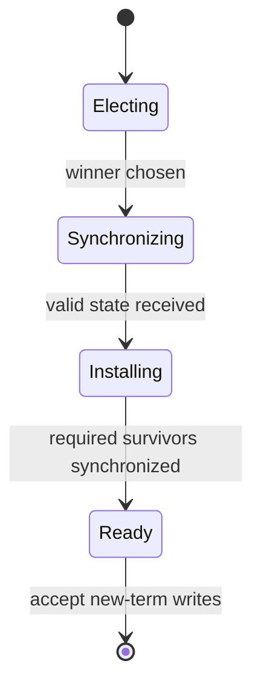
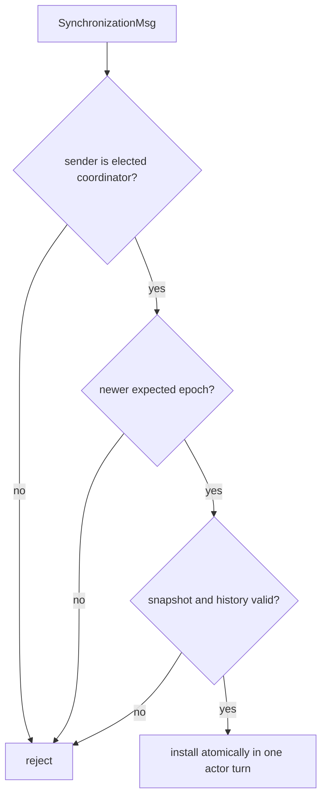
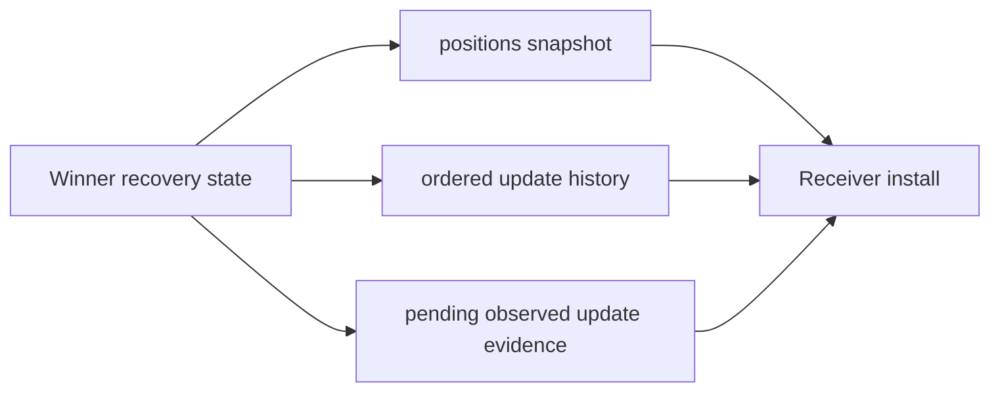
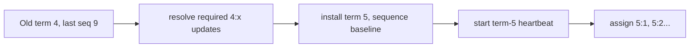
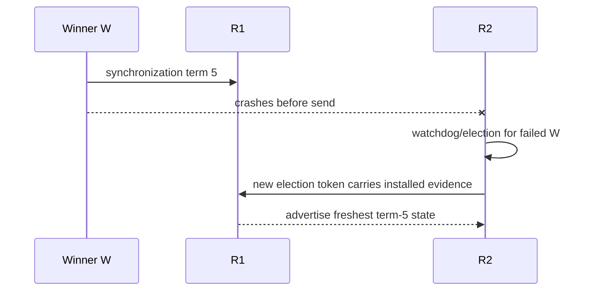
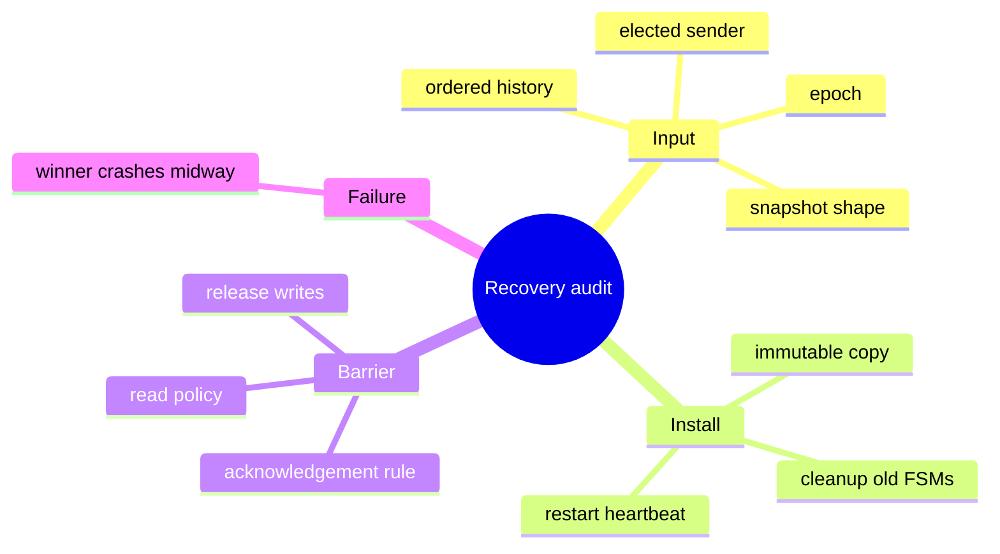

# Recovery, Synchronization, and Epoch Transition

> **Learning goal.** Separate leader selection from state recovery and understand what a new coordinator must finish before normal writes are safe again.

**Implementation inspected:** `feature/electionTransaction` at `d1222a2`.  
**Specification requirement:** recover incomplete/missing updates and preserve uniform agreement.  
**Status:** snapshot synchronization is implemented; full history replay is not.

## 1. Election is not the finish line

Election answers:

```text
Which surviving replica should lead?
```

Recovery answers:

```text
Which updates must exist, in what order, on every correct replica?
```

A system that chooses a single leader but discards an update applied by another replica violates uniform agreement. The new coordinator must become authoritative only after it has reconciled old-term work.

## 2. `SynchronizationMsg` contents

The current message carries:

- election transaction ID;
- message/start epoch metadata;
- sender ActorRef;
- failed coordinator ID;
- new coordinator ID;
- new epoch pair; and
- a defensive copy of the winner's `positions[]`.

The constructor copies the array and the getter returns another copy. This prevents sender and receiver actors from sharing mutable application state.

## 3. Winner-side transition

`Replica.completeElectionAsWinner` performs:

1. deduplicate completion for the failed coordinator;
2. find the local election FSM and move it to `SYNCHRONIZING`;
3. scan candidates for the maximum observed epoch;
4. choose new pair `<maxEpoch + 1, 0>`;
5. set local `coordinatorID` to self;
6. install the new pair;
7. invoke `callbackOnCoordinatorElected(self)`;
8. send synchronization snapshot to every other replica;
9. restart heartbeat for the new term; and
10. complete/remove election transactions.

The candidate selection algorithm routes the final list to the freshest winner, so the copied snapshot is intended to come from that replica.

## 4. Follower validation

Before applying synchronization, a follower checks:

- it is not crashed;
- transaction, epoch, and sender are non-null;
- failed and new coordinator IDs differ;
- its current coordinator is the announced failed coordinator;
- new coordinator exists in membership;
- sender equals that coordinator's ActorRef;
- message epoch equals announced new epoch;
- new epoch is strictly greater than local epoch, if local exists; and
- positions array length matches.

These checks prevent an unexpected replica, stale term, or malformed snapshot from replacing local leadership/state.

## 5. Follower application

For the first valid synchronization about this failed coordinator, follower:

1. marks that failure term completed;
2. moves matching election FSMs to synchronizing;
3. copies the snapshot into its own array;
4. installs new coordinator and epoch;
5. invokes coordinator-elected callback;
6. replaces heartbeat transaction; and
7. removes completed election FSMs.

Duplicate later synchronization is ignored through `completedElectionCoordinators` and epoch validation.

## 6. Why the new epoch must be newer

Old coordinator messages may still be in FIFO queues or actor mailboxes. A strictly newer epoch lets replicas distinguish old-term update traffic from new-term work.

Choosing one greater than the maximum candidate epoch ensures the new term outranks every candidate's known term. Sequence zero establishes the starting point for the term.

Final integration must define whether `<newEpoch,0>` is a term marker or the first assignable update ID. That choice must agree with update assignment logic.

## 7. Incomplete update example

Suppose old coordinator R0 assigned update U and sent WRITEOK to R1 but crashed before R2/R3 received it. R1 applies U. Later R1 also crashes, but before election a surviving quorum member R2 had observed U during UPDATE.

Uniform agreement requires the new coordinator to discover U and complete it. Merely copying the winner's current array works only if the winner definitely contains every update that must survive. A robust history-based design instead reasons from immutable ordered update records and their phase/status.

The specification explicitly says interrupted broadcasts must be detected and completed before new-epoch writes.

## 8. Snapshot versus history replay

### Snapshot approach in the branch

Advantages:

- simple;
- defensive copy is easy;
- followers converge quickly to winner's materialized array.

Limitations:

- loses the sequence of updates that produced the array;
- cannot distinguish two histories ending in the same values;
- does not explicitly complete an old update broadcast;
- cannot send only missing updates;
- makes duplicate-delivery reasoning harder; and
- assumes winner's array is authoritative, not merely winner's observed history.

### History replay required for a complete report/design

A richer recovery exchange needs ordered immutable records such as:

```text
<epoch,sequence> -> (index, value, observed/committed evidence)
```

The winner determines the common prefix and missing suffix, resolves interrupted work, sends updates in order, receives whatever acknowledgements the design requires, then opens the new epoch to client writes.

## 9. Synchronization completion acknowledgement

The current winner broadcasts snapshots and immediately restarts heartbeat/removes election transactions. It does not wait for synchronization ACKs from a quorum or all correct followers.

Because channels are reliable, followers should eventually receive the message if they remain correct. However, the statement “only after synchronization completes does the coordinator resume writes” needs a concrete completion criterion. A final design should define whether send completion, quorum ACK, or all reachable ACKs is sufficient.

## 10. Old transaction cleanup

`restartHeartbeat` removes the old heartbeat FSM from active routing and starts a new coordinator-scoped one. Old scheduled messages can still arrive but have no active transaction match.

Election transactions for the failed coordinator are moved to `DONE` and removed. Sets/maps remember scheduled, started, and completed failure terms to reject duplicates.

A complete integration should also decide what happens to old update and write transactions: retry, reconstruct, finish, or invalidate. Removing election state alone does not recover application work.

## 11. Safety and liveness questions

Safety questions:

- Can an old coordinator's late message overwrite new-term state?
- Can two synchronization messages install different leaders?
- Can an applied old update disappear from the snapshot?
- Can a missing update be applied twice during replay?

Liveness questions:

- What if a follower misses synchronization until much later?
- What if the elected winner crashes while synchronizing?
- What exact event allows new client writes?
- How is a new election triggered during recovery?

The current branch answers some stale/malformed-message safety questions but not the full recovery/liveness set.

## 12. Tests and missing evidence

Current election regression tests verify defensive array copies, unexpected-sender rejection, invalid synchronization not poisoning the term, and malformed election input rejection.

Needed system tests include:

- divergent arrays converge;
- old-epoch synchronization is ignored;
- incomplete update is completed on all survivors;
- new writes wait until recovery criterion;
- winner crashes during synchronization;
- heartbeat roles restart on every survivor; and
- callbacks occur exactly once per installed new coordinator.

## 13. Exam rehearsal

**Why is the freshest candidate preferred?** It is most likely to hold the latest recovery evidence, reducing the chance that a required update is lost.

**Why is copying `positions[]` not automatically equivalent to replaying history?** A snapshot contains final values but not update identity, order, or incomplete-broadcast evidence.

The invariant to remember is: **no new-term write may overtake recovery of an old-term update that uniform agreement requires the correct replicas to retain.**

## 14. Recovery is a barrier, not just a copy

<pre class="diagram">election winner chosen
        |
        v
winner gathers freshest state/history
        |
        +--> validate snapshot + source + epoch
        |
        +--> send SynchronizationMsg to survivors
                         |
                 install atomically
                         |
                 start heartbeat in new term
                         |
                 release queued/new writes</pre>

The barrier matters because a new coordinator can otherwise assign a new
sequence number while an older quorum decision is still unknown. “Copy the
array” is only one step; a safe transition also defines when history, current
epoch, pending transactions, and heartbeat role become visible together.

## 15. Code microscope: validating a SynchronizationMsg

Treat synchronization input as untrusted protocol data even when it comes from
the elected winner. A receiver should check the sender is the selected
coordinator, the message belongs to the new term, array dimensions match, and
the supplied history is internally ordered. Only after validation should it
replace local state.

<pre class="code-microscope">onSynchronization(msg):
    if (sender() != coordinator) return;
    if (!msg.epoch().isNewerThan(localEpoch)) return;
    if (!validShape(msg.positions(), expectedLength)) return;
    if (!ordered(msg.history())) return;
    installSnapshotAndHistory(msg); // one actor turn, then restart heartbeat
</pre>

An actor turn gives atomicity with respect to that replica's other handlers, but
it does not make installation atomic across replicas. The protocol must still
define whether it waits for synchronization acknowledgements and what happens
if the winner crashes halfway through.

## 16. Snapshot and history are different promises

Suppose a partial update changed index 1 on two of five replicas and the old
coordinator crashed. A winner with the newest observed history can preserve
that update; a winner with only the most common array value may erase it. If
the specification requires uniform agreement, recovery needs a rule for this
partial state (complete it, roll it back before exposure, or mark it unresolved)
and tests for each branch.

### Practice

Draw the messages when the synchronization winner crashes after sending to one
follower. Which replicas may serve reads? Which epoch should the second
election advertise? Answer using explicit state, not the wall-clock order of
messages.

<div class="page-break"></div>

## 17. Deep study plate: recovery barrier



Coordinator election is not the readiness transition. New writes remain behind
a barrier until the new term has a state that preserves required old-term
updates. The precise acknowledgement condition should be explicit; merely
sending synchronization does not prove recipients installed it.

Reads need a documented policy during the barrier. Serving a stable old
snapshot may be legal in some histories, while serving a partially installed
snapshot may not.

<div class="page-break"></div>

## 18. Deep study plate: synchronization message validation



Array length, immutable copy, ordered history, and term identity are protocol
validation, not defensive extras. A valid transaction ID alone does not prove
the sender won the election. After installation, old transaction FSMs and
timers must be cleaned up before heartbeat restarts.

Copy incoming arrays and collections so later sender mutation cannot change
installed state outside the receiver's mailbox.

<div class="page-break"></div>

## 19. Deep study plate: snapshot plus history



The snapshot supports immediate materialized reads. History supports ordering,
deduplication, and audit of past decisions. Pending evidence supports recovery
of a quorum or partial WRITEOK window. A complete design may checkpoint old
history, but then the checkpoint needs an explicit safety meaning.

The inspected election branch primarily copies position state. Report this as
snapshot synchronization and keep full history replay as a limitation unless
the exact code path proves otherwise.

<div class="page-break"></div>

## 20. Deep study plate: epoch transition



A newer term orders all its updates after older terms, but that ordering cannot
erase unresolved old work. Resolve or carry the evidence first, then establish
the new sequence baseline. Every survivor must install the same coordinator and
term before accepting its messages.

Queued term-4 UPDATE, ACK, WRITEOK, heartbeat, and election timeout messages may
still arrive. Sender, epoch, transaction, state, and generation checks make
them harmless.

<div class="page-break"></div>

## 21. Deep study plate: winner fails during synchronization



The second election must not choose using numeric ID alone. R1 may be the only
survivor that installed the first winner's state. The protocol needs a way to
advertise that freshness without treating a half-installed term as permission
for arbitrary new writes.

This scenario exposes why “callbacks on every survivor” and synchronization
acknowledgements are useful test evidence.

<div class="page-break"></div>

## 22. Student workbook: recovery audit



For each item, point to implementation evidence or mark it as an unmet
requirement. Then build a trace beginning with partial WRITEOK, followed by two
coordinator failures. The trace is safe only if required update knowledge
survives both transitions.
