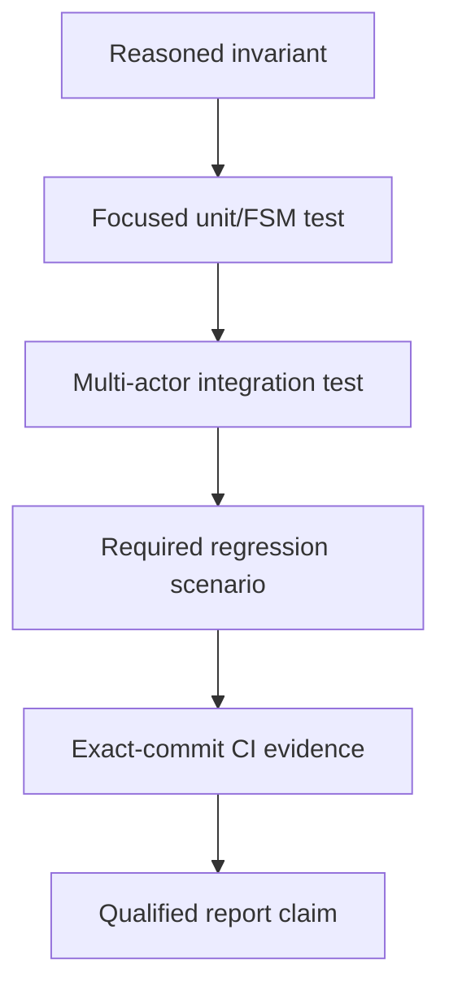
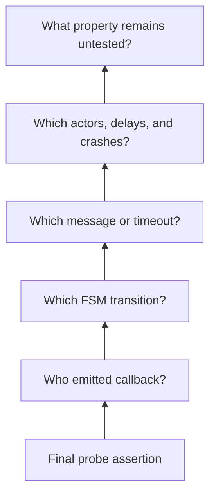
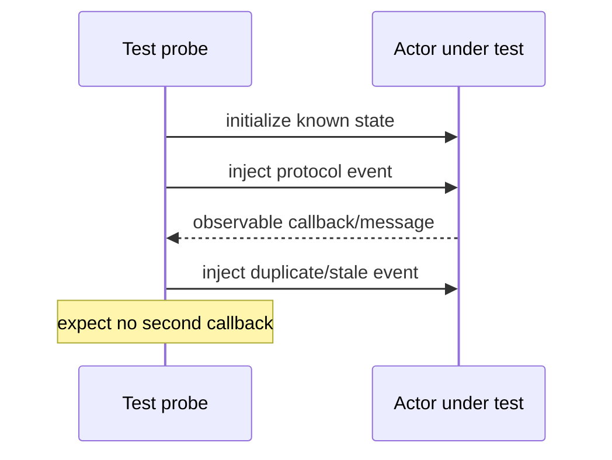
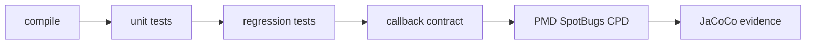
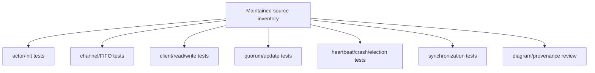
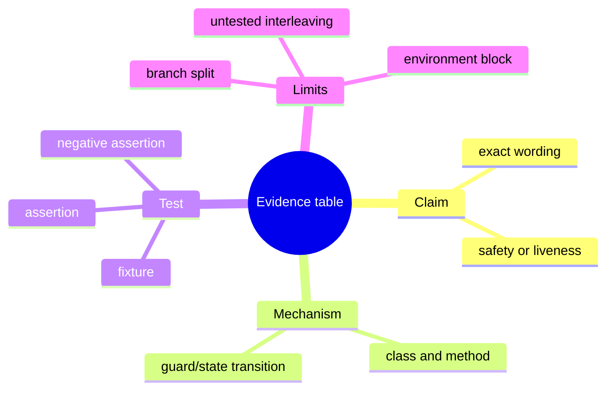

# Observability, Testing, and Verification Infrastructure

> **Learning goal.** Learn how the repository makes actor behavior observable, what each test/build tool proves, and how to avoid claiming more validation than the evidence supports.

**Build snapshot:** `feature/electionTransaction` at `d1222a2`.  
**Key files:** `Logger.java`, abstract callbacks, `TestsCommons.java`, base/regression/contract tests, `build.gradle`, `.github/workflows/ci.yml`, `charts/`.

## 1. Why distributed tests need observability

Most important state lives inside actors and cannot be read directly. Messages also arrive asynchronously. A test therefore needs stable public observations:

- client result/timeout callbacks;
- replica update/election callbacks;
- TestKit probes receiving those callback objects;
- protocol messages captured by probes;
- logs for human traces; and
- bounded waiting based on configured timing.

Testing only private fields would bypass the actor model and give false confidence about real message flows.

## 2. Logger contract

The supplied `Logger` produces timestamped INFO/DEBUG lines to stdout or a file. `AbstractClient` and `AbstractReplica` prepend actor identity.

Direct `System.out.println` inside hot protocol paths is discouraged because strict timing tests can be disturbed by slow I/O. Debug logging can be disabled, and all logging can be disabled during tests.

`Logger` synchronizes access to its shared writer. This static lock is infrastructure-level shared state; protocol application state remains actor-owned.

Logs help answer “what happened?” but do not prove correctness. Missing or reordered log output can also reflect buffering/timing rather than protocol state.

## 3. Mandatory callbacks

Client callbacks:

- read result;
- write result;
- read timeout;
- write timeout.

Replica callbacks:

- update applied;
- election started;
- coordinator elected.

Each callback logs and forwards a small immutable result object to the optional listener. Tests pass a TestKit actor as listener and assert those events.

Callback timing is semantic. For example, `callbackOnUpdateApplied` belongs immediately after actual local `positions[]` mutation, not merely after receiving UPDATE.

## 4. TestKit mental model

A TestKit probe is a controlled actor mailbox for a test. The system sends it ordinary messages; test code asks for the next message of a class, fishes for a matching message, or asserts no message arrives for a duration.

Useful patterns:

```text
expectMsgClass(Result.class)     wait for one result
expectNoMessage(duration)       assert silence in a window
fishForMessage(...)             ignore unrelated events until target
```

Negative timing assertions must be chosen carefully. “No message for 50 ms” proves little if the valid path can take 100 ms.

## 5. `TestsCommons`

`createTestSystem`:

1. creates an `ActorSystem`;
2. creates one listener probe per replica;
3. creates replicas with configurable latency/heartbeat interval;
4. sends `InitSystem` to all; and
5. returns actors, probes, and derived timeout values.

Timing helpers estimate read, write, update, and election windows from max latency, replica count, and heartbeat interval. These are test budgets, not formal proofs of worst-case Akka scheduling.

`getMaxUpdateDelay` comments model four logical hops: client to replica, replica to coordinator, coordinator broadcast/ACK round, and WRITEOK/result progression, with jitter allowance.

## 6. Three test layers

### Course base tests

`src/test/java/it/unitn/ds/base` is supplied contract/integration coverage. `APICompliance` checks required construction and API behavior. `NoCrashes` and `WithCrashes` run longer system scenarios.

These are the acceptance boundary: the README says all base tests must pass.

### Project regression tests

`src/test/java/it/unitn/ds/regression` contains focused tests written during development:

- message equality;
- epoch comparison;
- dispatcher routing;
- read/write wrappers;
- update feature behavior;
- heartbeat behavior; and
- election data structures/validation.

Regression tests should be fast and isolate one invariant or bug.

### Callback contract tests

`TestCallbackContract` uses ArchUnit bytecode inspection to ask whether any project class calls every mandatory callback.

This is a static checklist. It catches “callback is never called anywhere.” It does not catch wrong timing, wrong arguments, duplicate calls, or unreachable paths.

The task is deliberately separate because callbacks for unfinished features keep it red during development.

## 7. Gradle test tasks

- `./gradlew test`: base plus regression tests, excluding contract tag.
- `./gradlew regression`: only project regression package.
- `./gradlew callbackContract`: static callback checklist.
- `./gradlew regressionCoverage`: JaCoCo for the fast regression suite.
- `./gradlew testCoverage`: complete base and regression coverage.

The build requires Java 25 and configures the toolchain resolver. The CI workflow installs Java 25 and Gradle 9.2.1, creates the wrapper, then runs regression tests for pull requests to main.

CI evidence belongs to one exact commit. A green feature-branch check does not prove a later merge commit.

## 8. Coverage

JaCoCo measures executed lines and branches. It does not determine whether assertions are correct or whether protocol properties hold.

Coverage is most useful for finding unvisited failure paths:

- stale timeout branch;
- wrong coordinator filter;
- duplicate message branch;
- election skip path; and
- synchronization rejection.

Template infrastructure is excluded so project coverage is not diluted by supplied code.

High coverage with weak assertions can still miss a broken protocol. Low coverage reliably identifies places nobody tested.

## 9. Static analysis suite

The build integrates:

- **PMD:** source-level smells/rules;
- **SpotBugs:** bytecode dataflow suspicions;
- **CPD:** duplicated token blocks;
- **Spotless:** formatting output/check support;
- **ArchUnit:** callback architecture rules.

`staticAnalysis` combines reports and prints editor-clickable findings. PMD and SpotBugs use `ignoreFailures = true`, meaning task completion does not mean zero findings. The final count and report files must be inspected.

Static analysis can find probable local bugs. It cannot prove quorum, total order, uniform agreement, or election liveness.

## 10. VS Code integration

Tracked tasks attach problem matchers so tests and analysis findings appear at source lines. Continuous analysis re-runs on save.

This is developer ergonomics, not runtime architecture, but it affects how reliably findings are noticed. Running a Gradle command in an ordinary terminal may produce the same text without VS Code diagnostics.

## 11. Protocol diagrams

`charts/` contains:

- system and actor UML;
- transaction/message UML;
- healthy and failure sequences;
- heartbeat coordinator/follower FSMs;
- election sequence/FSM; and
- intended read/write/update traces.

Diagrams are explanatory artifacts, not automatically generated truth. Compare every arrow with current constructors, receive handlers, network/local paths, and branch status. Some diagrams describe intended update behavior not integrated in the current source.

## 12. Evidence ladder

From weakest to strongest for a behavior claim:

1. comment or TODO describes intention;
2. diagram shows proposed flow;
3. code contains a path;
4. focused test executes the path with meaningful assertions;
5. integration test exercises interacting actors/failures;
6. exact commit passes required suite/CI;
7. correctness argument connects tested mechanisms to stated assumptions.

No single level replaces all others.

## 13. Current validation snapshot

Prior recorded validation for election commit `d1222a2` showed focused election and regression tasks passing, while callback contract still had unrelated missing read/update callbacks and static analysis reported findings. That evidence is historical to this commit and environment.

For these documentation PDFs, source/render validity is checked separately; the task does not modify Java behavior or claim a fresh full protocol test pass.

## 14. Building a good protocol test

A strong test names one invariant, arranges a concrete state, triggers one event sequence, and checks externally visible effects plus forbidden effects.

Example stale watchdog test:

1. initialize follower with short heartbeat interval;
2. capture watchdog version 1 event;
3. deliver valid heartbeat, causing version 2;
4. inject expiry for version 1;
5. assert no election callback;
6. inject expiry for version 2;
7. assert exactly one election callback.

This demonstrates why the version check matters, not merely that lines execute.

## 15. Codebase coverage map

This report set assigns every maintained source area to an educational report:

- `Main`, `AbstractClient`, `AbstractReplica`, and actor factories: reports 01 and 05.
- `NetworkChannel` and replica send helpers: report 02.
- `DistributedActor`, `Transaction`, `Msg`, `EpochPair`, dispatchers, and `ProbeTransaction`: reports 03 and 04.
- `Client`: reports 05–07.
- branch-only `ReadTransaction`: report 06.
- `WriteTransaction`: report 07.
- branch-only `UpdateTransaction`: report 08.
- `HeartbeatTransaction`: report 09.
- crash fields/handlers across abstract and concrete replica code: report 10.
- `ElectionTransaction` and election-specific `Replica` handlers: report 11.
- synchronization and heartbeat replacement in `Replica`: report 12.
- `Logger`, `TestsCommons`, base/regression/contract tests, Gradle tasks, CI, PMD/SpotBugs configuration, and VS Code tasks: this report.
- the specification PDFs and all cross-protocol guarantees: reports 00 and 14.
- `charts/UML`, `charts/Transactions`, and `charts/protocol.mmd`: referenced by the matching architecture/protocol reports and assessed here as documentation evidence.
- `docs/ELECTION_TRANSACTION_PLAN.md`: election working notes; useful historical context, not automatically current behavior.

Generated `.gradle/` and `build/` contents are build outputs rather than maintained subsystem source. They are evidence only when a report explicitly cites a generated test, coverage, PMD, SpotBugs, CPD, or JaCoCo result.

## 16. Exam rehearsal

**What does callbackContract prove?** Only that compiled project code invokes each callback somewhere.

**What does green regression CI prove?** The configured regression task passed on that exact checked-out commit/environment; it does not prove untested protocol properties or later integration.

The invariant to remember is: **every correctness claim should name both the mechanism in code and the test or reasoning evidence that supports it.**

## 17. The evidence pipeline

<pre class="diagram">source code -> focused unit test -> regression scenario
     |                 |                    |
     +--> callback/log/probe observation ---+
                           |
                    claim with limits
                           |
                 build/SCA/CI evidence (when available)</pre>

Think of a test as an instrument, not a magic stamp. A focused test can show
that a timeout message is routed to the right transaction. A regression test
can show that a five-replica write eventually completes. Neither alone proves
all crash interleavings. The report should always state the observation and the
unobserved cases.

## 18. Code microscope: read a TestKit test backwards

Start with the final assertion and ask what mechanism could make it true. If a
test expects a probe to receive `CallbackOnCoordinatorElected`, trace backwards:

1. which actor sent the callback;
2. which election state called that sender;
3. which timeout or ACK caused the transition;
4. which fixture supplied membership, delays, and crash status; and
5. whether the test checked exactly-once behavior or merely eventual presence.

<pre class="code-microscope">// Conceptual assertion anatomy
probe.expectMsg(CoordinatorElected(id));
// proves an observable event, not automatically:
// - all replicas installed the same epoch
// - no duplicate callback was emitted
// - pending writes were recovered</pre>

This backwards reading habit is especially useful with `TestDispatcher` and
`TestsCommons`, where helper methods hide actor creation and timing settings.
Open the helper before trusting what a short test appears to configure.

## 19. Designing a high-value protocol test

Name one invariant, one perturbation, and one observable result. Example:

<table><tr><th>Invariant</th><th>Perturbation</th><th>Observable result</th></tr>
<tr><td>duplicate WRITEOK is idempotent</td><td>deliver the same message twice</td><td>one history entry and one state mutation</td></tr>
<tr><td>stale watchdog is harmless</td><td>deliver v6 after v7</td><td>no election callback for v6</td></tr>
<tr><td>queue preserves session order</td><td>enqueue write then read</td><td>read starts only after write completion</td></tr></table>

Add a negative assertion where possible: “probe receives no second callback
within the bounded test window.” Avoid arbitrary sleeps; derive the window from
configured channel delay plus protocol hops and explain the margin.

### Practice

Choose one claim from each of the read, heartbeat, election, and recovery
reports. For each, write what a unit test can establish and what integration or
formal reasoning is still needed.

<div class="page-break"></div>

## 20. Deep study plate: evidence ladder



Higher rungs add scope but do not replace reasoning. A green regression can
miss an unasserted property; a formal invariant can be implemented incorrectly.
Strong documentation names both mechanism and observation, plus the commit and
environment on which evidence was collected.

Do not turn an environment failure before compilation into a passing test. The
native-platform Gradle error, for example, means test execution was blocked.

<div class="page-break"></div>

## 21. Deep study plate: read a test backwards



Starting at the assertion prevents test names from substituting for evidence.
Open helpers in `TestsCommons` to see membership size, coordinator choice, delay
bounds, and initialization. Then check negative assertions and callback counts.

A test expecting one message proves presence. To prove exactly once, it also
needs a bounded absence check after duplicate or late inputs.

<div class="page-break"></div>

## 22. Deep study plate: deterministic protocol tests



Prefer injected events and TestKit expectations to arbitrary sleep. If time is
the behavior under test, derive the expectation window from channel and timer
configuration. Keep random delay deterministic through a seed or bounded
fixture when debugging failures.

Record both state and output where possible. A callback without a changed
position may reveal a false-success path.

<div class="page-break"></div>

## 23. Deep study plate: build and static analysis



Each task answers a different question. Compilation checks types; regression
checks configured scenarios; callback contract checks reachability of required
observations; static tools identify patterns; coverage identifies executed code
but not correctness. Report their results separately.

Tie CI evidence to an exact commit. A passing earlier head does not certify a
later change, and an in-progress remote job is not a pass.

<div class="page-break"></div>

## 24. Deep study plate: coverage by subsystem



File coverage is not line coverage. The map ensures every maintained area has
a report and verification discussion. Within each area, trace branches for
success, timeout, malformed input, duplicate traffic, crash state, and stale
events.

Generated build outputs are evidence artifacts, not maintained source. Keep
them out of conceptual coverage counts unless a report cites a specific result.

<div class="page-break"></div>

## 25. Student workbook: build an evidence table



Create one row for every major claim in the other fourteen reports. If a row
lacks a mechanism, weaken the claim. If it lacks a test, label it reasoned or
pending. If the code exists only on a feature branch, preserve that provenance
instead of presenting an integrated pass.

<div class="page-break"></div>

## 26. Lecture synthesis: evidence must match the claim

A distributed execution contains important facts that private field inspection
or a final return value cannot reveal. Which replica acknowledged? Which pair
was applied? Did election start once or twice? Did a crashed node remain
silent? The listener callbacks and structured logs expose these protocol events
to TestKit probes. Observability is therefore part of testability: it creates a
controlled surface on which correctness claims can be evaluated.

Instrumentation must be passive. A callback may report that an update was
applied, but it must not trigger the application or supply data that the real
protocol lacks. The production transition should happen first, followed by an
observation message. This ordering lets tests use callbacks as witnesses
without turning the test harness into another protocol participant.

### 26.1 Read a test as claim, setup, stimulus, oracle

Start from the assertion rather than the fixture. The assertion is the
test's actual claim. Work backward to the observation that satisfies it, the
stimulus that should cause that observation, and the initial state that makes
the stimulus meaningful. Then list forbidden observations. This method often
reveals that a test named “write succeeds” asserts only a client callback and
never checks replicated state.

An **oracle** is the rule that decides correctness. One callback can be an
oracle for API completion. A map of update-applied callbacks can be an oracle
for convergence. A proposed sequential history can be an oracle for read/write
consistency. Choose the oracle at the same abstraction level as the claim.

### 26.2 Determinism comes from controlling events

Sleeping and hoping a race occurs produces weak evidence. TestKit can inject a
specific message, wait for a named callback, and assert silence for a bounded
period. The crash controller can stop a replica at a counted protocol event.
Generation fields let tests construct a stale timeout deliberately. These
techniques turn concurrency bugs into reproducible state-machine cases.

Some nondeterminism remains valuable. Random channel delays explore legal
interleavings. Use fixed or recorded seeds when a failure must be reproduced,
and pair randomized campaigns with deterministic regression tests for every
discovered bug. A stable test suite is not one that avoids concurrency; it is
one that controls and explains it.

### 26.3 Positive and negative assertions form one proof

For a timeout race, assert that one terminal callback occurs and that the other
does not. For a stale watchdog, assert no election start, then inject the
current watchdog and assert one start. For a crash, assert the crash point was
reached, the target produces no forbidden output, and survivors progress.
Positive assertions show a path exists; negative assertions protect safety
boundaries around it.

Absence checks must use a justified observation window. Too short can miss a
delayed violation; too long hides the relationship between the protocol bound
and the test. Derive the window from configured maximum latency, heartbeat or
ACK timeout, and the number of expected hops.

### 26.4 Coverage and static analysis answer narrower questions

Line coverage says which bytecode executed, not whether the right invariant
held. One happy path can cover most of an FSM while missing wrong sender,
duplicate ACK, stale timeout, and old epoch behavior. Use coverage to find
unvisited code, then design semantic assertions from the state/message matrix.

PMD, SpotBugs, CPD, and formatting checks find maintainability and bug patterns;
they do not prove a distributed algorithm. Likewise, a Gradle task configured
with `ignoreFailures` can finish while reports contain findings. Verification
should record both task exit and substantive findings. Tool output is one rung
in the evidence ladder, below focused protocol and integration behavior.

### 26.5 Build a traceable verification matrix

For each requirement, name the enforcing transition, focused test, integration
test, and remaining gap. Include the exact Git ref because this repository
keeps important subsystems on different branches. A green test from one head
cannot validate code introduced later or code present only elsewhere.

The strongest final evidence combines compilation, focused FSM tests,
cross-replica tests, adversarial crash traces, callback-count assertions,
state/history convergence, static-analysis review, and rendered documentation
inspection. No single number replaces that portfolio.
